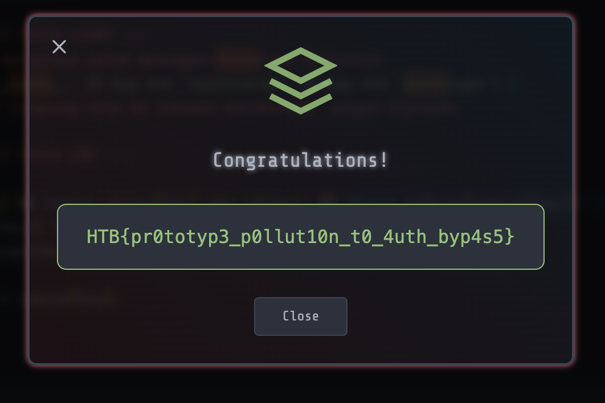
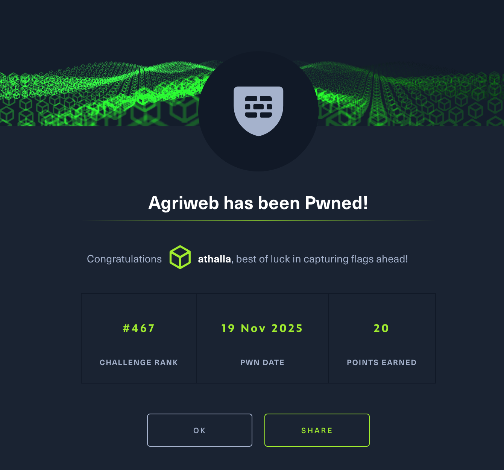

# Challenge: AgriWeb – Prototype Pollution

Category: Secure Coding
Points: 4 Stars
Difficulty: Medium

## Challenge Description

Patch sebuah celah keamanan pada aplikasi AgriWeb yang memungkinkan attacker mendapatkan hak akses **admin** melalui teknik **Prototype Pollution** pada fitur update profil.

## Resource

`routes/profile.js`, `app.js`, dan script eksploit `solver.py` yang diberikan di challenge.

## Step-by-Step Solution

1.  Buka file `solver.py` untuk memahami cara kerja eksploit. Terlihat bahwa attacker mengirimkan JSON payload yang memanipulasi properti `__proto__` saat melakukan request ke endpoint `/api/profile`:

    ```python
    data1 = {
        "favoriteCrop": "wheat",
        "__proto__": {
            "isAdmin": True
        }
    }
    ```

2.  Masalahnya terletak pada fungsi `deepMerge` di file `routes/profile.js`. Fungsi ini melakukan penggabungan objek secara rekursif tanpa memfilter _key_ yang sensitif:

    ```javascript
    // Vulnerable Code
    function deepMerge(target, source) {
      for (let key in source) {
        if (source[key] && typeof source[key] === 'object'...) {
          if (!target[key]) target[key] = {};
          deepMerge(target[key], source[key]); // Rekursif tanpa validasi
        } ...
      }
      return target;
    }
    ```

    Akibatnya, payload attacker memodifikasi `Object.prototype` global. Ketika middleware `isAdmin` di `app.js` mengecek `req.user.isAdmin`, nilainya menjadi `true` karena mewarisi dari prototype yang sudah tercemar, meskipun user tersebut sebenarnya bukan admin.

3.  Untuk menghentikan serangan ini, kita harus mencegah fungsi `deepMerge` memproses key yang berkaitan dengan prototype objek JavaScript (`__proto__`, `constructor`, dan `prototype`).

4.  Update fungsi `deepMerge` di `routes/profile.js` dengan menambahkan validasi di dalam loop:

    ```javascript
    function deepMerge(target, source) {
      for (let key in source) {
        // --- AWAL PATCH ---
        // Cek apakah key adalah properti berbahaya
        if (key === '__proto__' || key === 'constructor' || key === 'prototype') {
          continue; // Lewati (skip) key ini
        }
        // --- AKHIR PATCH ---

        if (source[key] && typeof source[key] === 'object' && !Array.isArray(source[key])) {
          if (!target[key]) target[key] = {};
          deepMerge(target[key], source[key]);
        } else {
          target[key] = source[key];
        }
      }
      return target;
    }
    ```

5.  **Penting:** Karena Prototype Pollution mencemari memori proses yang sedang berjalan, aplikasi/container harus di-restart agar efek polusi sebelumnya hilang. Setelah patch diterapkan dan direstart, eksploit dari `solver.py` gagal karena properti `isAdmin` tidak lagi tertulis ke prototype global.
    
    

## Reflection

- **Status:** ✅ Berhasil
- **Root Cause:** Implementasi fungsi recursive merge yang tidak aman (unsafe recursive merge) memungkinkan modifikasi `Object.prototype`.
- **Attack Vector:** Mengirimkan JSON malicious pada endpoint update profil untuk menyuntikkan properti `isAdmin` ke seluruh objek aplikasi.
- **Key Insight:**
  - Fungsi utility seperti `deepMerge` atau `extend` sering menjadi tempat bersembunyinya celah Prototype Pollution.
  - Selalu blacklist key sensitif: `__proto__`, `constructor`, dan `prototype` saat memproses input JSON user.
  - Pada environment Node.js (long-running process), patching saja tidak cukup; restart diperlukan untuk membersihkan memori yang sudah terpolusi.
