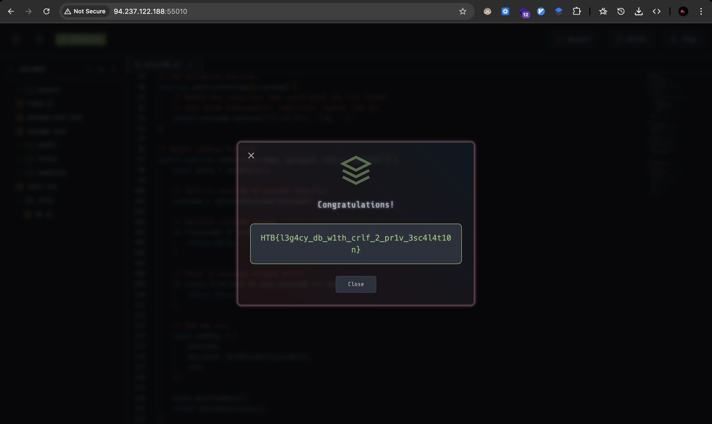

# Challenge: PowerGrid – Newline Injection in Username

Category: Secure Coding
Points: 4 Stars
Difficulty: Medium

## Challenge Description

Patch sebuah celah keamanan pada aplikasi PowerGrid yang memungkinkan attacker mendapatkan role **admin** melalui teknik **newline injection** di username.

## Resource

`db.js`, `users.txt`, dan script eksploit `solver.py` yang diberikan di challenge.

## Step-by-Step Solution

1. Buka file `solver.py` untuk memahami cara kerja eksploit. Terlihat bahwa attacker menyisipkan karakter newline ke dalam username saat registrasi:

   ```python
   payload = "{}|4befd7f713861d52cb520dcf4b5b262b11a306fbd19a76563fa36b07e99a7aef|admin\n{}".format(username, username)
   ```

2. Masalahnya ada pada fungsi `addUser()` di `db.js`. Username langsung ditulis ke file `users.txt` **tanpa validasi atau sanitasi**:

   ```javascript
   const newUser = {
     username, // tidak disanitasi
     password: hashPassword(password),
     role,
   };
   ```

   Akibatnya, payload attacker menghasilkan dua baris di `users.txt`:

   ```
   malicious|hash|admin
   malicious|hash|operator
   ```

   Sistem membaca baris pertama, sehingga attacker mendapatkan role **admin**.

3. Untuk menghentikan serangan ini, tambahkan sanitasi input pada username. Buat helper sederhana:

   ```javascript
   function sanitizeUsername(username) {
     return username.replace(/[^a-zA-Z0-9_.-]/g, '');
   }
   ```

4. Update fungsi `addUser()` agar:

   - Menjalankan sanitasi username
   - Menolak username yang tidak valid atau terlalu pendek/panjang
   - Mencegah newline, pipe, dan karakter berbahaya lain masuk ke file

   Patch final:

   ```javascript
   export function addUser(username, password, role = 'operator') {
     const users = readUsers();

     username = sanitizeUsername(username);

     if (!username || username.length < 3 || username.length > 50) {
       return false;
     }

     if (users.find((user) => user.username === username)) {
       return false;
     }

     const newUser = {
       username,
       password: hashPassword(password),
       role,
     };

     users.push(newUser);
     return writeUsers(users);
   }
   ```

5. Setelah patch diterapkan, eksploit dari `solver.py` tidak lagi berhasil karena karakter newline otomatis dibuang, sehingga tidak dapat memanipulasi struktur file `users.txt`.
   
   

## Reflection

- **Status:** ✅ Berhasil
- **Root Cause:** Username tidak disanitasi sebelum ditulis ke file, sehingga attacker bisa menyisipkan newline dan membuat entri palsu.
- **Attack Vector:** Register akun baru dengan payload berisi newline untuk menyuntikkan baris tambahan ke `users.txt`.
- **Key Insight:**

  - Validasi dan sanitasi input wajib dilakukan sebelum data ditulis ke file atau database.
  - Format file berbasis line-delimited sangat rentan jika input dibiarkan mentah.
  - Simple newline injection bisa berujung privilege escalation jika tidak dicegah.
