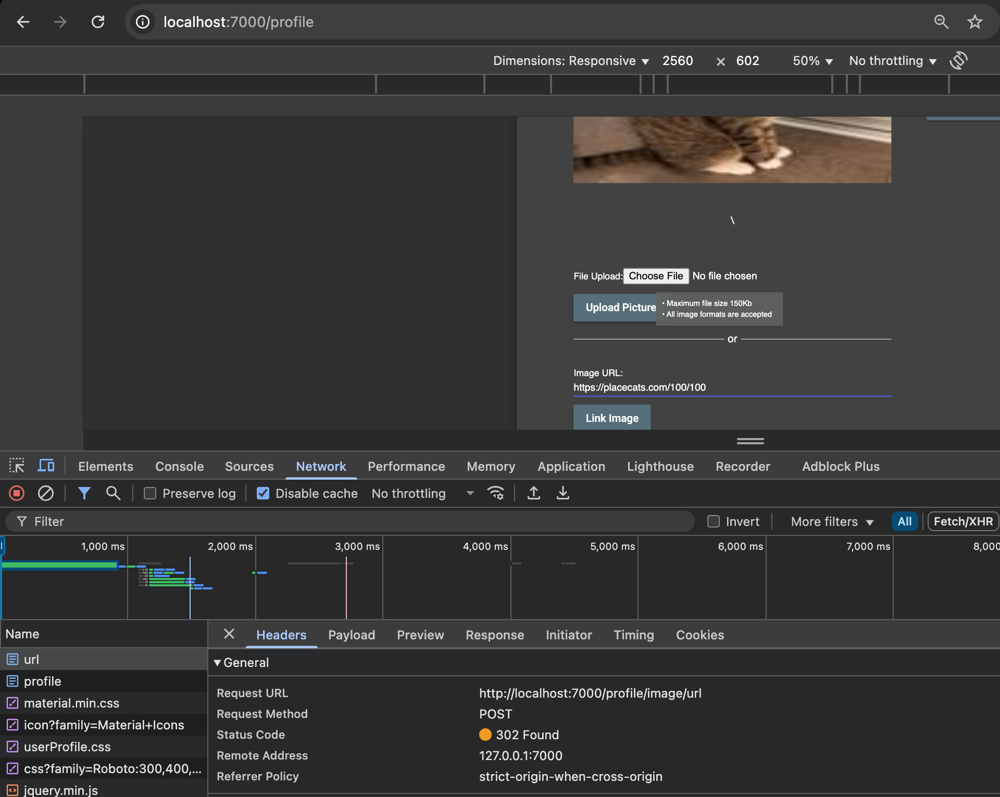
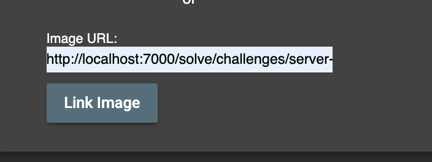
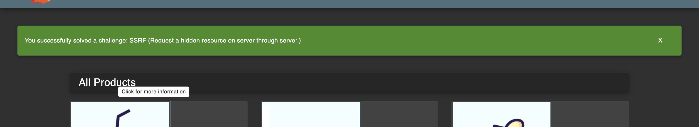

# Challenge: Server-Side Request Forgery (SSRF)

Kategori: Server-Side Request Forgery
Poin: 4 Bintang
Tingkat Kesulitan: Sulit

## Deskripsi Challenge

Lab ini menantang kita untuk menemukan URL rahasia yang tersembunyi dan menggunakannya untuk melakukan serangan SSRF melalui fitur pembaruan avatar untuk menyelesaikan tantangan.

## Langkah-langkah Penyelesaian

1.  Login ke aplikasi dan navigasi ke halaman profil (`/profile`).

2.  Temukan fungsionalitas untuk mengubah avatar. Terdapat input field untuk "Gravatar URL". Coba masukkan URL gambar eksternal (misalnya, `https://placecats.com/100/100`) untuk memahami cara kerjanya.
    

3.  Tantangan ini mengharuskan kita menemukan URL rahasia. Deskripsi tantangan di Juice Shop menyarankan untuk menganalisis "juicy malware" atau memonitor trafiknya. Dari sana, kita akan menemukan URL: `http://localhost:7000/solve/challenges/server-side?key=tRy_H4rd3r_n0thIng_iS_Imp0ssibl3`.

4.  Masukkan URL yang ditemukan ke dalam field "Gravatar URL" dan klik "Link Gravatar".
    

5.  Aplikasi akan membuat permintaan dari server-side ke URL tersebut, dan tantangan akan terselesaikan.
    

## Refleksi

- **Status:** ✅ Berhasil
- **Akar Masalah:** Aplikasi rentan terhadap SSRF karena mengambil URL dari input pengguna (`imageUrl`) dan membuat permintaan server-side tanpa validasi yang memadai terhadap tujuan URL, memungkinkan permintaan ke layanan internal (`localhost`).
- **Vektor Serangan:** SSRF melalui parameter `imageUrl` pada fitur pembaruan avatar.
- **Wawasan Kunci:**
  - Input pengguna yang digunakan untuk mengambil sumber daya eksternal (seperti gambar) adalah vektor umum untuk SSRF.
  - Penting untuk memvalidasi dan membatasi URL yang dapat diakses oleh server untuk mencegah permintaan ke sumber daya internal atau jaringan lokal.
  - Terkadang, untuk menyelesaikan sebuah tantangan, diperlukan langkah-langkah di luar aplikasi web itu sendiri, seperti rekayasa balik atau analisis malware.
