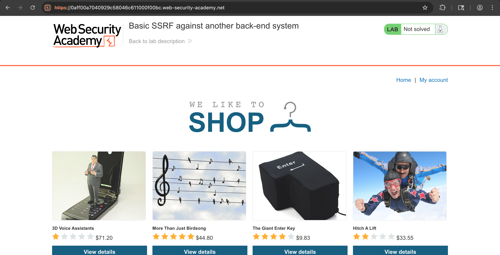
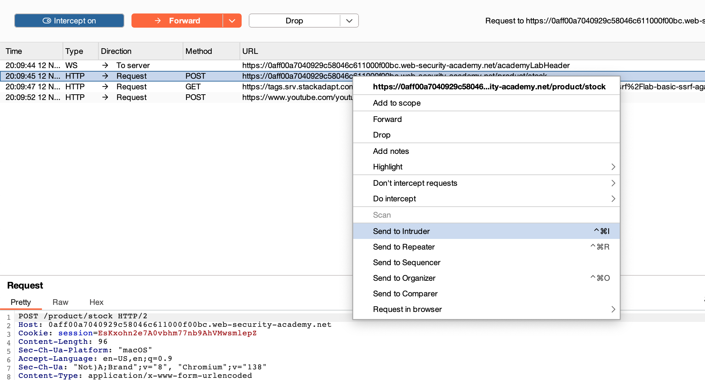
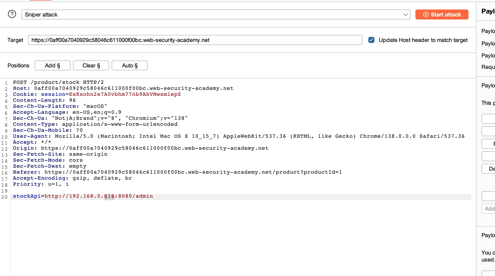
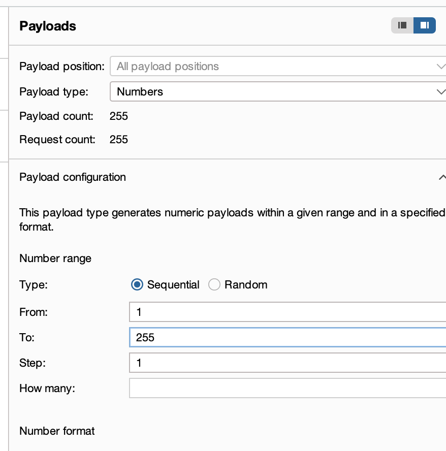

# Challenge: Basic SSRF against another back-end system

Kategori: Server-Side Request Forgery
Poin: 3 Bintang
Tingkat Kesulitan: Menengah

## Deskripsi Challenge

Lab ini memiliki fitur pengecekan stok yang mengambil data dari sistem internal. Untuk menyelesaikan lab, Anda perlu menemukan alamat IP sistem back-end, mengakses antarmuka adminnya, dan menghapus pengguna `carlos`.

## Sumber Daya

[PortSwigger - Basic SSRF against another back-end system](https://portswigger.net/web-security/ssrf/lab-basic-ssrf-against-another-back-end-system)

## Langkah-langkah Penyelesaian

1.  Akses lab yang disediakan.
    

2.  Pilih salah satu produk, aktifkan intercept pada Burp Suite saat mengklik "Check stock", lalu kirim request yang di-intercept ke Intruder.
    

3.  Di Intruder, ubah URL dari parameter `stockApi` menjadi `http://192.168.0.1:8080/admin`. Sorot angka '1' pada oktet terakhir alamat IP (`192.168.0.1`) dan klik "Add §" untuk menjadikannya posisi payload.
    

4.  Pada tab "Payloads", ubah tipe payload menjadi "Numbers". Atur "From" menjadi `1`, "To" menjadi `255`, dan "Step" menjadi `1`.
    

5.  Mulai serangan ("Start attack"). Setelah menemukan respons dengan status 200 OK (yang menunjukkan panel admin), kirim request tersebut ke Repeater. Di Repeater, tambahkan `/admin/delete?username=carlos` ke URL yang ditemukan (misalnya, `http://192.168.0.X:8080/admin/delete?username=carlos`) lalu kirim.

## Refleksi

- **Status:** ✅ Berhasil
- **Akar Masalah:** Aplikasi ini rentan terhadap SSRF karena fungsionalitas pengecekan stok mengambil URL dari parameter `stockApi` tanpa validasi yang memadai, sehingga memungkinkan permintaan dibuat ke layanan internal.
- **Vektor Serangan:** SSRF melalui parameter `stockApi` dan pemindaian IP internal menggunakan Burp Intruder.
- **Wawasan Kunci:**
  - Penyerang dapat memanipulasi parameter `stockApi` untuk memindai jaringan internal dan menemukan host yang rentan.
  - Dengan menggunakan Burp Intruder, dimungkinkan untuk mengidentifikasi alamat IP internal yang menghosting panel admin.
  - Setelah panel admin ditemukan, fungsionalitas penghapusan pengguna dapat dieksploitasi melalui permintaan SSRF kedua untuk menyelesaikan tantangan.
