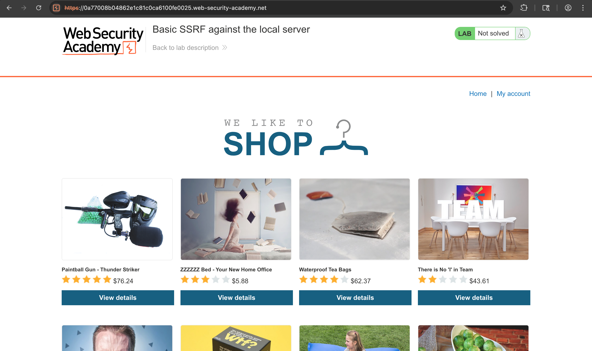
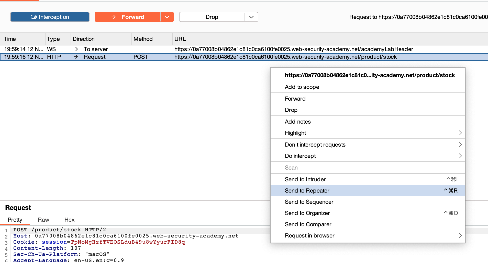
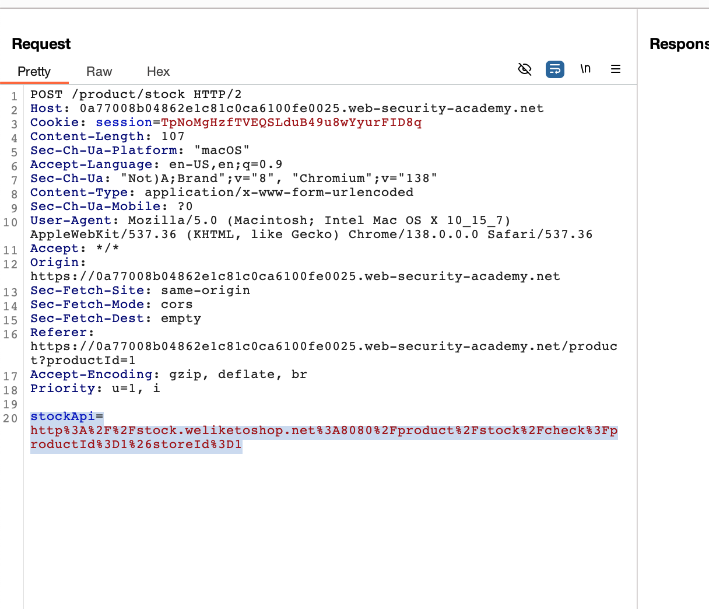
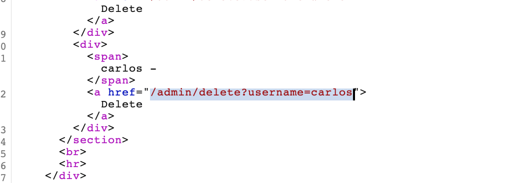
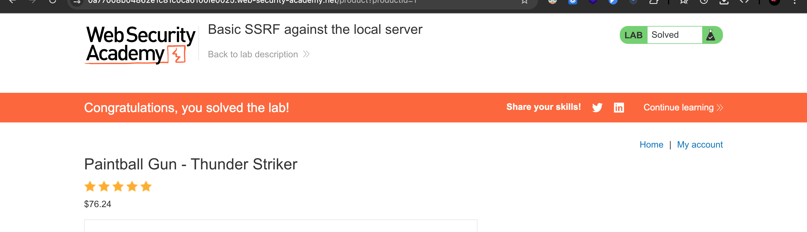

# Challenge: Basic SSRF against the local server

Kategori: Server-Side Request Forgery
Poin: 3 Bintang
Tingkat Kesulitan: Menengah

## Deskripsi Challenge

Lab ini memiliki fitur pengecekan stok yang mengambil data dari sistem internal. Untuk menyelesaikan lab, gunakan fungsionalitas pengecekan stok untuk mengakses antarmuka admin di `http://localhost/admin` dan hapus pengguna `carlos`.

## Sumber Daya

[PortSwigger - Basic SSRF against the local server](https://portswigger.net/web-security/ssrf/lab-basic-ssrf-against-localhost)

## Langkah-langkah Penyelesaian

1.  Akses lab yang disediakan.
    

2.  Pilih salah satu produk, aktifkan intercept pada Burp Suite, lalu klik "Check stock". Kirim request yang di-intercept ke Repeater.
    

3.  Pada Repeater, ubah nilai parameter `stockApi` menjadi `http://localhost/admin` dan kirim request tersebut.
    

4.  Respons dari server akan berisi panel admin, yang di dalamnya terdapat link untuk menghapus user `carlos`.
    

5.  Gunakan URL penghapusan tersebut (`/admin/delete?username=carlos`) sebagai nilai baru untuk parameter `stockApi` (menjadi `http://localhost/admin/delete?username=carlos`) dan kirim kembali requestnya.
    
    

## Refleksi

- **Status:** ✅ Berhasil
- **Akar Masalah:** Aplikasi ini rentan terhadap SSRF karena fungsionalitas pengecekan stok mengambil URL dari parameter `stockApi` tanpa validasi yang memadai, sehingga memungkinkan permintaan dibuat ke layanan internal.
- **Vektor Serangan:** SSRF melalui parameter `stockApi`.
- **Wawasan Kunci:**
  - Penyerang dapat memanipulasi URL di parameter `stockApi` untuk membuat server mengirim permintaan ke titik akhir khusus internal.
  - Dengan mengakses `http://localhost/admin`, panel admin yang tidak diekspos secara eksternal dapat dilihat.
  - Panel admin berisi fungsionalitas untuk menghapus pengguna. Tindakan ini dipicu dengan membuat payload SSRF kedua untuk menyelesaikan tantangan.
