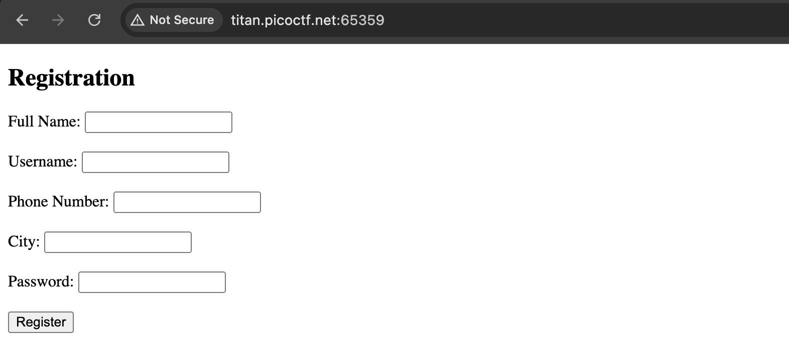
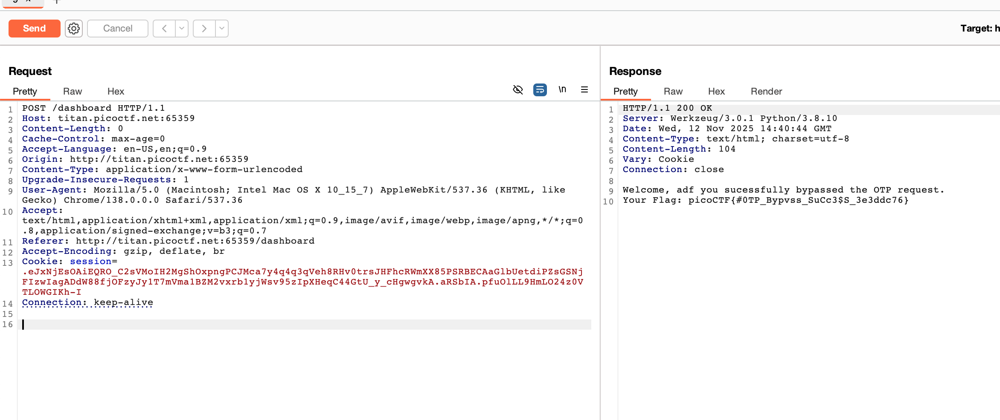

# Challenge: IntroToBurp

Kategori: Web Exploitation
Poin: 100 Poin
Tingkat Kesulitan: Mudah

## Deskripsi Challenge

Challenge ini memperkenalkan dasar-dasar penggunaan Burp Suite untuk mengintersep dan memodifikasi permintaan web. Tujuannya adalah untuk melewati verifikasi OTP dengan memanipulasi body permintaan untuk mendapatkan flag.

## Sumber Daya

[picoCTF - IntroToBurp](https://play.picoctf.org/practice/challenge/419?page=1&search=introtoburp)

## Langkah-langkah Penyelesaian

1.  Pertama, akses instance dari challenge tersebut. Isi formulir pendaftaran dengan data sembarang dan klik tombol "Register".
    

2.  Setelah mengklik "Register", aktifkan intercept pada Burp Suite. Masukkan OTP sembarang pada halaman berikutnya, lalu kirim permintaan yang di-intercept ke Repeater.
    

3.  Di Repeater, hapus seluruh body permintaan (request body) dan kirim kembali permintaan tersebut. Flag akan didapatkan pada respons.
    

## Refleksi

- **Status:** ✅ Berhasil
- **Akar Masalah:** Aplikasi tidak memvalidasi keberadaan atau format body permintaan OTP, sehingga memungkinkan bypass dengan menghapus body permintaan.
- **Vektor Serangan:** Manipulasi permintaan HTTP menggunakan Burp Suite.
- **Wawasan Kunci:**
  - Burp Suite adalah alat yang sangat berguna untuk mengintersep, memodifikasi, dan menganalisis lalu lintas HTTP/HTTPS.
  - Terkadang, menghapus bagian tertentu dari permintaan (seperti body) dapat menghasilkan perilaku tak terduga atau melewati validasi yang tidak lengkap.
  - Penting untuk selalu memeriksa bagaimana aplikasi menangani permintaan yang tidak standar atau dimodifikasi.
