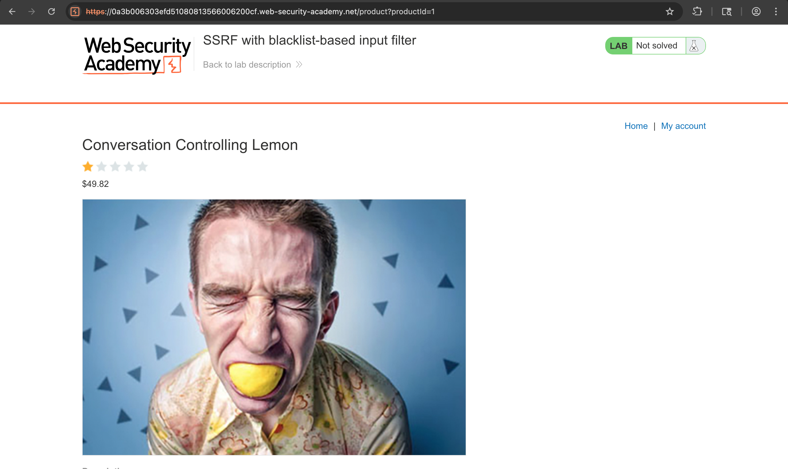
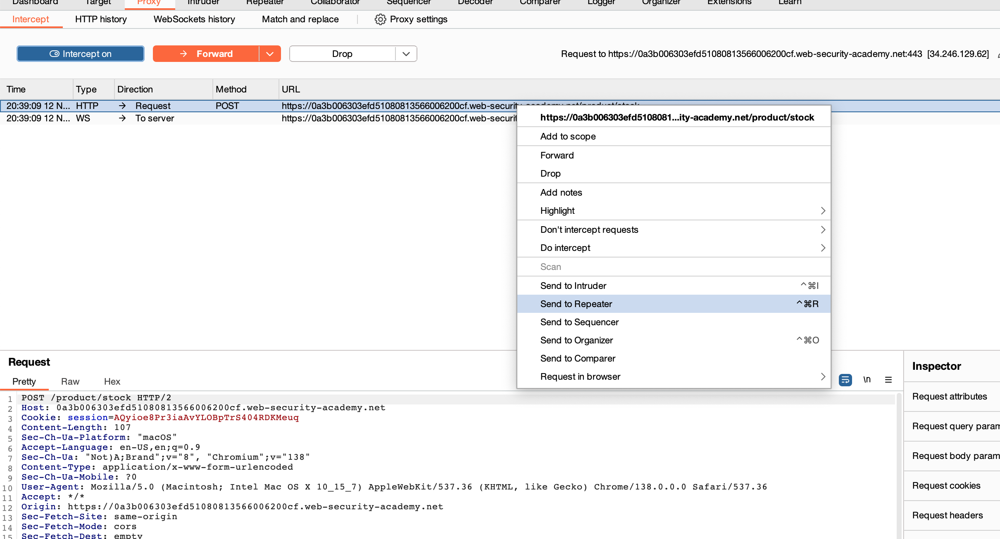
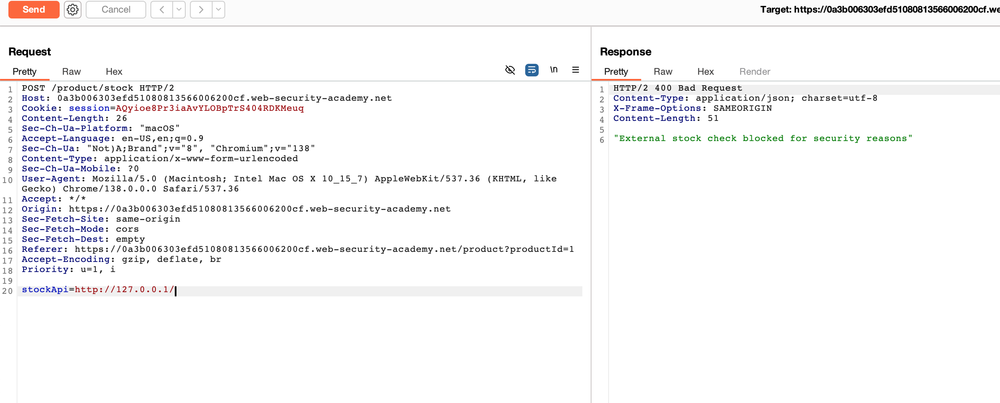
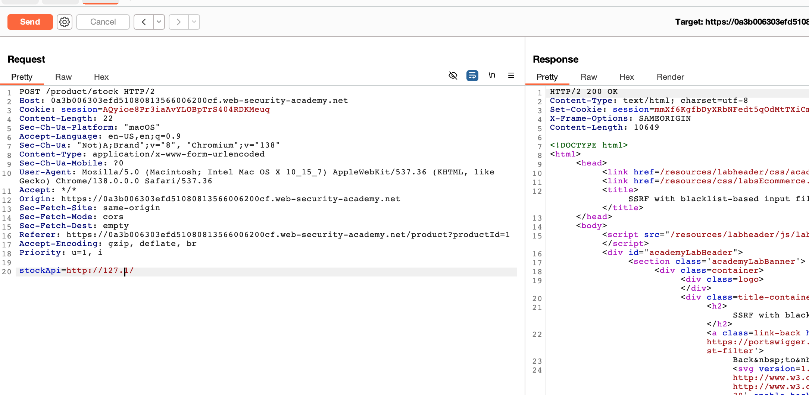
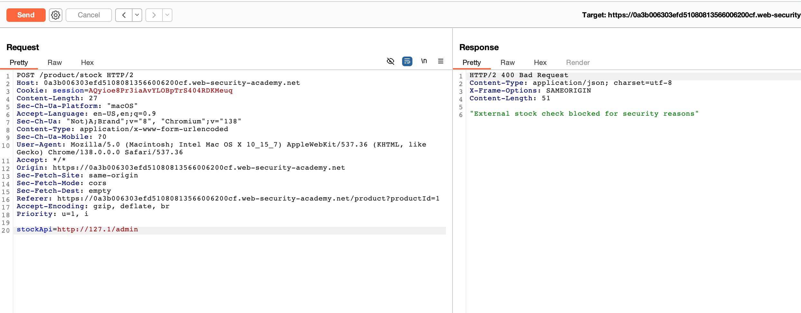
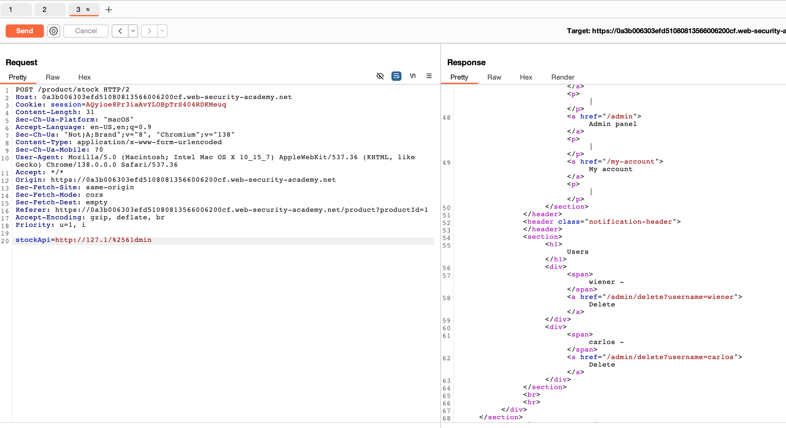
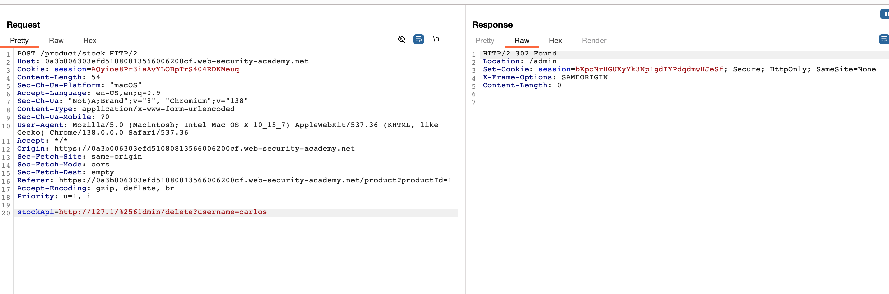
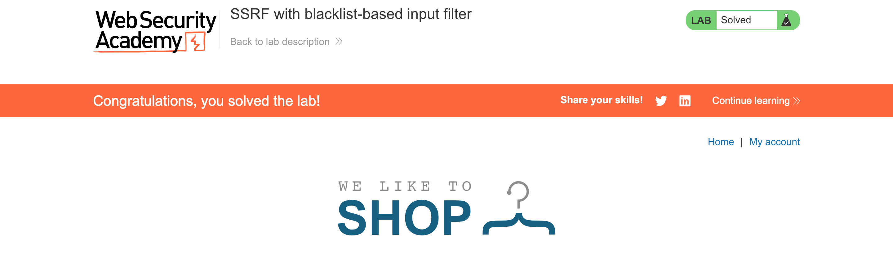

# Challenge: SSRF with Blacklist-Based Input Filter

Kategori: Server-Side Request Forgery
Poin: 3 Bintang
Tingkat Kesulitan: Menengah

## Deskripsi Challenge

Lab ini memiliki fitur pengecekan stok yang rentan terhadap SSRF. Aplikasi mencoba memblokir permintaan ke sistem internal menggunakan daftar hitam (blacklist). Untuk menyelesaikan lab, Anda perlu melewati filter untuk mengakses antarmuka admin dan menghapus pengguna `carlos`.

## Sumber Daya

[PortSwigger - SSRF with blacklist-based input filter](https://portswigger.net/web-security/ssrf/lab-ssrf-with-blacklist-filter)

## Langkah-langkah Penyelesaian

1.  Akses lab yang disediakan.
    

2.  Aktifkan interceptor pada Burp Suite, klik "Check stock", dan kirim request yang di-intercept ke Repeater.
    

3.  Ubah URL pada parameter `stockApi` menjadi `http://127.0.0.1`. Saat dikirim, terlihat bahwa permintaan diblokir karena filter daftar hitam.
    

4.  Coba lewati filter dengan menggunakan representasi IP alternatif. Ubah URL menjadi `http://127.1/`. Permintaan ini berhasil melewati filter IP.
    

5.  Selanjutnya, coba akses panel admin dengan menambahkan `/admin` ke URL. Permintaan ini kembali diblokir, menandakan kata "admin" juga ada di daftar hitam.
    

6.  Untuk melewati filter kata "admin", kita bisa melakukan obfuscation. Ubah huruf "a" menjadi bentuk URL-encoded ganda: `%2561`. Payload menjadi `http://127.1/%2561dmin`. Dengan ini, kita berhasil mengakses panel admin.
    

7.  Terakhir, hapus pengguna `carlos` dengan menggunakan payload yang sama: `http://127.1/%2561dmin/delete?username=carlos`.
    
    

## Refleksi

- **Status:** ✅ Berhasil
- **Akar Masalah:** Aplikasi menggunakan filter berbasis daftar hitam yang tidak lengkap untuk mencegah SSRF. Filter ini dapat dilewati menggunakan teknik obfuscation dan representasi IP alternatif.
- **Vektor Serangan:** SSRF dengan melewati filter daftar hitam.
- **Wawasan Kunci:**
  - Filter daftar hitam seringkali tidak efektif karena banyaknya cara untuk merepresentasikan data (seperti alamat IP atau string teks).
  - Menggunakan `127.1` adalah cara yang efektif untuk melewati filter yang hanya memblokir `127.0.0.1` atau `localhost`.
  - Obfuscation karakter (seperti URL encoding ganda) dapat digunakan untuk melewati filter kata kunci tertentu seperti "admin".