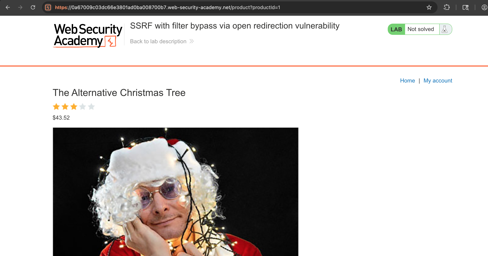
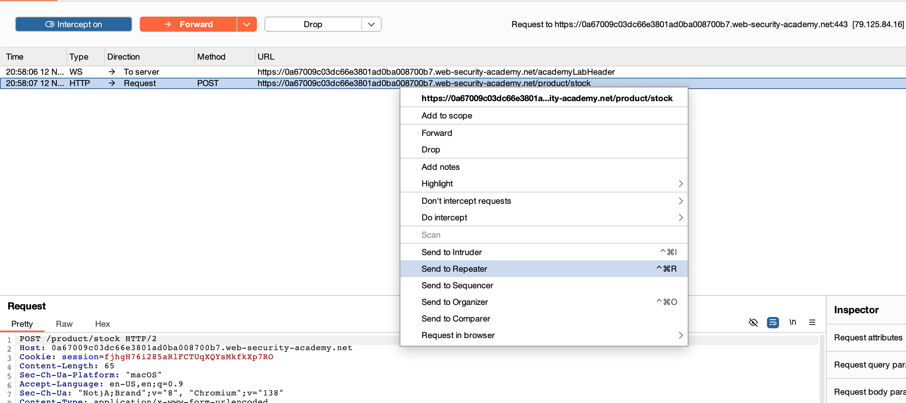
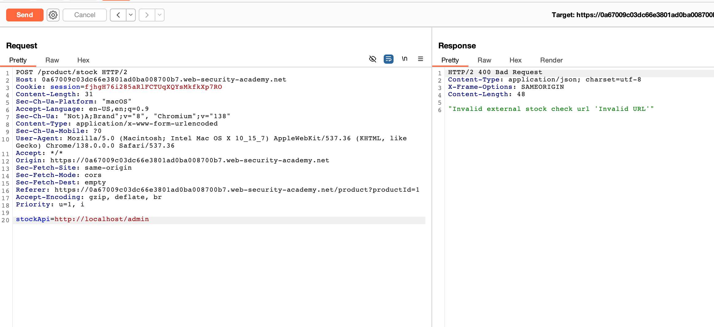
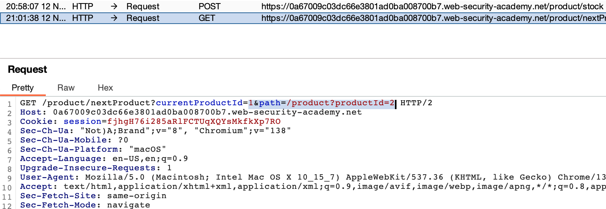
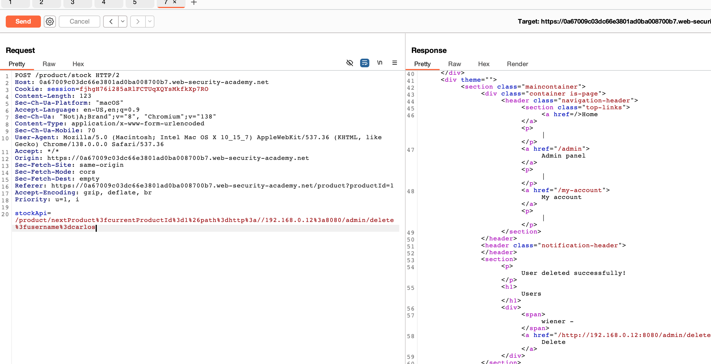

# Challenge: SSRF with filter bypass via open redirection vulnerability

Kategori: Server-Side Request Forgery
Poin: 3 Bintang
Tingkat Kesulitan: Menengah

## Deskripsi Challenge

Lab ini memiliki fitur pengecekan stok yang rentan terhadap SSRF, tetapi menggunakan filter untuk mencegah permintaan berbahaya. Untuk menyelesaikan lab, Anda perlu menemukan dan mengeksploitasi kerentanan pengalihan terbuka (open redirection) untuk melewati filter, mengakses antarmuka admin, dan menghapus pengguna `carlos`.

## Sumber Daya

[PortSwigger - SSRF with filter bypass via open redirection vulnerability](https://portswigger.net/web-security/ssrf/lab-ssrf-with-filter-bypass-via-open-redirection)

## Langkah-langkah Penyelesaian

1.  Akses lab dan lihat detail salah satu produk.
    

2.  Aktifkan interceptor pada Burp Suite, klik "Check stock", dan kirim request yang di-intercept ke Repeater.
    

3.  Saat mencoba mengubah parameter `stockApi` secara langsung ke alamat internal, permintaan diblokir oleh filter.
    

4.  Dengan mengklik "Next product", kita menemukan adanya fungsionalitas pengalihan (redirect) yang menggunakan parameter `&path=`. Ini adalah potensi kerentanan open redirection.
    

5.  Kita manfaatkan kerentanan open redirection ini untuk melewati filter SSRF. Ubah nilai parameter `stockApi` menjadi path yang mengeksploitasi redirect tersebut untuk mengakses panel admin dan menghapus pengguna `carlos`. Payloadnya akan terlihat seperti: `/product/nextProduct?path=http://192.168.0.1:8080/admin/delete?username=carlos`.
    
    Setelah mengirim request, pengguna `carlos` berhasil dihapus.

## Refleksi

- **Status:** ✅ Berhasil
- **Akar Masalah:** Aplikasi memiliki filter SSRF yang tidak memadai yang dapat dilewati dengan menggabungkannya dengan kerentanan open redirection yang ada di fungsionalitas lain.
- **Vektor Serangan:** SSRF yang digabungkan dengan Open Redirection.
- **Wawasan Kunci:**
  - Kerentanan yang tampaknya tidak berbahaya seperti open redirection bisa menjadi sangat kritis ketika digabungkan dengan kerentanan lain seperti SSRF.
  - Filter keamanan yang hanya memeriksa awal dari sebuah path URL dapat dengan mudah dilewati jika ada endpoint di dalam path yang diizinkan yang memiliki perilaku tak terduga (seperti redirect).
  - Penting untuk menguji semua titik akhir aplikasi untuk kerentanan, karena satu kerentanan dapat digunakan untuk memperparah yang lain.