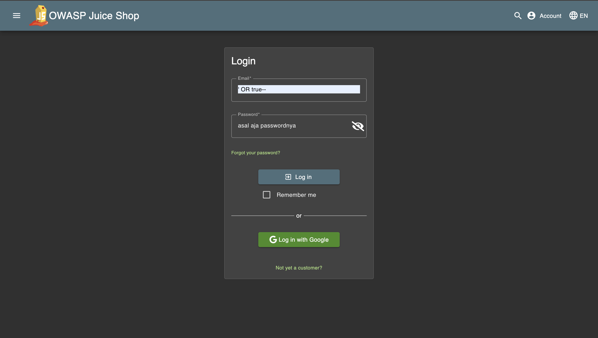
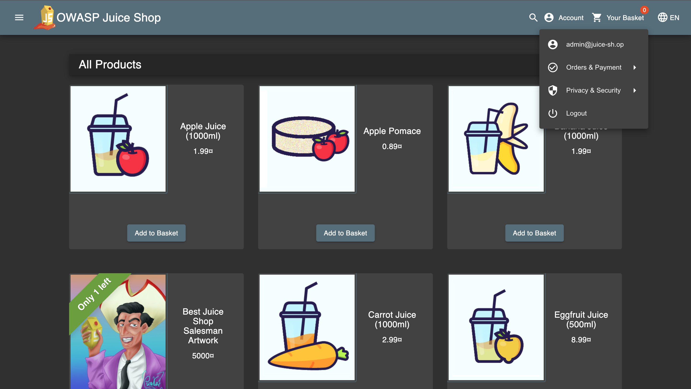

# Challenge: Login Admin

Category: Injection
Points: 2 Stars
Difficulty: Easy

## Challenge Description

Log in with the administrator's user account.

## Resource

[OWASP Juice Shop - Injection Challenges](https://juice-shop.herokuapp.com/#/score-board?categories=Injection)

## Step-by-Step Solution

1. Masuk ke login page
   
2. Lalu isi email dengan `' OR 1=1--` yang merupakan payload SQL Injection. Payload ini menutup string email yang asli, lalu menambahkan kondisi 'OR 1=1' yang selalu benar, dan mengomentari sisa query (seperti pengecekan password). Hal ini menyebabkan sistem menganggap kondisi login selalu terpenuhi.
   
3. Isi kata sandi dengan teks apa pun
   
4. Klik login dan lihat akunnya
   

## Reflection

- **Status:** ✅ Berhasil
- **Root Cause:** Query SQL pada login tidak memiliki validasi input yang proper
- **Attack Vector:** SQL injection melalui parameter email dengan payload `' OR 1=1--`
- **Key Insight:**
  - Payload `' OR 1=1--` berhasil bypass autentikasi dengan memanipulasi kondisi WHERE clause
  - Kondisi `1=1` selalu bernilai TRUE, sehingga query login selalu berhasil
  - Comment `--` mengabaikan pengecekan password, memungkinkan login tanpa password yang valid
  - Demonstrasi bagaimana SQL injection bisa digunakan untuk bypass authentication mechanism
