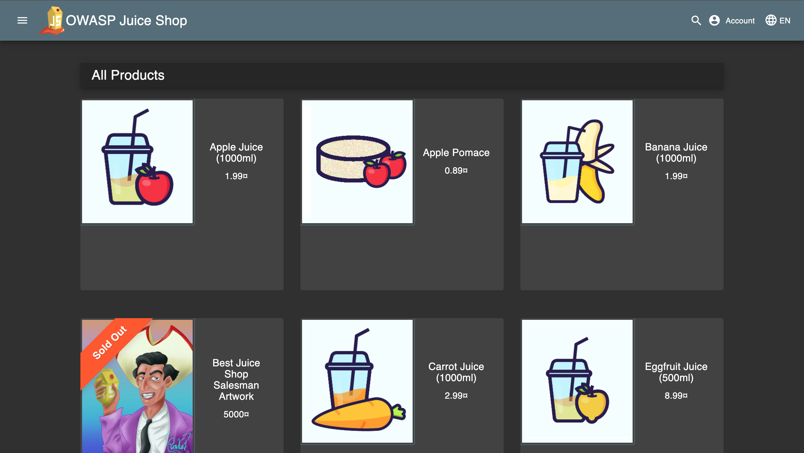
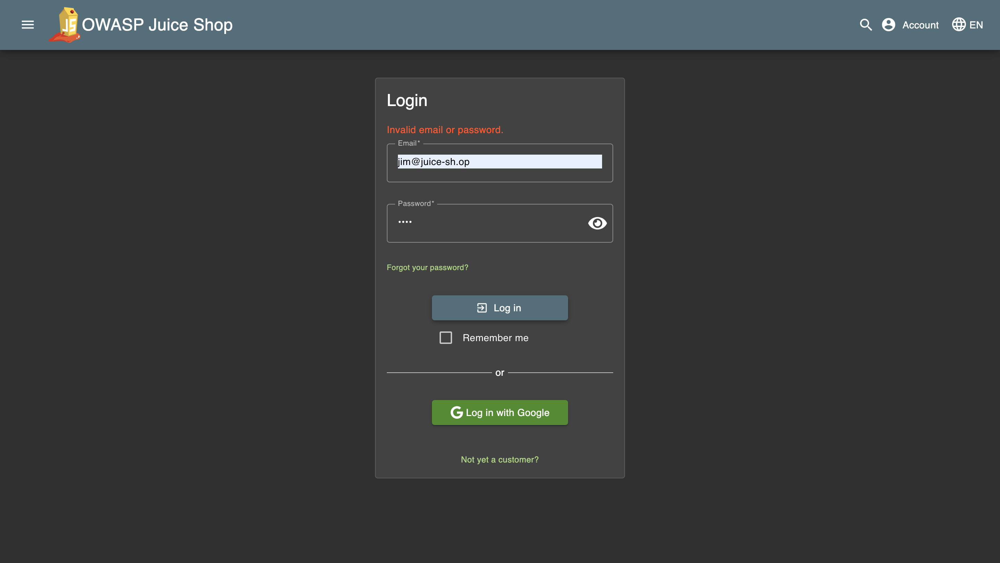
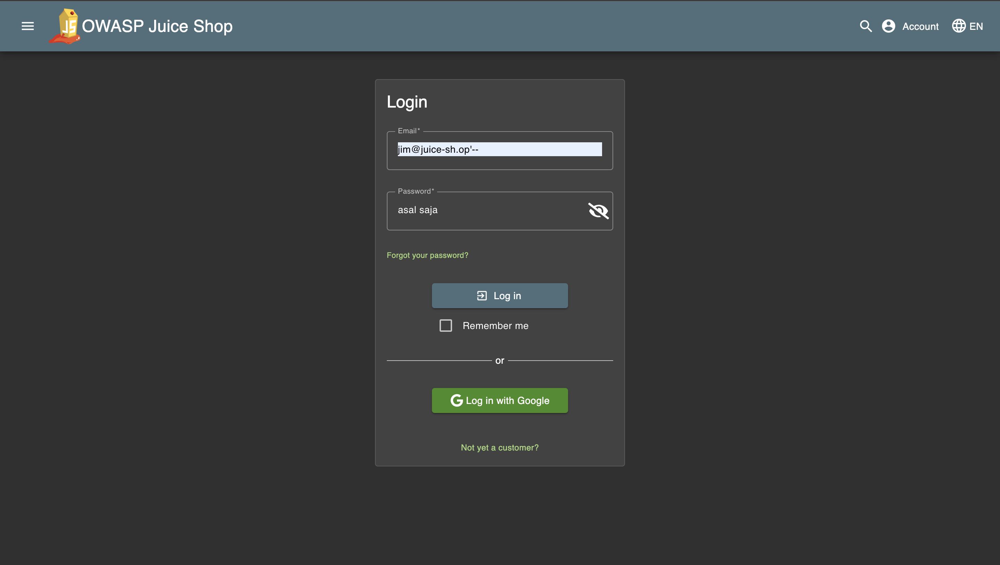
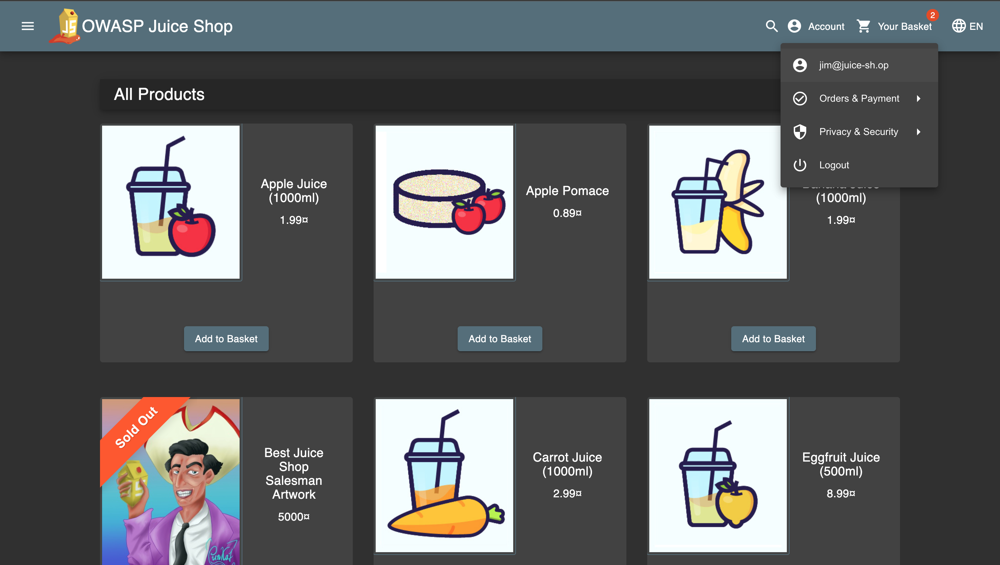

# Challenge: Login Jim

Category: Injection
Points: 3 Stars
Difficulty: Easy

## Challenge Description

Log in with the Jim's user account.

## Resource

[OWASP Juice Shop - Injection Challenges](https://juice-shop.herokuapp.com/#/score-board?categories=Injection)

## Step-by-Step Solution

1. Kita coba cari email jim di product reviews
   
2. Disini kita menemukan email dari Jim
   
3. Kita ke login page dan input email jim dan coba login tapi disini kita belum tau password
   
4. Tambahkan `'--` pada kolom email setelah `jim@juice-sh.op` untuk memanfaatkan kerentanan SQL Injection.
   
5. Kita berhasil login menggunakan akun jim
   

## Reflection

- **Status:** ✅ Berhasil
- **Root Cause:** Query SQL pada login tidak memiliki validasi input yang proper
- **Attack Vector:** SQL injection melalui parameter email dengan payload `' OR 1=1--`
- **Key Insight:**
  - Payload `' OR 1=1--` berhasil bypass autentikasi dengan memanipulasi kondisi WHERE clause
  - Kondisi `1=1` selalu bernilai TRUE, sehingga query login selalu berhasil
  - Comment `--` mengabaikan pengecekan password, memungkinkan login tanpa password yang valid
  - Demonstrasi bagaimana SQL injection bisa digunakan untuk bypass authentication mechanism
