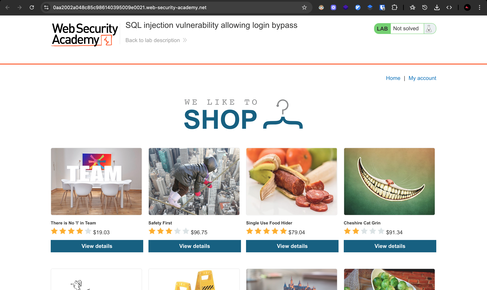
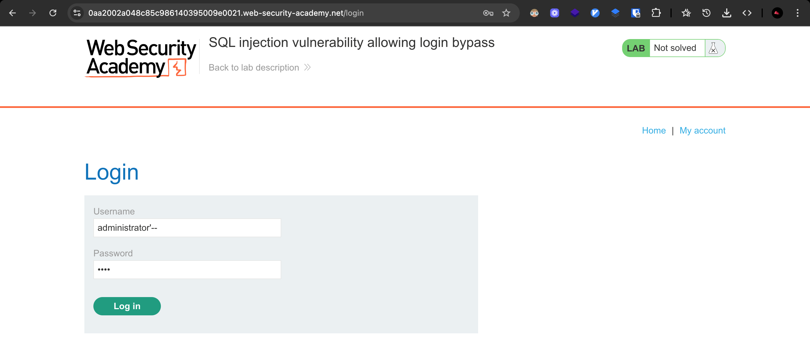
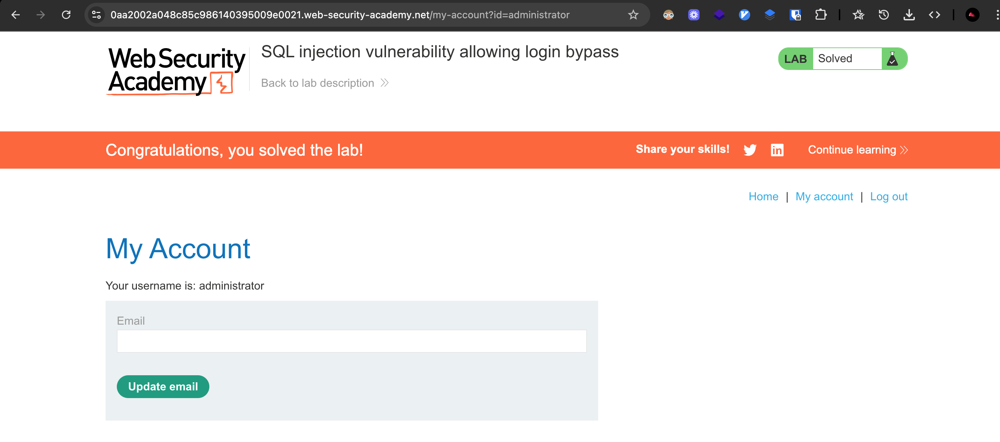

# Challenge: SQL Injection Login Bypass

Lab: SQL injection vulnerability allowing login bypass

## Challenge Description

This lab contains a SQL injection vulnerability in the login function.

To solve the lab, perform a SQL injection attack that logs in to the application as the administrator user.

## Resource

[Port Swigger - SQL Injection (login bypass)](https://portswigger.net/web-security/sql-injection/lab-login-bypass)

## Step-by-Step Solution

1. **Akses Lab**
   Buka lab SQL injection untuk login bypass
   

2. **Bypass Authentication**
   Login sebagai administrator dengan menambahkan payload SQL injection:

   - **Username:** `administrator`
   - **Password:** `'--`

   **Penjelasan Payload:**

   - `'` - Menutup string parameter password
   - `--` - Comment untuk mengabaikan sisa query (termasuk pengecekan password)

   **Cara Kerja:**

   - Query asli: `SELECT * FROM users WHERE username = 'administrator' AND password = 'password'`
   - Query setelah injection: `SELECT * FROM users WHERE username = 'administrator' AND password = ''--'`
   - Hasil: Query hanya mengecek username, mengabaikan pengecekan password

   

3. **Verifikasi Login**
   Konfirmasi bahwa login berhasil sebagai administrator
   

## Reflection

- **Status:** ✅ Berhasil
- **Root Cause:** Login function tidak memiliki validasi input yang proper untuk SQL injection
- **Attack Vector:** SQL injection melalui parameter password untuk bypass authentication
- **Key Insight:**
  - Berhasil menggunakan comment `--` untuk mengabaikan pengecekan password
  - Payload `'--` memungkinkan login hanya dengan username yang valid
  - Demonstrasi bagaimana SQL injection bisa digunakan untuk bypass authentication mechanism
  - Teknik ini memungkinkan attacker untuk login tanpa mengetahui password yang benar
  - Single quote `'` menutup string parameter, comment `--` mengabaikan sisa query
  - Vulnerability ini sangat berbahaya karena memungkinkan unauthorized access
