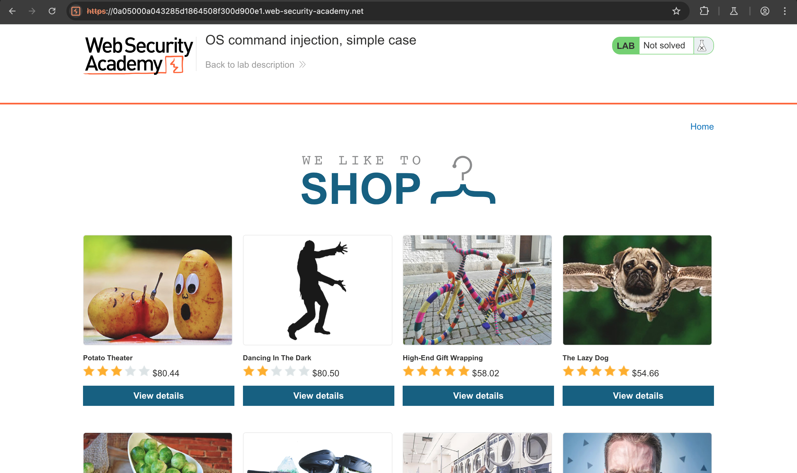
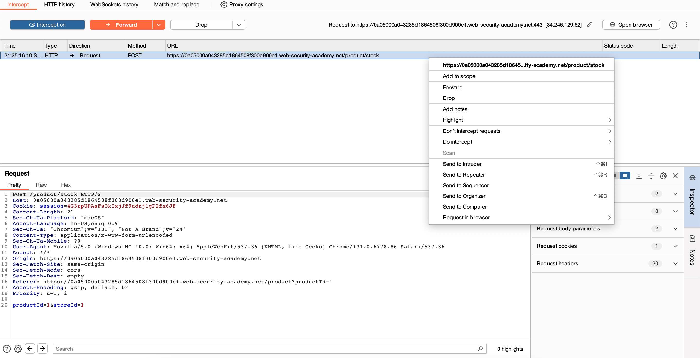
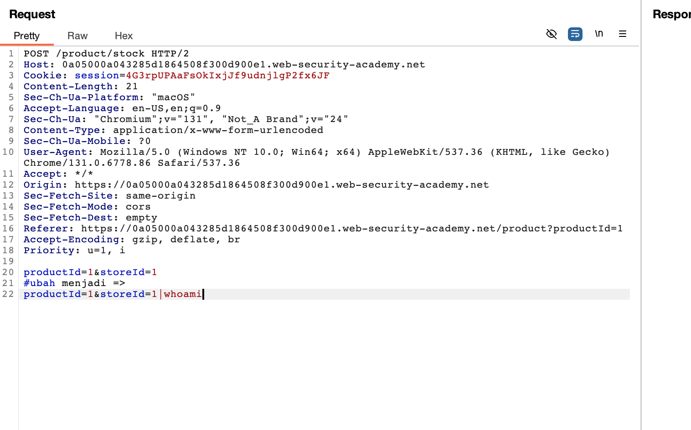
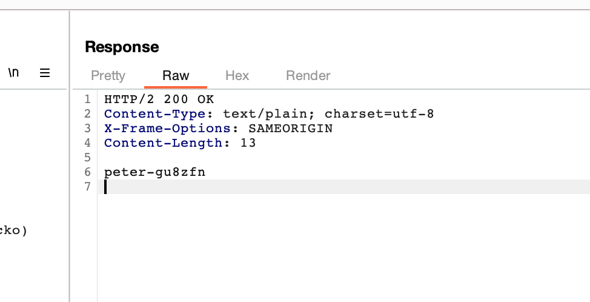
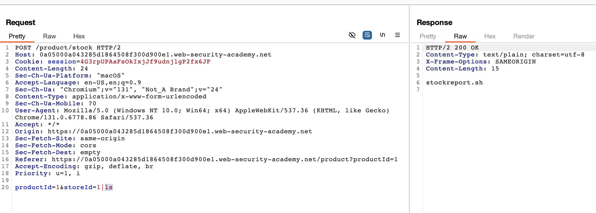
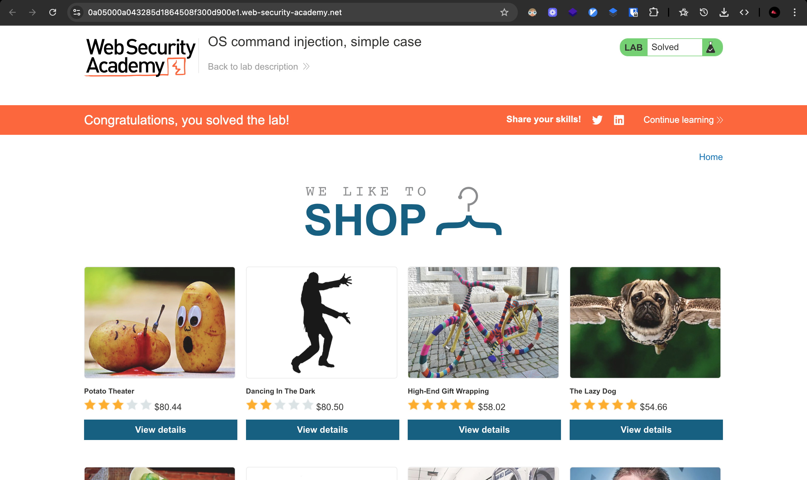

# Challenge: OS Command Injection

Lab: OS command injection, simple case

## Challenge Description

This lab contains an OS command injection vulnerability in the product stock checker.

The application executes a shell command containing user-supplied product and store IDs, and returns the raw output from the command in its response.

To solve the lab, execute the whoami command to determine the name of the current user.

## Resource

[Port Swigger - OS Command Injection (simple case)](https://portswigger.net/web-security/os-command-injection/lab-simple)

## Step-by-Step Solution

1. **Akses Lab**
   Buka lab OS command injection
   

2. **Setup Interception**
   Lakukan intercept saat melakukan cek stock dan dapatkan request untuk dikirim ke repeater
   

3. **Inject OS Command**
   Ubah parameter `storeId` menjadi payload command injection:

   ```
   storeId: 1|whoami
   ```

   **Penjelasan Payload:**

   - `1` - Store ID yang valid
   - `|` - Pipe operator untuk menjalankan command kedua
   - `whoami` - Command untuk menampilkan username saat ini

   **Cara Kerja:**

   - Command asli: `stock-checker 1 2` (productId storeId)
   - Command setelah injection: `stock-checker 1 1|whoami`
   - Hasil: Menjalankan stock-checker dan command whoami secara bersamaan

   

4. **Verifikasi Command Execution**
   Saat request dikirim, command `whoami` akan dieksekusi dan menampilkan username
   

5. **Test Command Lainnya**
   Kita juga bisa menjalankan command lain seperti `ls` untuk melihat list direktori

   ```
   storeId: 1|ls
   ```

   

6. **Konfirmasi Success**
   Berhasil menyelesaikan challenge dengan mengeksekusi OS command
   

## Reflection

- **Status:** ✅ Berhasil
- **Root Cause:** Parameter storeId tidak memiliki validasi input yang proper untuk OS command injection
- **Attack Vector:** OS command injection melalui parameter storeId menggunakan pipe operator
- **Key Insight:**
  - Berhasil menggunakan pipe operator `|` untuk menjalankan command tambahan
  - Payload `1|whoami` memungkinkan eksekusi arbitrary OS commands
  - Demonstrasi bagaimana command injection bisa digunakan untuk system reconnaissance
  - Teknik ini memungkinkan attacker untuk mengeksekusi command pada server
  - Pipe operator `|` memungkinkan chaining multiple commands
  - Vulnerability ini sangat berbahaya karena memungkinkan remote code execution
