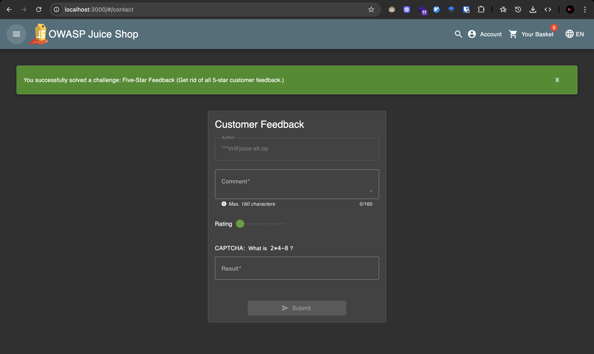
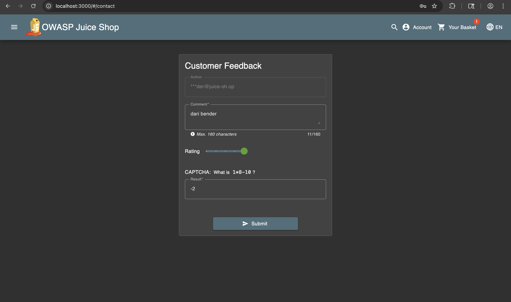
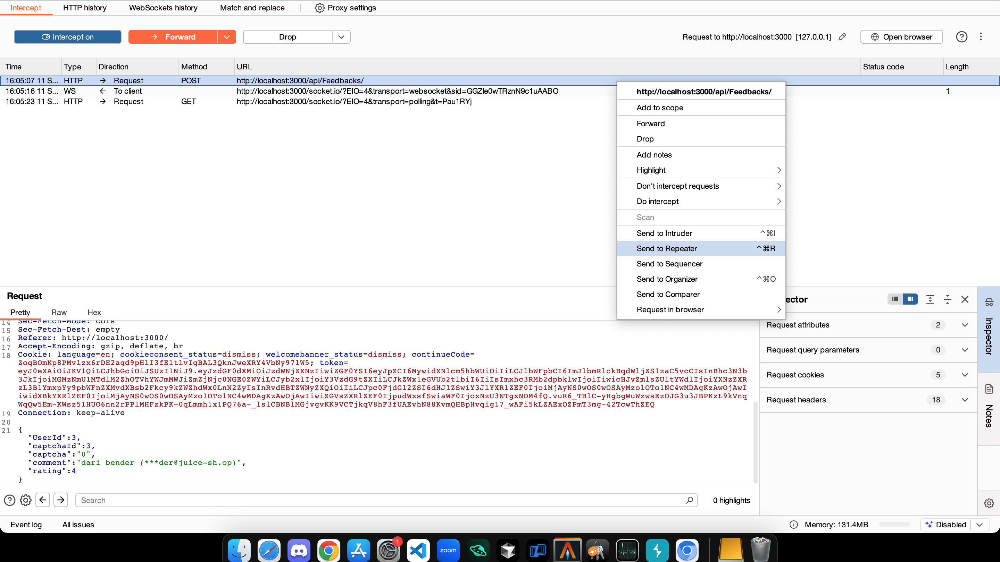
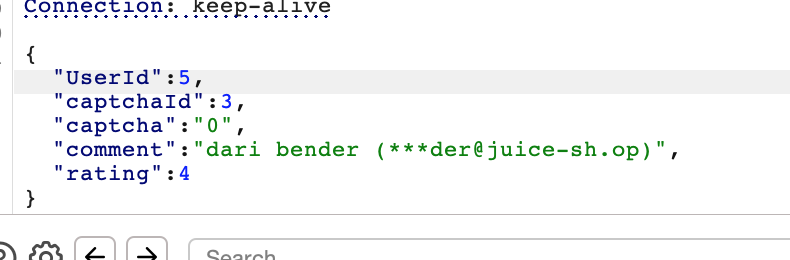
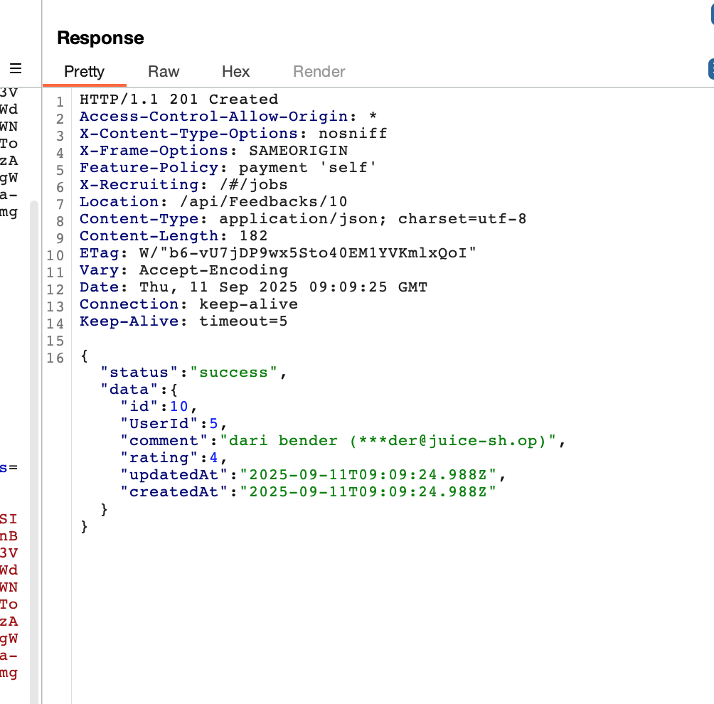
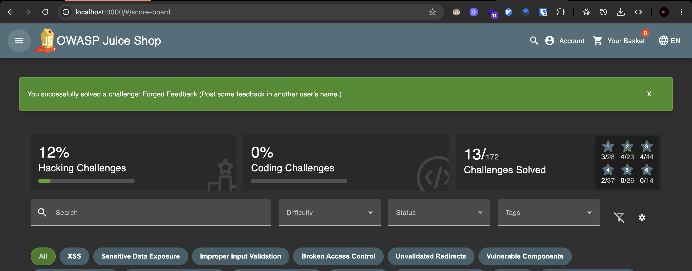

# Challenge: Forged Feedback

Category: Broken Access Control
Points: 3 Stars
Difficulty: Medium

## Challenge Description

Post a product review as another user or edit any user's existing review.

## Resource

[OWASP Juice Shop - Broken Access Control Challenges](https://juice-shop.herokuapp.com/#/score-board?categories=Broken%20Access%20Control)

## Step-by-Step Solution

1. **Akses Halaman Feedback**
   Buka halaman feedback untuk melihat form review
   

2. **Setup Interception**
   Aktifkan Burp Suite interceptor dan submit feedback untuk menangkap request
   

3. **Capture Request**
   Kirim request feedback ke Burp Repeater untuk modifikasi
   

4. **Manipulasi User ID**
   Modifikasi parameter `userId` dalam request untuk memalsukan feedback sebagai user lain

   **Penjelasan Attack:**

   - Awalnya `userId` adalah 3 (milik bender@juice-sh.op)
   - Ubah `userId` menjadi 5 (user lain)
   - Tidak ada validasi server-side untuk memastikan user hanya bisa post feedback dengan ID mereka sendiri

   

5. **Verifikasi Success**
   Berhasil membuat feedback dengan memalsukan identitas user lain
   
   

## Reflection

- **Status:** ✅ Berhasil
- **Root Cause:** Feedback submission tidak memiliki validasi server-side yang proper untuk user ID
- **Attack Vector:** Manipulasi parameter userId dalam request untuk memalsukan feedback
- **Key Insight:**
  - Berhasil menggunakan parameter manipulation untuk bypass access control
  - Parameter `userId` di client-side tidak divalidasi di server-side
  - Demonstrasi bagaimana broken access control bisa digunakan untuk identity spoofing
  - Teknik ini memungkinkan attacker untuk memposting feedback atas nama user lain
  - Request manipulation memungkinkan unauthorized impersonation
  - Vulnerability ini berbahaya karena memungkinkan reputation manipulation dan identity fraud
