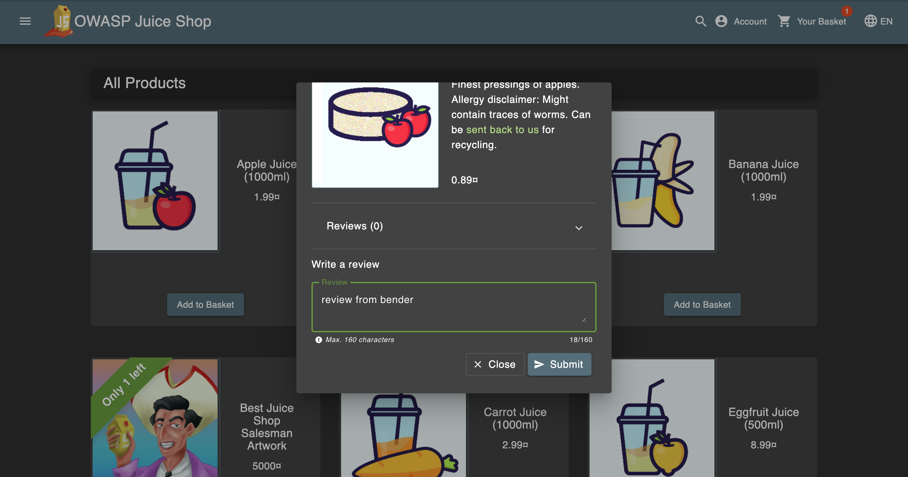
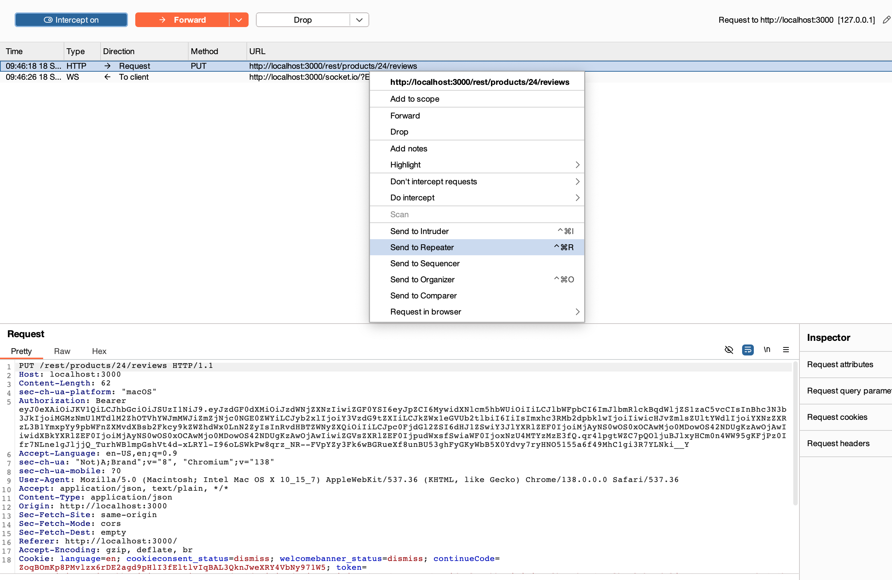
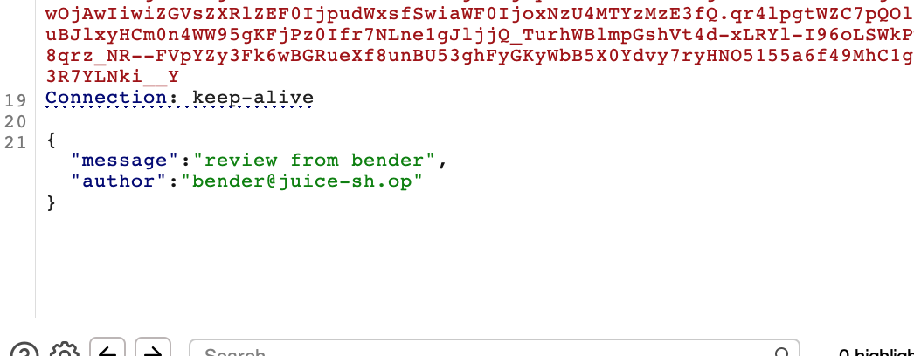
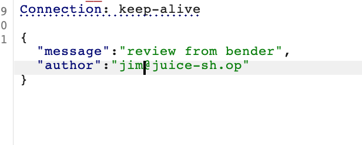
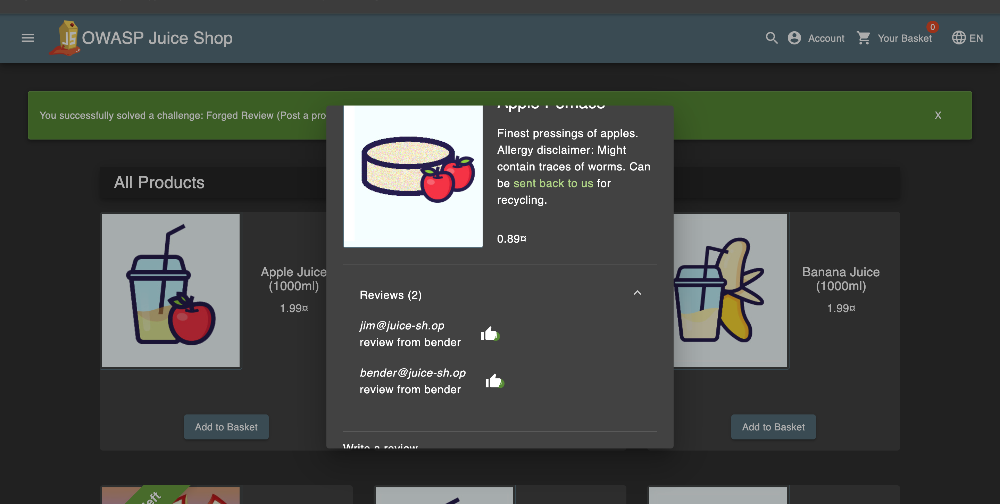

# Challenge: Forged Review

Category: Broken Access Control
Points: 3 Stars
Difficulty: Medium

## Challenge Description

Post a product review as another user or edit any user's existing review.

## Resource

[OWASP Juice Shop - Broken Access Control Challenges](https://juice-shop.herokuapp.com/#/score-board?categories=Broken%20Access%20Control)

## Step-by-Step Solution

1. **Buat Review di Produk**
   Buat review di produk untuk memahami alur request normal
   

2. **Setup Interception**
   Nyalakan intercept di Burp Suite dan kirim request ke repeater untuk modifikasi
   

3. **Identifikasi Parameter Author**
   Lihat parameter `author` dalam request yang bisa dimanipulasi
   

4. **Modifikasi Author**
   Ubah parameter `author` menjadi "jim@juice-sh.op" untuk memalsukan review sebagai user lain

   **Penjelasan Attack:**

   - Parameter `author` di client-side tidak divalidasi di server-side
   - Tidak ada pengecekan untuk memastikan user hanya bisa post review dengan nama mereka sendiri
   - Manipulasi parameter memungkinkan identity spoofing

   

5. **Verifikasi Success**
   Berhasil membuat review dengan author yang berbeda (jim)
   

## Reflection

- **Status:** ✅ Berhasil
- **Root Cause:** Review submission tidak memiliki validasi server-side yang proper untuk parameter author
- **Attack Vector:** Manipulasi parameter author dalam request untuk memalsukan review
- **Key Insight:**
  - Berhasil menggunakan parameter manipulation untuk bypass access control
  - Parameter `author` di client-side tidak divalidasi di server-side
  - Demonstrasi bagaimana broken access control bisa digunakan untuk identity spoofing
  - Teknik ini memungkinkan attacker untuk memposting review atas nama user lain
  - Request manipulation memungkinkan unauthorized impersonation
  - Vulnerability ini berbahaya karena memungkinkan reputation manipulation dan identity fraud
