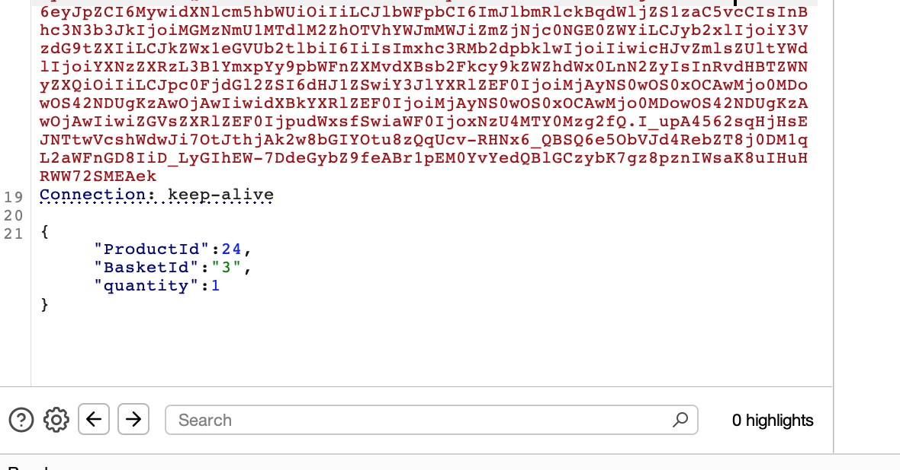
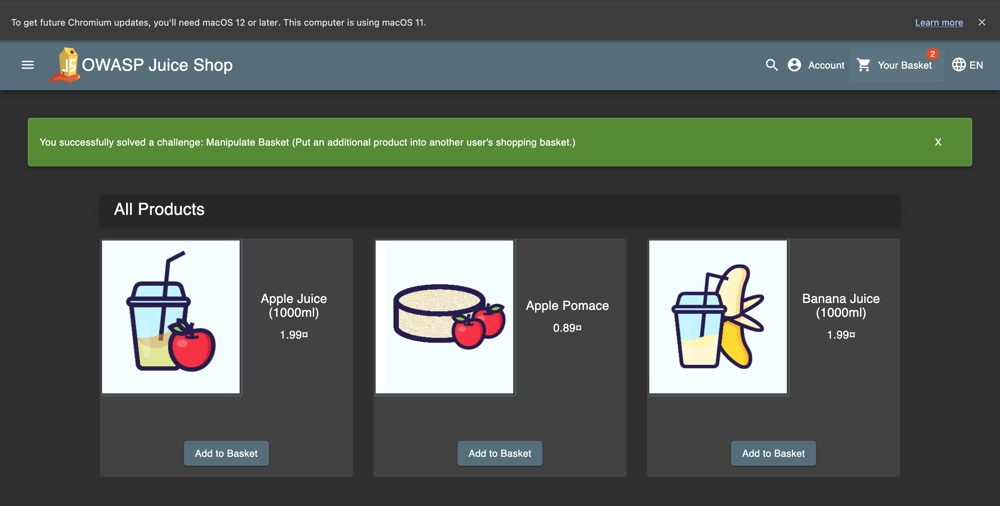

# Challenge: Manipulate Basket

Category: Broken Access Control
Points: 3 Stars
Difficulty: Medium

## Challenge Description

Manipulate someone else's shopping basket.

## Resource

[OWASP Juice Shop - Broken Access Control Challenges](https://juice-shop.herokuapp.com/#/score-board?categories=Broken%20Access%20Control)

## Step-by-Step Solution

1. **Setup Interception**
   Nyalakan intercept untuk mendapatkan HTTP request yang digunakan untuk menambah item ke basket, lalu kirim ke repeater
   

2. **Analisis Payload**
   Payload memiliki parameter `BasketId` yang bisa dimanipulasi
   

3. **Test Manipulasi BasketId**
   Coba ganti `BasketId` dengan ID yang berbeda, tapi malah ada error

   **Penjelasan:**

   - Mengganti `BasketId` dengan ID yang tidak valid menyebabkan error
   - Perlu strategi yang berbeda untuk manipulasi basket

   

4. **Parameter Pollution Attack**
   Lakukan parameter pollution dengan menambahkan `BasketId` tambahan

   **Penjelasan Attack:**

   - Parameter pollution memungkinkan override nilai parameter
   - Menambahkan `BasketId` tambahan bisa memanipulasi target basket
   - Teknik ini memungkinkan akses ke basket user lain

   

5. **Verifikasi Success**
   Berhasil menambahkan produk ke `BasketId: 1` (basket user lain)
   
   
   

## Reflection

- **Status:** ✅ Berhasil
- **Root Cause:** Aplikasi tidak memiliki validasi yang proper untuk parameter pollution pada BasketId
- **Attack Vector:** Parameter pollution attack untuk memanipulasi target basket
- **Key Insight:**
  - Berhasil menggunakan parameter pollution untuk override BasketId
  - Menambahkan parameter `BasketId` tambahan memungkinkan manipulasi target basket
  - Demonstrasi bagaimana broken access control bisa digunakan untuk unauthorized basket manipulation
  - Teknik ini memungkinkan attacker untuk menambahkan item ke basket user lain
  - Parameter pollution memungkinkan bypass access control mechanism
  - Vulnerability ini berbahaya karena memungkinkan unauthorized modification of user data
