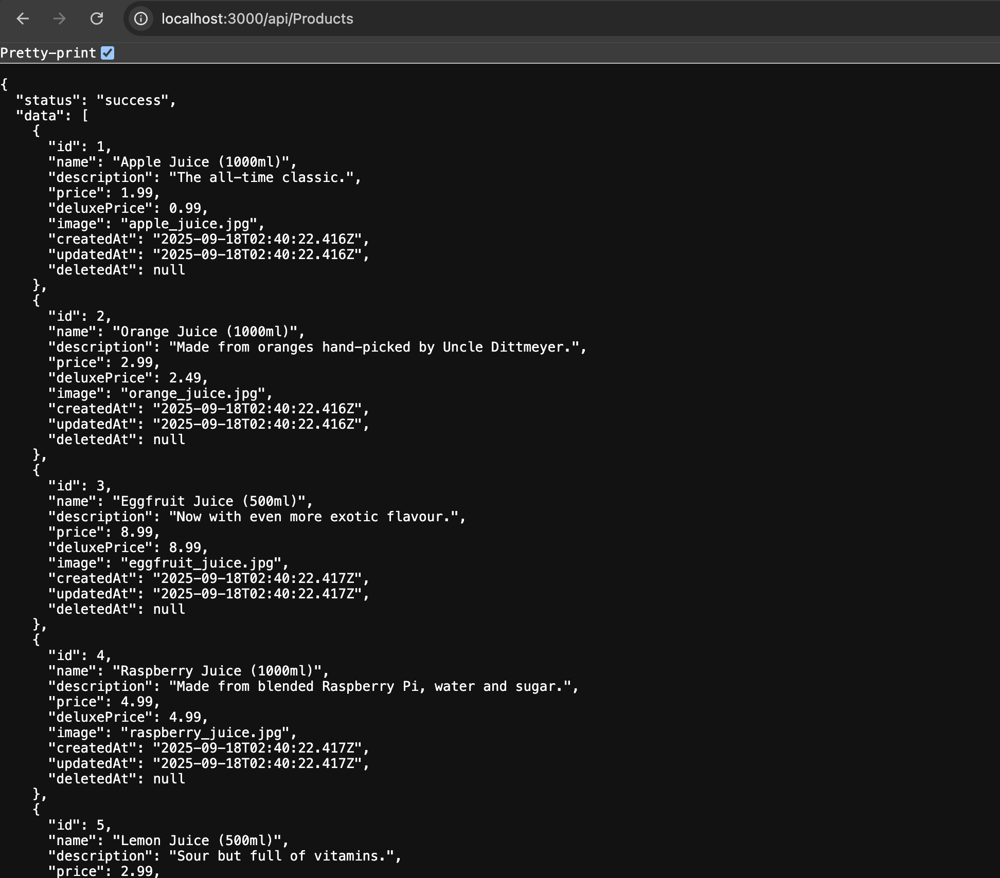
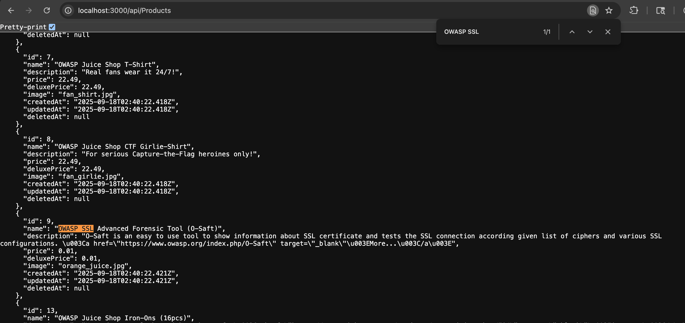
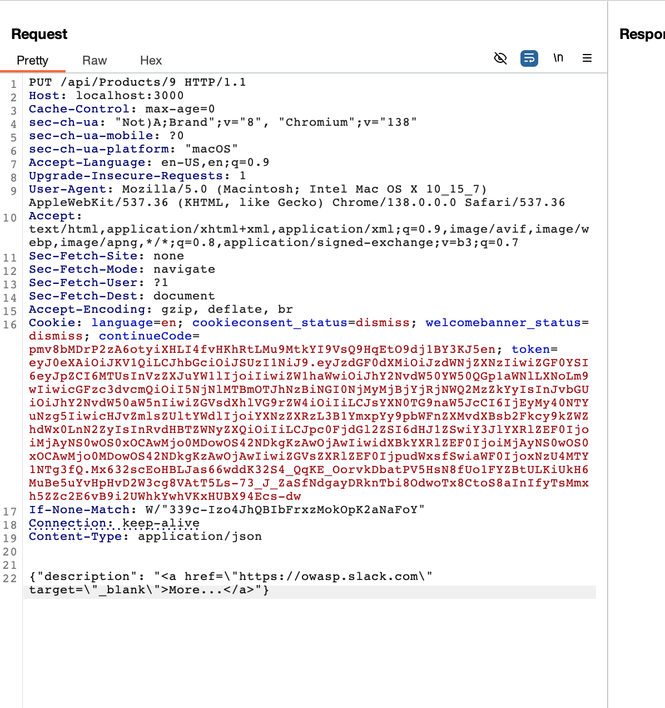
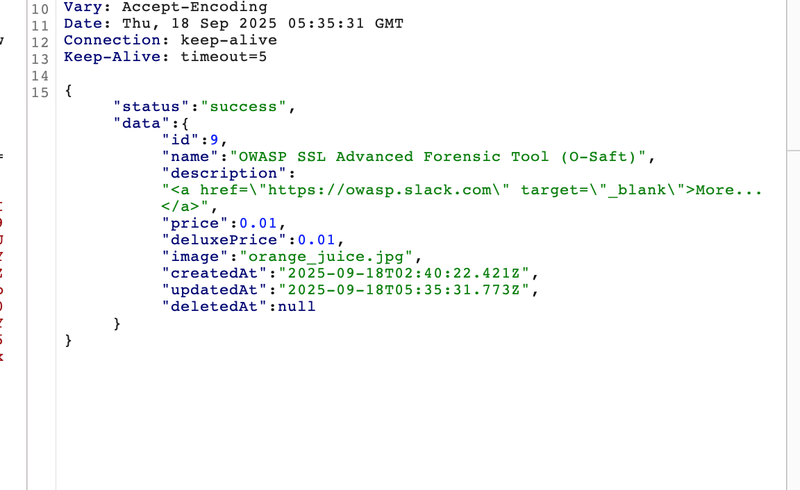
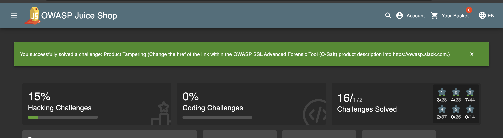

# Challenge: Product Tampering

Category: Broken Access Control
Points: 3 Stars
Difficulty: Medium

## Challenge Description

Manipulate a product that does not belong to you.

## Resource

[OWASP Juice Shop - Broken Access Control Challenges](https://juice-shop.herokuapp.com/#/score-board?categories=Broken%20Access%20Control)

## Step-by-Step Solution

1. **Akses Endpoint Products**
   Akses endpoint `/api/Products` yang sudah diketahui dari challenge sebelumnya
   

2. **Identifikasi Target Product**
   Cari product yang ingin di-tampering menggunakan fitur search
   

3. **Modifikasi Request**
   Intercept request `/api/Products` dan kirim ke repeater untuk modifikasi:

   **Modifikasi yang dilakukan:**

   - Ubah request method menjadi `PUT`
   - Tambahkan ID produk di endpoint: `/api/Products/9`
   - Tambahkan `Content-Type: application/json`
   - Modifikasi payload untuk mengubah deskripsi produk

   **Penjelasan Attack:**

   - Endpoint tidak memiliki validasi untuk memastikan hanya owner yang bisa mengubah produk
   - PUT method memungkinkan update data produk
   - Tidak ada authorization check untuk product modification

   

4. **Verifikasi Success**
   Berhasil melakukan product tampering dengan mengubah link pada deskripsi produk O-Saft
   
   

## Reflection

- **Status:** ✅ Berhasil
- **Root Cause:** Endpoint `/api/Products` tidak memiliki validasi authorization yang proper untuk product modification
- **Attack Vector:** Direct API manipulation menggunakan PUT method untuk mengubah produk yang bukan milik user
- **Key Insight:**
  - Berhasil menggunakan direct API access untuk memodifikasi produk
  - PUT method memungkinkan update data tanpa proper authorization check
  - Demonstrasi bagaimana broken access control bisa digunakan untuk unauthorized data modification
  - Teknik ini memungkinkan attacker untuk mengubah produk yang bukan miliknya
  - API endpoint tidak memvalidasi ownership sebelum mengizinkan modification
  - Vulnerability ini berbahaya karena memungkinkan unauthorized modification of product data
