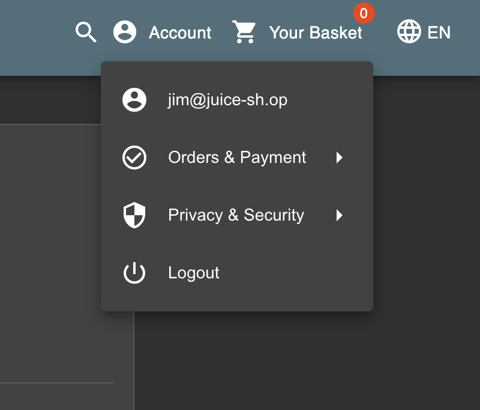
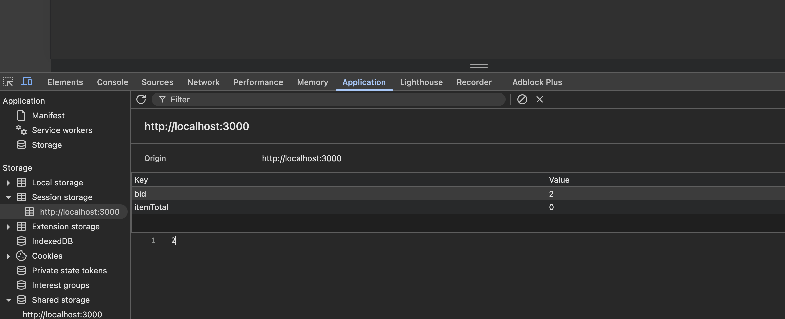
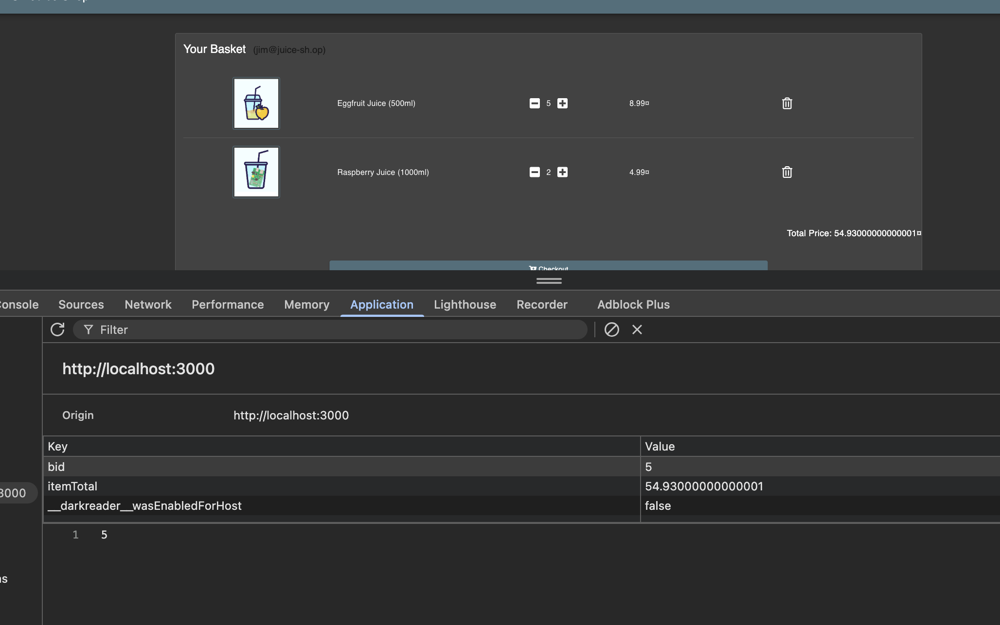

# Challenge: View Basket

Category: Broken Access Control
Points: 3 Stars
Difficulty: Medium

## Challenge Description

View another user's shopping basket.

## Resource

[OWASP Juice Shop - Broken Access Control Challenges](https://juice-shop.herokuapp.com/#/score-board?categories=Broken%20Access%20Control)

## Step-by-Step Solution

1. **Login dengan User Account**
   Login menggunakan akun user, misalnya jim@juice-sh.op
   

2. **Inspect Session Storage**
   Buka Developer Tools dan periksa tab Application, lihat bagian Session Storage
   

3. **Manipulasi Basket ID**
   Terlihat ada `bid` (basket ID) yang bisa dimanipulasi. Ganti nilai `bid` dengan ID basket user lain dan reload halaman

   **Penjelasan Attack:**

   - `bid` - Parameter yang menyimpan basket ID di session storage
   - Manipulasi nilai `bid` memungkinkan akses ke basket user lain
   - Tidak ada validasi server-side untuk memastikan user hanya bisa akses basket miliknya

   

4. **Verifikasi Success**
   Berhasil melihat basket user lain tanpa otorisasi yang proper
   

## Reflection

- **Status:** ✅ Berhasil
- **Root Cause:** Aplikasi tidak memiliki validasi server-side yang proper untuk basket ID
- **Attack Vector:** Manipulasi client-side session storage untuk mengakses data user lain
- **Key Insight:**
  - Berhasil menggunakan manipulasi session storage untuk bypass access control
  - Parameter `bid` di client-side tidak divalidasi di server-side
  - Demonstrasi bagaimana broken access control bisa digunakan untuk unauthorized data access
  - Teknik ini memungkinkan attacker untuk melihat shopping basket user lain
  - Session storage manipulation memungkinkan privilege escalation
  - Vulnerability ini berbahaya karena memungkinkan akses ke data pribadi user lain
