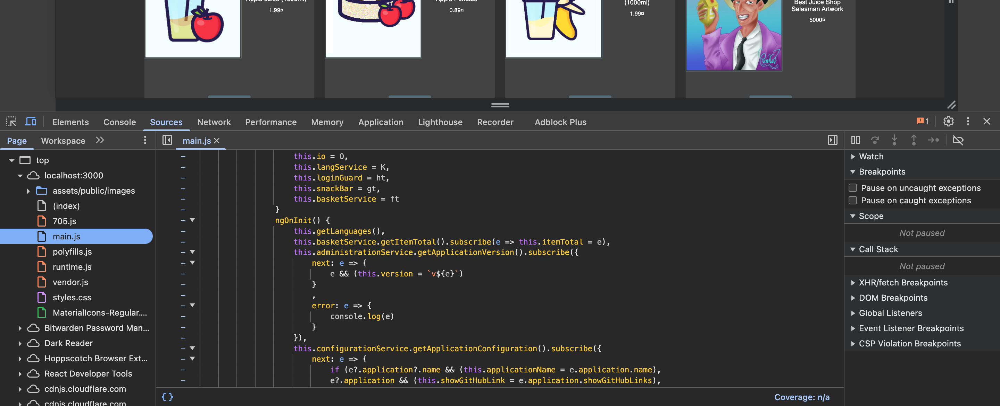
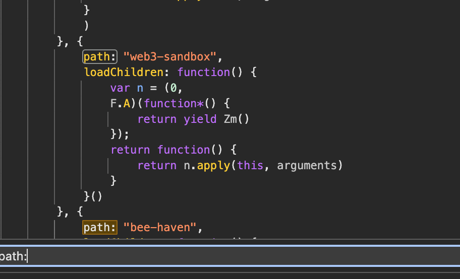
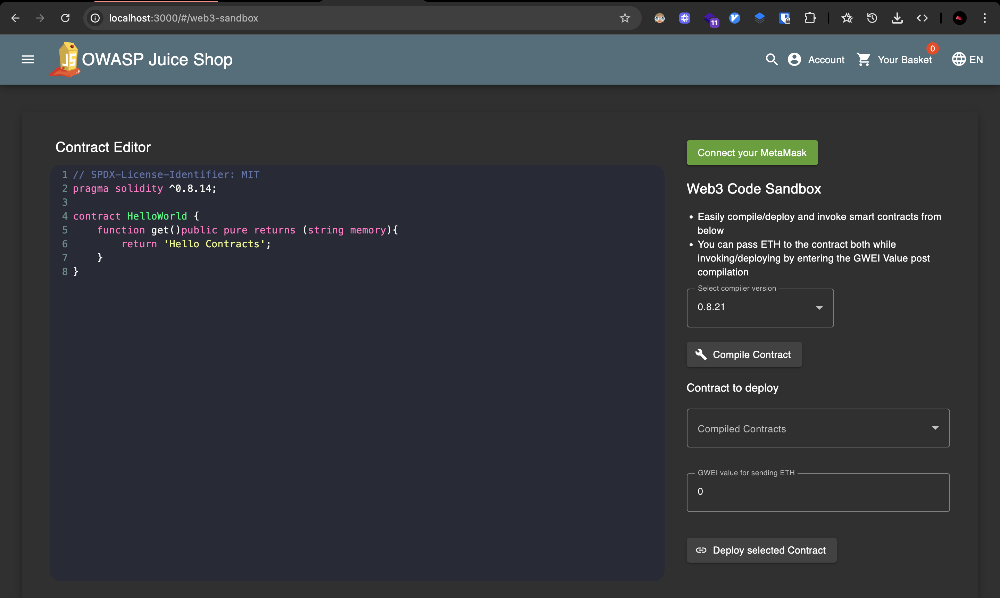

# Challenge: Web3 Sandbox

Category: Broken Access Control
Points: 1 Stars
Difficulty: Easy

## Challenge Description

Access the hidden Web3 sandbox page.

## Resource

[OWASP Juice Shop - Broken Access Control Challenges](https://juice-shop.herokuapp.com/#/score-board?categories=Broken%20Access%20Control)

## Step-by-Step Solution

1. **Analisis Source Code**
   Cari halaman tersembunyi dengan menganalisis file JavaScript utama (main.js) di tab Sources

   **Penjelasan:**

   - Source code analysis membantu menemukan route atau endpoint yang tersembunyi
   - File main.js biasanya berisi routing configuration untuk SPA (Single Page Application)
   - Route yang tidak terlihat di UI mungkin masih bisa diakses secara langsung

   

2. **Identifikasi Hidden Route**
   Gunakan fitur "Find" dengan keyword "path:" untuk melihat semua path yang tersedia dalam aplikasi

   **Penjelasan:**

   - Keyword "path:" membantu menemukan route definitions
   - Route `web3-sandbox` ditemukan dalam source code
   - Route ini tidak terlihat di navigasi utama aplikasi

   

3. **Akses Hidden Page**
   Berhasil menemukan dan mengakses halaman Web3 sandbox yang tersembunyi
   

## Reflection

- **Status:** ✅ Berhasil
- **Root Cause:** Hidden route tidak memiliki proper access control dan dapat diakses melalui source code analysis
- **Attack Vector:** Source code analysis dan direct URL access untuk menemukan hidden functionality
- **Key Insight:**
  - Berhasil menggunakan source code analysis untuk menemukan hidden routes
  - Route `web3-sandbox` tersembunyi dari navigasi utama tapi masih bisa diakses
  - Demonstrasi bagaimana broken access control bisa digunakan untuk unauthorized access ke hidden features
  - Teknik ini memungkinkan attacker untuk menemukan dan mengakses functionality yang tidak terlihat
  - Source code analysis memungkinkan discovery of hidden endpoints
  - Vulnerability ini berbahaya karena memungkinkan akses ke fitur yang seharusnya tidak terlihat
