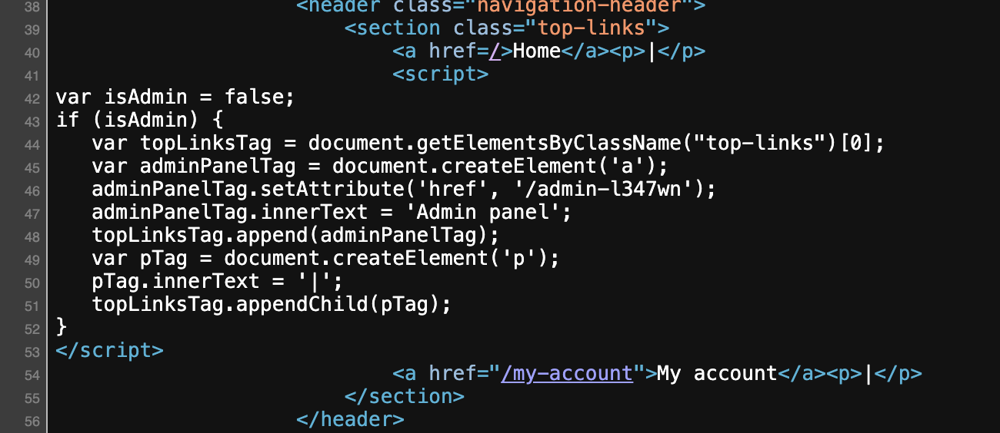
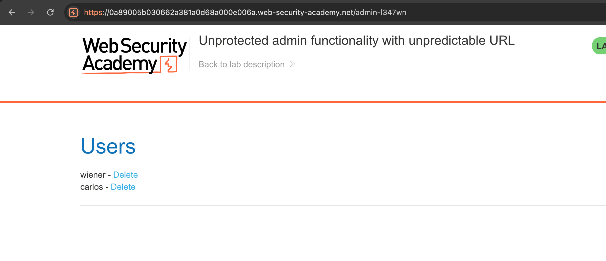
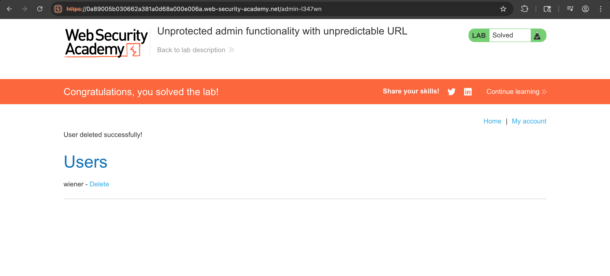

# Challenge: Unprotected Admin Functionality (Unpredictable URL)

Category: Broken Access Control
Level: Apprentice

## Challenge Description

This lab exposes an unprotected admin panel hidden behind an unpredictable URL. Your task is to discover the URL and delete the user carlos.

## Resource

[PortSwigger - Unprotected admin functionality with unpredictable URL](https://portswigger.net/web-security/access-control/lab-unprotected-admin-functionality-with-unpredictable-url)

## Step-by-Step Solution

1. **Akses Lab dan Inspect Source**
   Buka lab, kemudian inspect page source untuk mencari petunjuk URL admin
   

   - Temukan file JavaScript yang mengungkapkan path admin panel
   - Unpredictable URL sering di-hardcode di client-side script

2. **Akses Admin Panel**
   Kunjungi path admin yang ditemukan dan gunakan fungsi delete user
   

3. **Hapus User Carlos**
   Hapus user `carlos` dari admin panel
   

## Reflection

- Status: ✅ Berhasil
- Root Cause: Admin panel disembunyikan dengan URL tidak terduga, tetapi tetap tanpa access control
- Attack Vector: Source code analysis (client-side JS) untuk menemukan hidden admin URL + direct access
- Key Insight:
  - Security by obscurity tidak cukup tanpa access control yang proper
  - Client-side code dapat membocorkan sensitive endpoints
  - Broken access control memungkinkan unauthorized administrative actions
