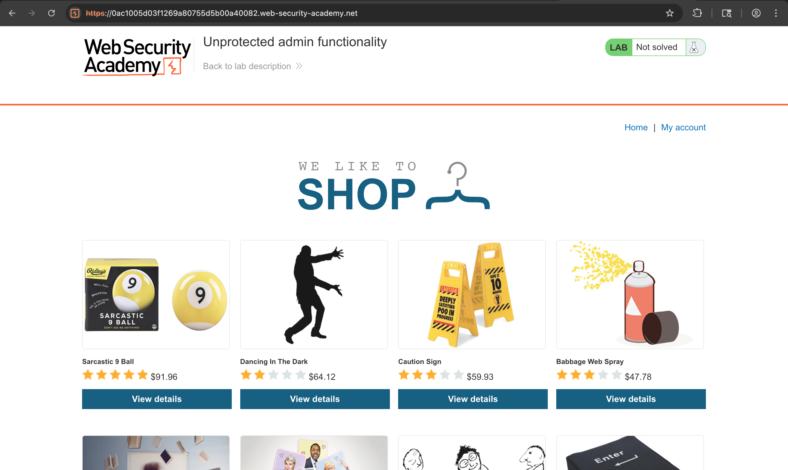
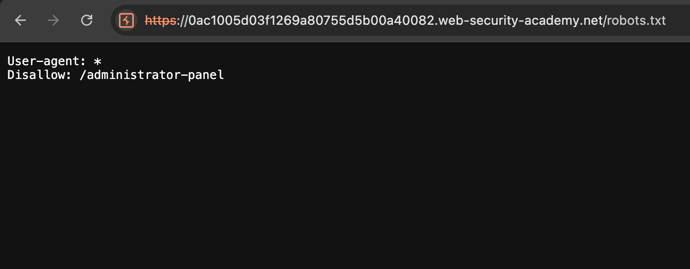
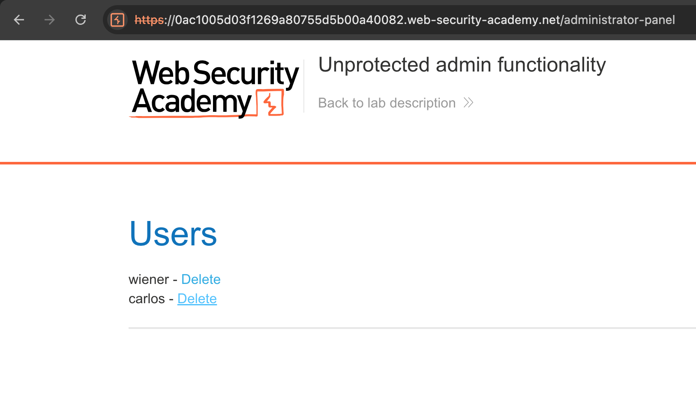
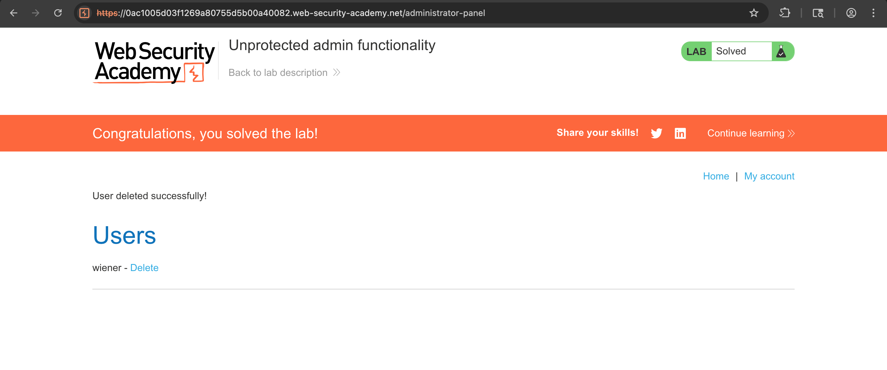

# Challenge: Unprotected Admin Functionality

Category: Broken Access Control
Level: Apprentice

## Challenge Description

This lab exposes an unprotected admin panel. Your task is to discover the panel and delete the user carlos.

## Resource

[PortSwigger - Unprotected admin functionality](https://portswigger.net/web-security/access-control/lab-unprotected-admin-functionality)

## Step-by-Step Solution

1. **Akses Lab**
   Buka lab PortSwigger
   

2. **Cek robots.txt**
   Periksa file `robots.txt` dan temukan disallow path admin panel:

   - `Disallow: /administrator-panel`
     

3. **Akses Admin Panel**
   Kunjungi `/administrator-panel` dan gunakan fungsi delete user
   

4. **Hapus User Carlos**
   Hapus user `carlos` dari admin panel
   

## Reflection

- Status: ✅ Berhasil
- Root Cause: Admin panel tidak dilindungi oleh access control yang semestinya
- Attack Vector: Discovery melalui robots.txt dan direct URL access ke admin panel
- Key Insight:
  - robots.txt dapat mengungkapkan lokasi sensitive paths
  - Admin functionality seharusnya tidak dapat diakses tanpa autentikasi/otorisasi
  - Broken access control memungkinkan unauthorized administrative actions
