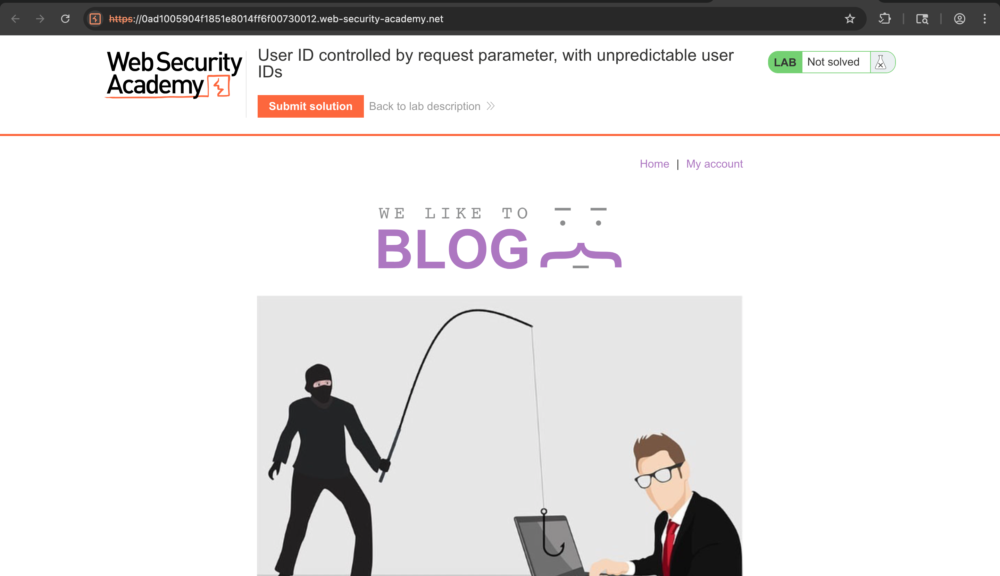

# Challenge: User ID Controlled by Request Parameter

Category: Broken Access Control

## Challenge Description

Exploit IDOR dengan mengubah parameter `id` pada request untuk mendapatkan API key milik user lain (Carlos).

## Resource

[PortSwigger - User ID controlled by request parameter](https://portswigger.net/web-security/access-control/lab-user-id-controlled-by-request-parameter)

## Step-by-Step Solution

1. **Akses Lab**
   Buka lab
   

2. **Login Sebagai User Biasa**
   Login menggunakan kredensial `wiener:peter`
   

3. **Parameter Tampering**
   Pada endpoint pengambilan API key, ganti parameter `id` menjadi milik `carlos`, lalu submit
   

4. **Verifikasi**
   Berhasil mendapatkan API key milik `carlos`
   

## Reflection

- Status: ✅ Berhasil
- Root Cause: Tidak ada authorization check pada akses resource berdasarkan parameter `id` (IDOR)
- Attack Vector: Parameter tampering mengganti `id` ke milik user target
- Key Insight:
  - Server harus memverifikasi ownership resource berdasarkan session, bukan parameter client-side
  - IDOR memungkinkan akses data sensitif user lain tanpa otorisasi
