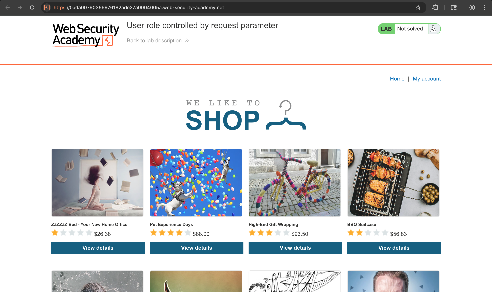
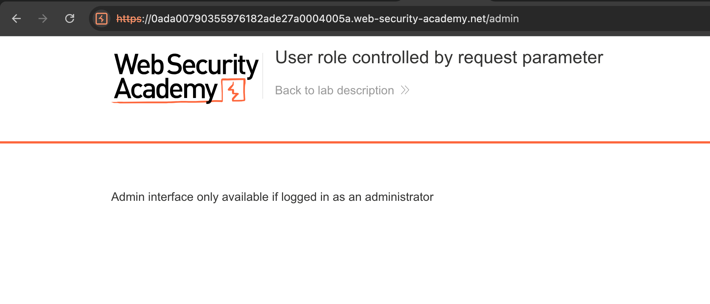
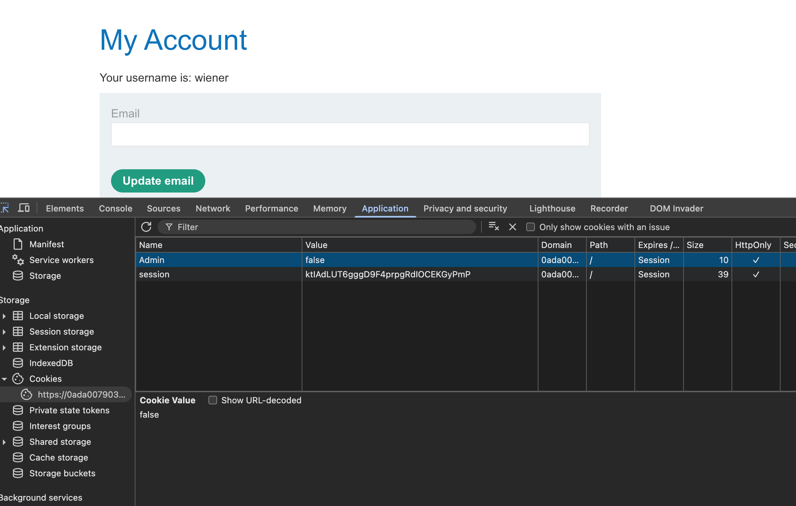
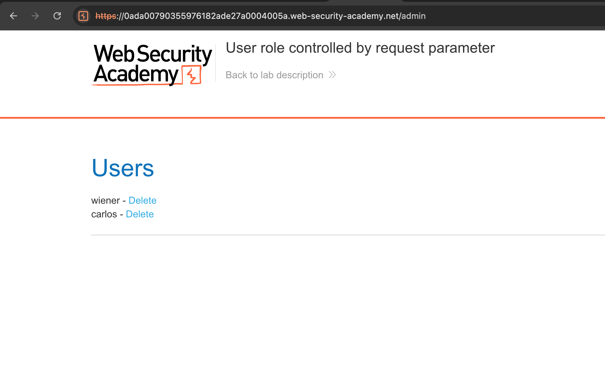
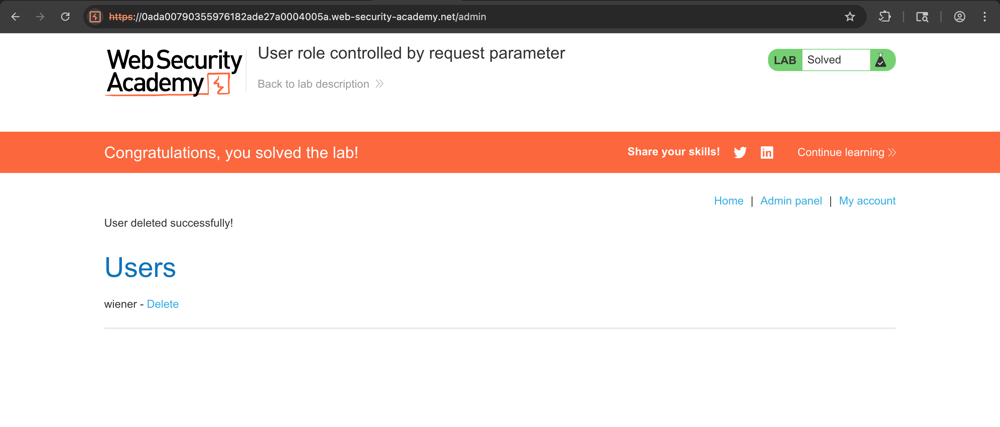

# Challenge: User Role Controlled by Request Parameter

Category: Broken Access Control
Points: 3 Stars
Difficulty: Medium

## Challenge Description

Gain administrative access by manipulating a role parameter (e.g., cookie or request parameter) that controls user privileges.

## Resource

[OWASP Juice Shop - Broken Access Control Challenges](https://juice-shop.herokuapp.com/#/score-board?categories=Broken%20Access%20Control)

## Step-by-Step Solution

1. **Akses Aplikasi**
   Buka aplikasi/lab
   

2. **Coba Akses /admin**
   Akses `/admin` ditolak ketika belum memiliki peran admin
   

3. **Login Normal**
   Login menggunakan akun biasa untuk mendapatkan session/cookies

4. **Manipulasi Role Parameter**
   Ubah parameter kontrol role (misalnya cookie) menjadi admin:

   - Contoh: `admin=true`
   - Simpan perubahan pada Application/Storage di DevTools
     

5. **Akses Admin Section**
   Setelah cookie diubah, akses `/admin` kembali
   

6. **Lakukan Aksi Admin**
   Hapus user target (misalnya `carlos`) dari admin panel
   

## Reflection

- **Status:** ✅ Berhasil
- **Root Cause:** Privilege/role dikendalikan oleh parameter client-side tanpa verifikasi server-side
- **Attack Vector:** Manipulasi cookie/request parameter (`admin=true`) untuk eskalasi hak akses
- **Key Insight:**
  - Role/privilege tidak boleh ditentukan dari nilai yang dapat dimodifikasi di client
  - Server harus melakukan authorization check berbasis session/server-side claims
  - Broken access control memungkinkan unauthorized administrative actions
