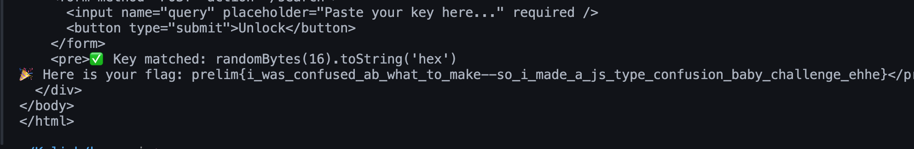

# Challenge: Extra Challenge 1

Category: Web Exploitation
Points: -
Difficulty: Medium

## Challenge Description

Bypass the key check to get the flag.

## Resource

-

## Step-by-Step Solution

1. **Analisis Source Code**
   Diberikan sebuah snippet kode JavaScript (Node.js/Express) yang menangani request pencarian.

   ```javascript
   const key = "randomBytes(16).toString('hex')";

    <!--  htmlPage() here  -->

   app.get("/", (req, res) => {
     res.send(htmlPage());
   });

   app.post("/search", (req, res) => {
     const query = req.body.query;

     if (query.includes("String")) {
       return res.send(
         htmlPage("❌ Access Denied: Suspicious pattern detected.")
       );
     }

     if (query.includes(key)) {
       return res.send(
         htmlPage(
           "✅ Key matched: " +
             query +
             "\n🎉 Here is your flag: prelim    {i_was_confused_ab_what_to_make--so_i_made_a_js_type_confusion_baby_challenge_ehhe}"
         )
       );
     } else {
       return res.send(htmlPage("❌ Key did not match."));
     }
   });

   app.listen(port, () => {
     console.log(`🚀 Challenge running at http://localhost:${port}`);
   });
   ```

   Kunci (`key`) di-hardcode sebagai string biasa. Pengecekan `query.includes(key)` membandingkan input dari user dengan string `key` tersebut.

2. **Bypass Pengecekan**
   Karena `key` adalah string literal `"randomBytes(16).toString('hex')"` dan pengecekannya menggunakan `String.prototype.includes()`, kita bisa mengirimkan string tersebut sebagai bagian dari `query`. Namun, `body-parser` (middleware Express) dapat menginterpretasikan `query` sebagai array jika diakhiri dengan `[]`. Ini menyebabkan `query.includes(...)` menjadi `Array.prototype.includes(...)`, yang akan melakukan perbandingan strict (`===`) terhadap setiap elemen array. Dengan mengirimkan `query[]` yang berisi string `key`, kita bisa mem-bypass pengecekan `query.includes("String")` (karena `["..."]` tidak mengandung "String") dan memenuhi kondisi `query.includes(key)`.

   Gunakan `curl` untuk mengirim POST request dengan payload yang dimanipulasi:
   `curl -X POST http://localhost:10009/search -d "query[]=randomBytes(16).toString('hex')"`

3. **Dapatkan Flag**
   Request tersebut berhasil dan mengembalikan flag: `prelim{i_was_confused_ab_what_to_make--so_i_made_a_js_type_confusion_baby_challenge_ehhe}`
   

## Reflection

- **Status:** ✅ Berhasil
- **Root Cause:** Type confusion vulnerability pada JavaScript. Aplikasi mengharapkan `query` sebagai string, tetapi dapat dimanipulasi menjadi array. Hal ini mengubah perilaku method `.includes()` dari `String.prototype.includes()` menjadi `Array.prototype.includes()`.
- **Attack Vector:** Mengirimkan parameter POST dengan `[]` di akhir nama parameter untuk membuatnya diinterpretasikan sebagai array oleh `body-parser`.
- **Key Insight:**
  - Type coercion dan type confusion adalah kelas vulnerability yang umum di bahasa yang di-type secara dinamis seperti JavaScript.
  - Memahami bagaimana middleware (seperti `body-parser`) mem-parsing request body sangat penting untuk menemukan celah keamanan.
  - Validasi input harus selalu memeriksa tipe data, bukan hanya isinya.
