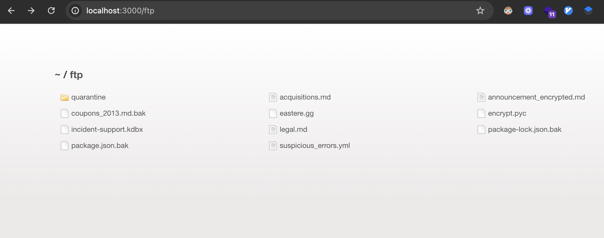
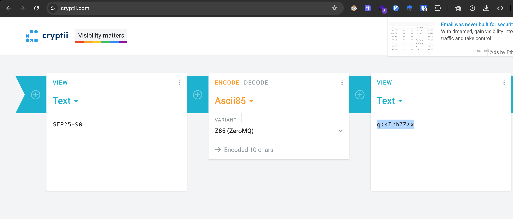
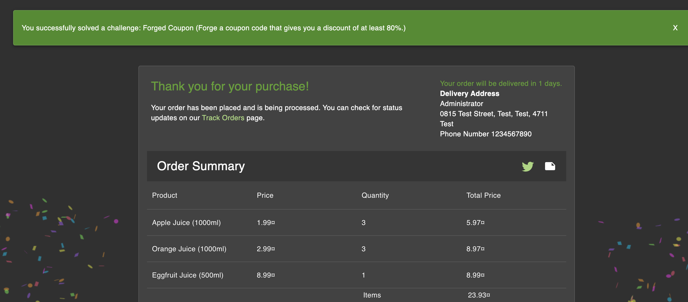

# Challenge: Forged Coupon

Category: Broken Cryptography
Points: 4 Stars
Difficulty: Hard

## Challenge Description

Forge a coupon that gives you a discount of at least 80%.

## Resource

[OWASP Juice Shop](https://juice-shop.herokuapp.com/)

## Step-by-Step Solution

1. **Akses Direktori FTP**
   Akses `/ftp` untuk melihat file yang tersedia. Terdapat dua file yang menarik: `coupons_2013.md.bak` dan `package.json.bak`.
   

2. **Download File Backup Kupon**
   Download `coupons_2013.md.bak` dengan menambahkan `%2500.md` pada URL untuk bypass filter.
   

3. **Lihat Isi File Kupon**
   Setelah berhasil di-download, buka file untuk melihat isi dari `coupons_2013.md.bak`.
   

4. **Analisis `package.json.bak`**
   Lakukan hal yang sama untuk `package.json.bak`. Di dalamnya, kita menemukan dependency `z85`, yang mengindikasikan algoritma enkripsi yang digunakan.
   

5. **Decode Kode Kupon**
   Decode kode kupon dari file `.bak` menggunakan `z85`. Hasilnya adalah format tanggal.
   

6. **Buat Kupon Sendiri**
   Dengan mengetahui formatnya (`MonthYear-Discount`), kita bisa membuat kupon sendiri. Contoh: `SEP25-90` untuk diskon 90%.
   

7. **Redeem Kupon**
   Gunakan kupon yang telah dibuat untuk checkout dan kita berhasil mendapatkan diskon.
   
   

## Reflection

- **Status:** ✅ Berhasil
- **Root Cause:** Informasi sensitif (kode kupon dan algoritma enkripsi) terekspos melalui file backup di direktori FTP yang dapat diakses publik.
- **Attack Vector:** Memanfaatkan file backup yang terekspos untuk merekayasa balik (reverse-engineer) algoritma pembuatan kupon dan membuat kupon palsu.
- **Key Insight:**
  - File backup (`.bak`) tidak boleh terekspos ke publik, karena seringkali berisi kode sumber atau data sensitif.
  - Null byte injection (`%00`) bisa digunakan untuk bypass filter keamanan pada path traversal.
  - Menganalisis `package.json` dapat mengungkap library dan teknologi yang digunakan, yang bisa menjadi petunjuk untuk eksploitasi.
