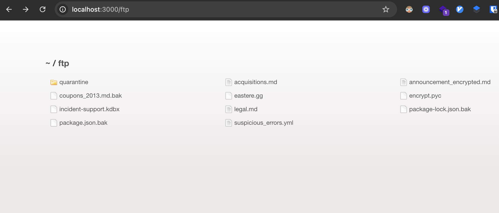
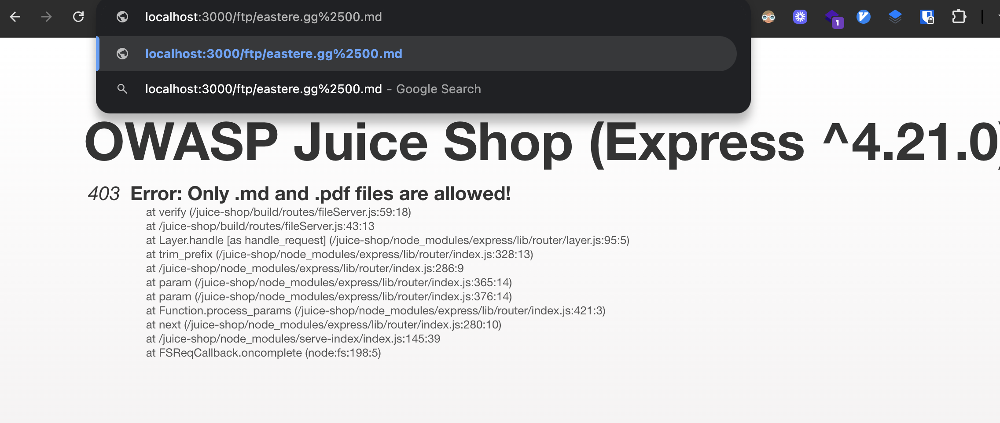
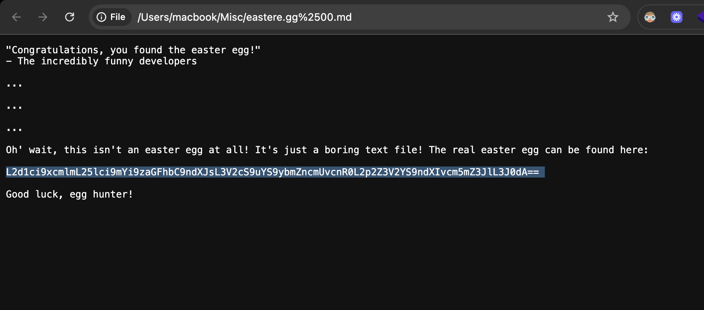
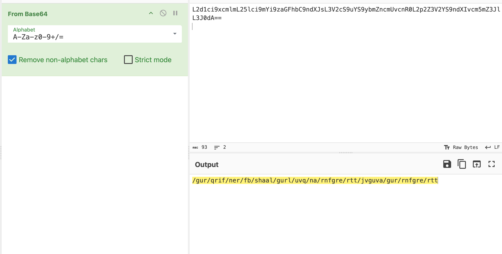
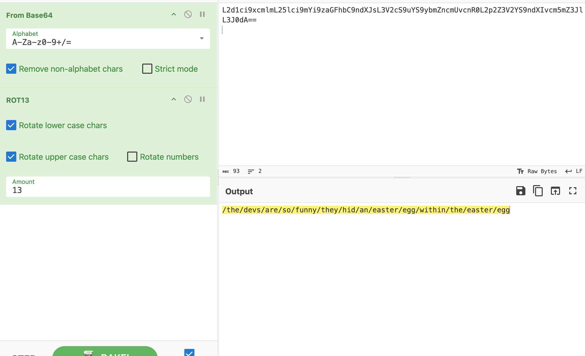
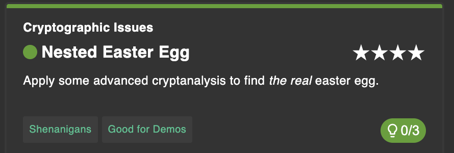

# Challenge: Nested Easter Egg

Category: Miscellaneous
Points: 4 Stars
Difficulty: Medium

## Challenge Description

Find and retrieve the hidden “easter egg” by traversing exposed files and decoding nested clues.

## Resource

[OWASP Juice Shop - Misc Challenges](https://juice-shop.herokuapp.com/#/score-board)

## Step-by-Step Solution

1. **Akses Direktori FTP**  
   Buka halaman `/ftp` untuk melihat file yang dapat diunduh
   

2. **Bypass Filter Ekstensi**  
   Terlihat file `eastere.egg`, namun hanya file dengan ekstensi `.md` dan `.pdf` yang bisa diunduh. Gunakan teknik double-URL-encoding null byte untuk bypass: tambahkan suffix `%2500.md` pada nama file agar lolos filter dan tetap mengunduh file aslinya.

   - `%00` = null byte
   - `%2500` = encoded `%00` (double-encoded) sehingga server menganggap ada `.md` di akhir, namun OS/handler membaca sebelum null byte

   

3. **Identifikasi Konten Terenkode**  
   Setelah diunduh/dibuka, konten terlihat seperti string Base64
   

4. **Decode Base64 → Dapat Clue Lanjutan**  
   Decode Base64 menghasilkan teks yang tampak masih tidak jelas, berupa clue path yang masih teracak
   

5. **ROT13 Decoding**  
   Lanjutkan dengan melakukan ROT13 pada hasil sebelumnya. Setelah ROT13, path menjadi terbaca jelas dan mengarah ke lokasi easter egg yang benar
   

6. **Akses Path Final**  
   Buka path yang sudah didecode untuk menyelesaikan challenge
   
   

## Reflection

- **Status:** ✅ Berhasil
- **Root Cause:** Filter ekstensi file hanya memeriksa suffix string tanpa mempertimbangkan null byte/double-encoding
- **Attack Vector:** Double-URL-encoded null byte (`%2500.md`) untuk bypass ekstensi yang diizinkan, lalu chained decoding (Base64 → ROT13) untuk menemukan path tersembunyi
- **Key Insight:**
  - Validasi file-type harus berbasis MIME/content-sniffing dan server-side allowlist, bukan sekadar suffix
  - Hindari mengandalkan “security by obscurity”; clue di file dapat didecode dengan metode standar
  - Layered encoding/decoding sering dipakai sebagai puzzle; uji beberapa teknik decoding umum (Base64, ROT13, URL-encoding)
