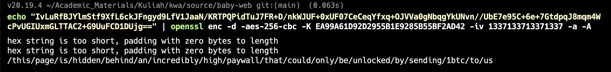

# Challenge: Premium Paywall

Category: Cryptographic Issues
Points: 6 Stars
Difficulty: Hard

## Challenge Description

Access a page that is hidden behind a paywall.

## Resource

[OWASP Juice Shop](https://juice-shop.herokuapp.com/#/score-board?categories=Cryptographic%20Issues)

## Step-by-Step Solution

1. **Temukan Path Tersembunyi**
   Gunakan Gobuster atau alat sejenis untuk menemukan direktori dan file tersembunyi. Ditemukan path `/encryptionkeys`.
   

2. **Analisis Kunci Enkripsi**
   Di dalam direktori `/encryptionkeys`, terdapat file `premium.key`. Setelah di-download, isinya adalah string `1337133713371337.EA99A61D92D2955B1E9285B55BF2AD42`. Ini terlihat seperti IV (Initialization Vector) dan Kunci AES.
   

3. **Dekripsi Konten**
   Di salah satu file JavaScript aplikasi, terdapat konten terenkripsi base64. Gunakan OpenSSL untuk mendekripsinya dengan IV dan Kunci yang telah ditemukan.
   `echo "IvLuRfBJYlmStf9XfL6ckJFngyd9LfV1JaaN/KRTPQPidTuJ7FR+D/nkWJUF+0xUF07CeCeqYfxq+OJVVa0gNbqgYkUNvn//UbE7e95C+6e+7GtdpqJ8mqm4WcPvUGIUxmGLTTAC2+G9UuFCD1DUjg==" | openssl enc -d -aes-256-cbc -K EA99A61D92D2955B1E9285B55BF2AD42 –iv 1337133713371337 -a –A`
   Hasil dekripsi adalah path URL yang tersembunyi.
   

4. **Akses Halaman Tersembunyi**
   Akses URL yang didapatkan dari hasil dekripsi untuk menyelesaikan challenge.
   `http://localhost:3000/this/page/is/hidden/behind/an/incredibly/high/paywall/that/could/only/be/unlocked/by/sending/1btc/to/us`
   

## Reflection

- **Status:** ✅ Berhasil
- **Root Cause:** Kunci enkripsi dan IV terekspos di direktori yang dapat diakses publik. Konten sensitif (URL tersembunyi) dienkripsi tetapi kuncinya tidak diamankan.
- **Attack Vector:** Menemukan kunci enkripsi yang terekspos, lalu menggunakannya untuk mendekripsi konten tersembunyi dan mendapatkan akses tidak sah.
- **Key Insight:**
  - Kunci enkripsi adalah data yang sangat sensitif dan tidak boleh terekspos.
  - "Security through obscurity" (mengandalkan kerahasiaan path) bukanlah mekanisme keamanan yang efektif.
  - Semua komponen dari sistem kriptografi (algoritma, kunci, IV) harus dikelola dengan aman.
