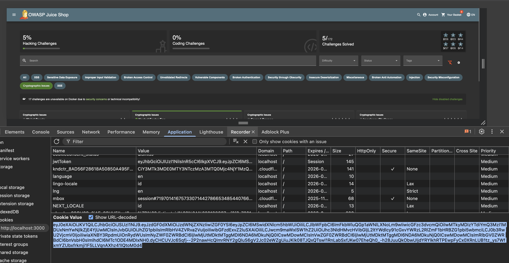
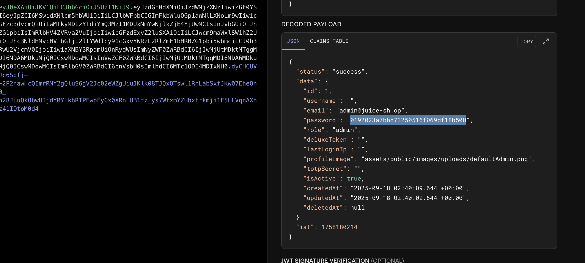
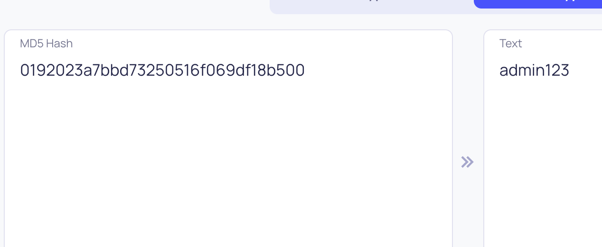

# Challenge: Weird Crypto

Category: Broken Cryptography
Points: 3 Stars
Difficulty: Medium

## Challenge Description

Log in with the administrator's user account.

## Resource

[OWASP Juice Shop](https://juice-shop.herokuapp.com/)

## Step-by-Step Solution

1. **Ambil Token Admin**
   Setelah login sebagai admin, buka tab "Application" di DevTools dan copy token dari cookies.
   

2. **Analisis Payload JWT**
   Gunakan jwt.io untuk mendekode token. Payload-nya berisi password yang di-hash, sepertinya menggunakan MD5.
   

3. **Dapatkan Password**
   Hash MD5 tersebut dapat di-crack (misalnya, menggunakan tools online) untuk mendapatkan password admin.
   

## Reflection

- **Status:** ✅ Berhasil
- **Root Cause:** Penggunaan algoritma hashing yang lemah (MD5) untuk password di dalam JWT payload.
- **Attack Vector:** Cracking hash MD5 yang disimpan dalam JWT untuk mendapatkan password cleartext.
- **Key Insight:**
  - JWT tidak boleh berisi informasi sensitif dalam payload-nya, bahkan jika di-hash dengan algoritma yang lemah.
  - MD5 adalah algoritma hashing yang sudah tidak aman dan rentan terhadap collision dan cracking.
  - Informasi sensitif seperti password harus di-hash dengan algoritma yang kuat (seperti bcrypt atau Argon2) dan disimpan di sisi server, bukan di dalam token.