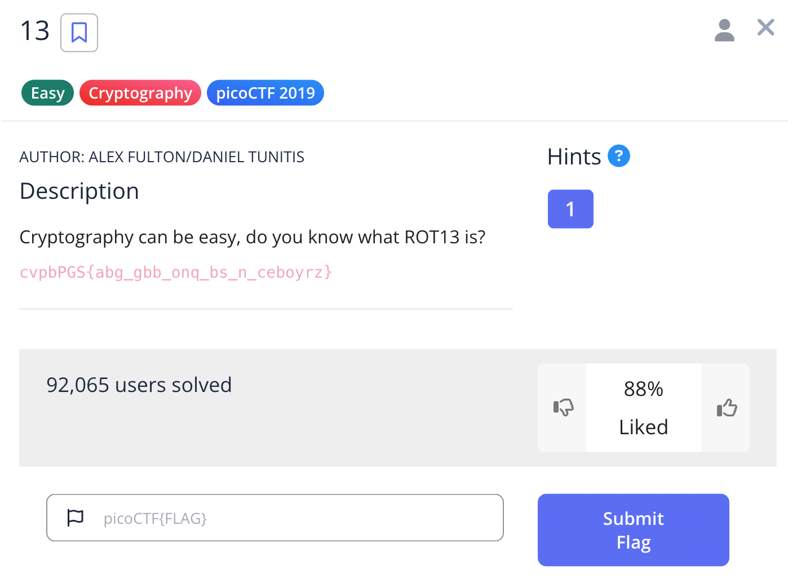
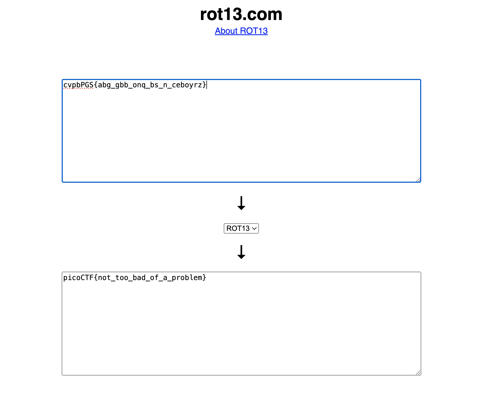
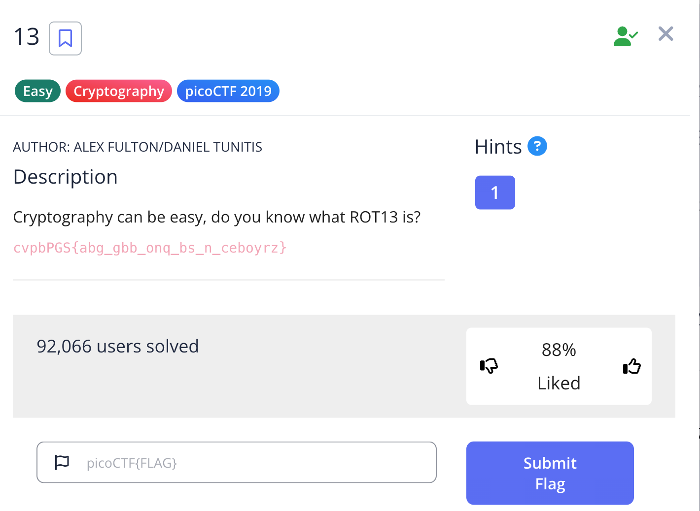

# Challenge: 13

Category: Cryptography
Points: 100
Difficulty: Easy

## Challenge Description

Cryptography can be easy, do you know what ROT13 is? cvpbPGS{abg_gbb_onq_bs_n_ceboyrz}

## Resource

[PicoCTF](https://play.picoctf.org/practice/challenge/62?category=2&page=1)

## Step-by-Step Solution

1. **Analisis String**
   Diberikan sebuah string terenkripsi. Judul challenge, "13", mengisyaratkan penggunaan ROT13.
   

2. **Decode Menggunakan ROT13**
   Gunakan decoder ROT13 untuk mendekripsi string tersebut. Hasilnya adalah flag yang dicari.
   
   

## Reflection

- **Status:** ✅ Berhasil
- **Root Cause:** Teks dienkripsi menggunakan Caesar cipher dengan pergeseran 13 (ROT13).
- **Attack Vector:** Menggunakan ROT13 decoder untuk membalikkan enkripsi.
- **Key Insight:**
  - Judul challenge seringkali memberikan petunjuk penting tentang metode enkripsi yang digunakan.
  - ROT13 adalah salah satu cipher substitusi paling sederhana dan umum dijumpai dalam CTF.
