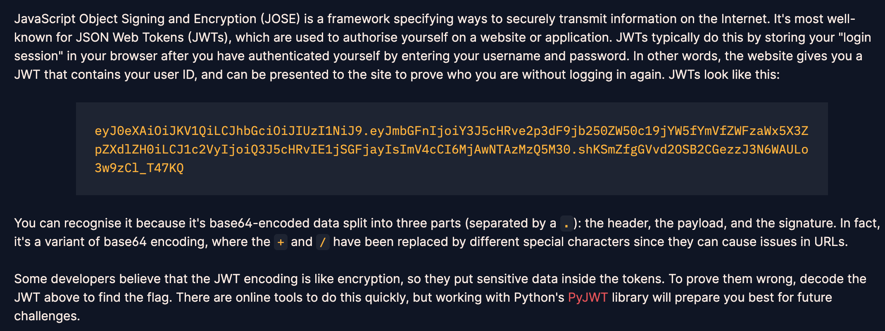
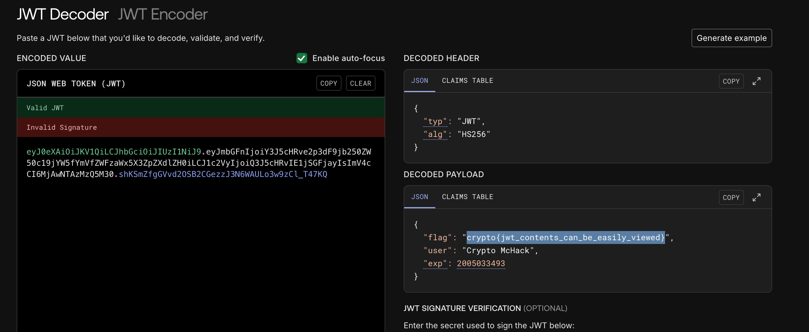
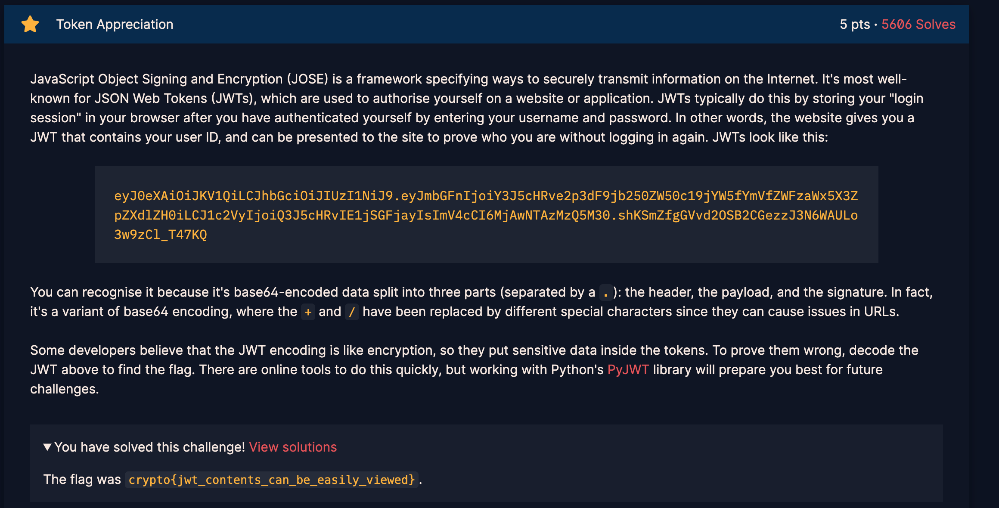

# Challenge: Token Appreciation

Category: Web
Difficulty: Easy

## Challenge Description

I've made a simple token checker, but I'm not sure if it's secure. Can you take a look?

## Resource

[CryptoHack](https://cryptohack.org/)

## Step-by-Step Solution

1. **Analisis Token JWT**
   Diberikan sebuah JSON Web Token (JWT).
   

2. **Decode Token**
   Gunakan tool online seperti jwt.io untuk mendekode token. Payload dari JWT tidak dienkripsi, hanya di-encode dengan Base64, sehingga isinya dapat dengan mudah dilihat.
   

3. **Dapatkan Flag**
   Flag ditemukan di dalam payload JWT yang telah didekode.
   `crypto{jwt_contents_can_be_easily_viewed}`
   

## Reflection

- **Status:** ✅ Berhasil
- **Root Cause:** Kesalahpahaman fundamental tentang JWT. Payload JWT hanya di-encode (Base64), bukan dienkripsi.
- **Attack Vector:** Mendekode payload JWT untuk membaca isinya.
- **Key Insight:**
  - Jangan pernah menyimpan informasi sensitif di dalam payload JWT kecuali jika JWT tersebut dienkripsi (menggunakan JWE).
  - JWT secara default hanya memastikan integritas (melalui signature), bukan kerahasiaan (confidentiality).
  - Siapapun dapat membaca isi payload JWT.
