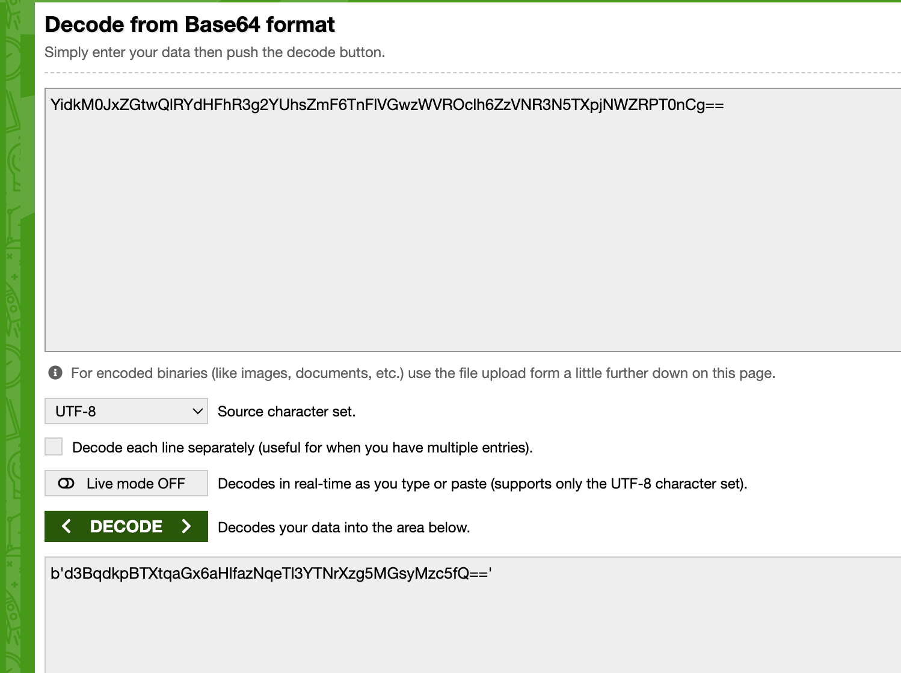
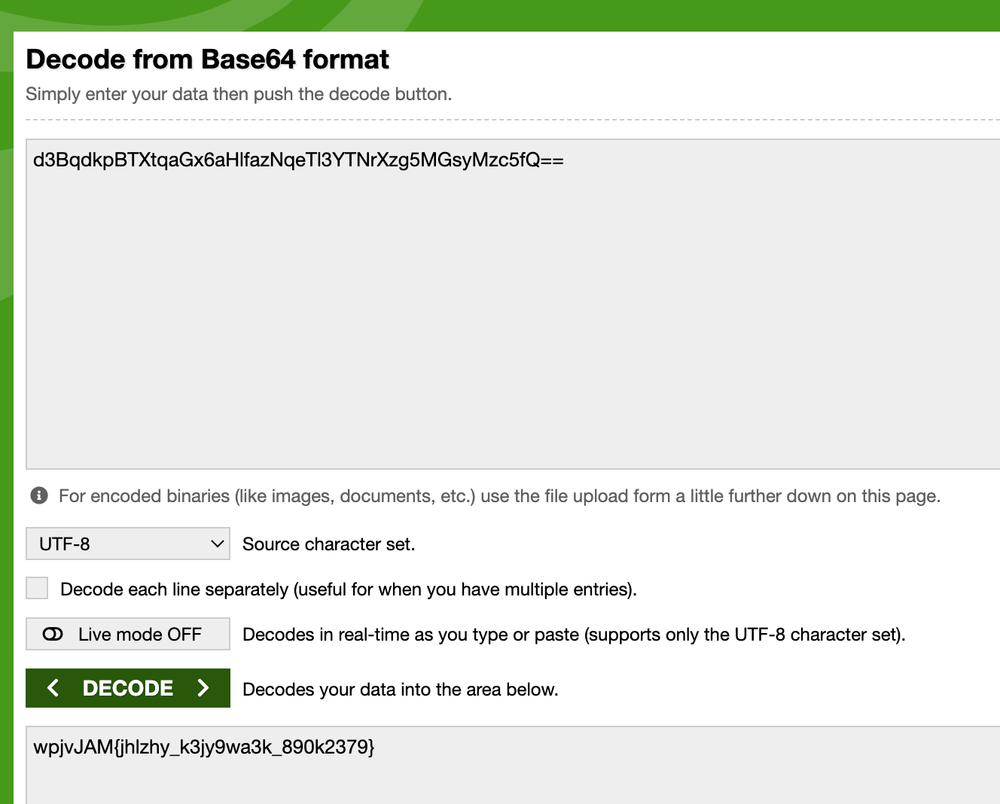
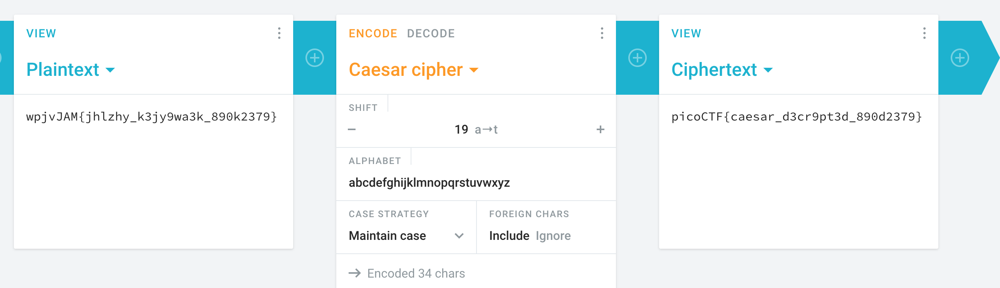
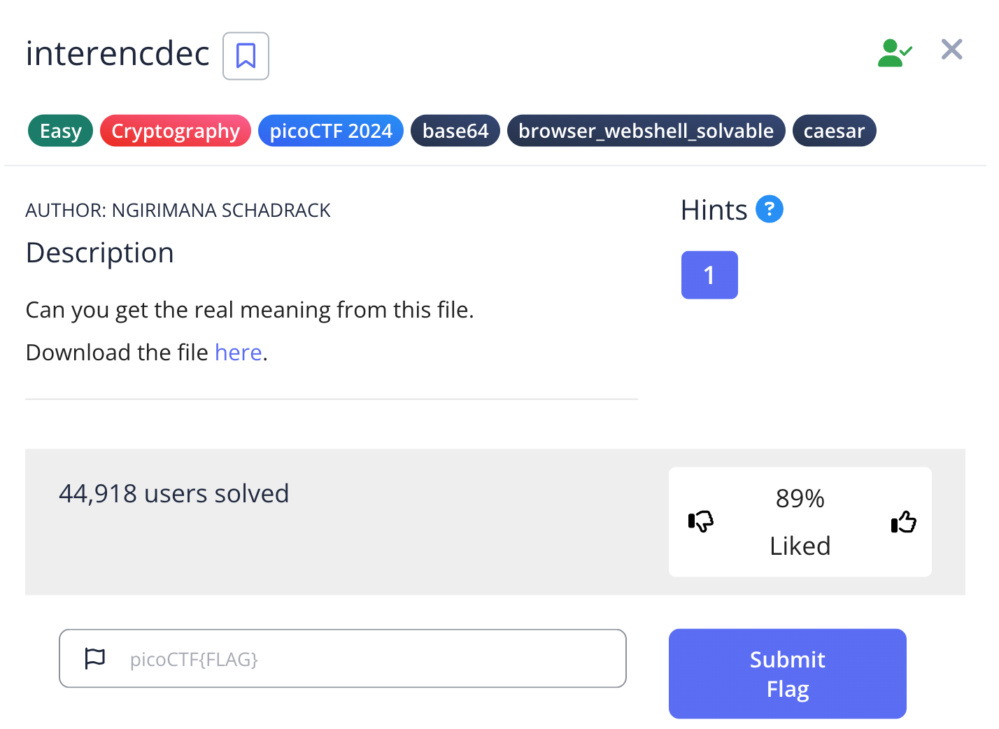

# Challenge: interencdec

Category: Cryptography
Points: 150
Difficulty: Medium

## Challenge Description

Can you get the real meaning from this file.
Download the file here.

## Resource

[PicoCTF](https://play.picoctf.org/practice/challenge/418?category=2&difficulty=1&page=1&search=)

## Step-by-Step Solution

1. **Analisis File**
   Setelah men-download file, kita menemukan string base64: `YidkM0JxZGtwQlRYdHFhR3g2YUhsZmF6TnFlVGwzWVROclh6ZzVNR3N5TXpjNWZRPT0nCg==`.

2. **Decode Base64 (Tahap 1)**
   Decode string tersebut menggunakan base64. Hasilnya adalah: `b'd3BqdkpBTXtqaGx6aHlfazNqeTl3YTNrXzg5MGsyMzc5fQ=='`.
   

3. **Decode Base64 (Tahap 2)**
   String hasil dekode pertama masih terlihat seperti base64. Setelah menghapus `b'` di awal dan `'` di akhir, kita decode lagi. Hasilnya adalah string yang mirip flag: `wpjvJAM{jhlzhy_k3jy9wa3k_890k2379}`.
   

4. **Decode Caesar Cipher**
   String tersebut tampaknya dienkripsi dengan Caesar cipher. Dengan mencoba berbagai pergeseran (shifting), kita menemukan bahwa pergeseran ke-19 (a -> t) menghasilkan flag yang benar.
   

5. **Flag Ditemukan**
   Flag berhasil didapatkan.
   

## Reflection

- **Status:** ✅ Berhasil
- **Root Cause:** Enkripsi berlapis (multi-layer encryption) menggunakan base64 dan Caesar cipher.
- **Attack Vector:** Menerapkan dekripsi secara berurutan: base64, lalu base64 lagi, dan terakhir Caesar cipher.
- **Key Insight:**
  - Enkripsi seringkali dilakukan berlapis-lapis untuk menambah kompleksitas.
  - Mengenali format encoding (seperti base64) adalah langkah pertama yang penting.
  - Setelah satu lapisan dekripsi, penting untuk menganalisis hasilnya untuk petunjuk tentang lapisan enkripsi berikutnya.
  - Trial-and-error (seperti mencoba semua pergeseran Caesar cipher) adalah teknik yang valid ketika ruang pencarian terbatas.
