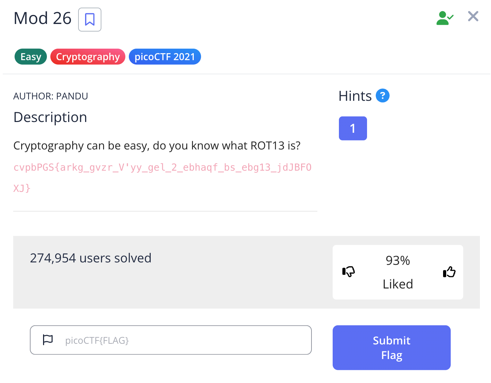

# Challenge: Mod 26

Category: Cryptography
Points: 100
Difficulty: Easy

## Challenge Description

Cryptography can be easy, do you know what ROT13 is? cvpbPGS{arkg_gvzr_V'yy_gel_2_ebhaqf_bs_ebg13_jdJBFOXJ}

## Resource

[PicoCTF](https://play.picoctf.org/practice/challenge/144?category=2&page=1)

## Step-by-Step Solution

1. **Analisis String**
   Diberikan sebuah string terenkripsi. Deskripsi challenge menyebutkan "ROT13", yang merupakan petunjuk kuat untuk metode dekripsi.
   

2. **Decode Menggunakan ROT13**
   Gunakan decoder ROT13 online untuk mendekripsi string tersebut. Hasilnya adalah flag yang dicari.
   
   

## Reflection

- **Status:** ✅ Berhasil
- **Root Cause:** Teks dienkripsi menggunakan Caesar cipher dengan pergeseran 13 (ROT13).
- **Attack Vector:** Menggunakan ROT13 decoder untuk membalikkan enkripsi.
- **Key Insight:**
  - ROT13 adalah kasus spesifik dari Caesar cipher, di mana setiap huruf digeser 13 posisi.
  - Karena alfabet Inggris memiliki 26 huruf, menerapkan ROT13 dua kali akan mengembalikan teks asli.
  - Ini adalah bentuk enkripsi yang sangat lemah dan tidak boleh digunakan untuk mengamankan data sensitif.
