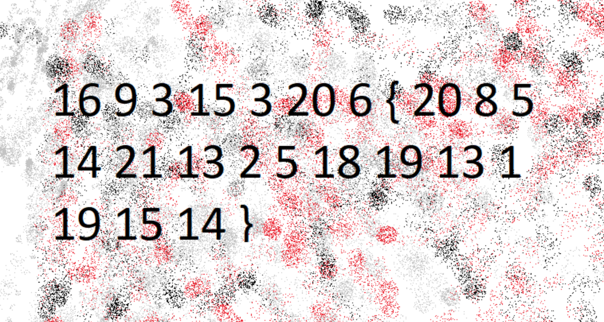
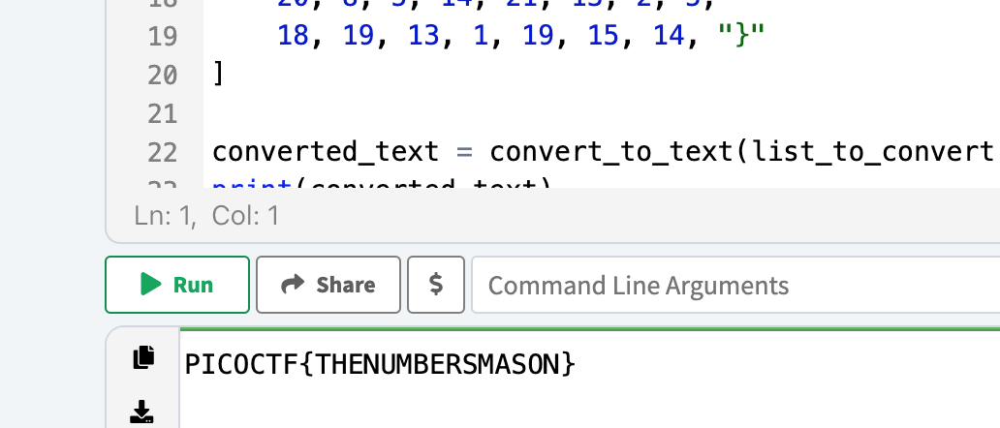

# Challenge: The Numbers

Category: Cryptography
Points: 100
Difficulty: Easy

## Challenge Description

The numbers... what do they mean?

## Resource

[PicoCTF](https://play.picoctf.org/practice/challenge/68?category=2&page=1)

## Step-by-Step Solution

1. **Analisis Gambar**
   Terdapat sebuah gambar yang berisi serangkaian angka dan simbol.
   

2. **Konversi Angka ke Teks**
   Angka-angka tersebut tampaknya sesuai dengan urutan alfabet (A=1, B=2, dst.). Kita bisa menggunakan script Python untuk mengonversinya menjadi teks.

   ```python
   def convert_to_text(numbers):
       letters = "ABCDEFGHIJKLMNOPQRSTUVWXYZ" # Alphabet string
       result = ""

       for item in numbers:
           # Check if the item is a number; convert to letter if so
           if isinstance(item, int):
               result += letters[item - 1]  # Convert number to corresponding letter
           else:
               result += str(item)  # Add non-integer items directly

       return result

   list_to_convert = [
       16, 9, 3, 15, 3, 20, 6, "{",
       20, 8, 5, 14, 21, 13, 2, 5,
       18, 19, 13, 1, 19, 15, 14, "}"
   ]

   converted_text = convert_to_text(list_to_convert)
   print(converted_text)
   ```

3. **Dapatkan Flag**
   Setelah menjalankan script, kita mendapatkan flag-nya.
   `PICOCTF{THENUMBERSMASON}`
   

## Reflection

- **Status:** ✅ Berhasil
- **Root Cause:** Pesan dienkripsi menggunakan substitusi sederhana (angka ke huruf).
- **Attack Vector:** Analisis frekuensi dan pemetaan langsung dari angka ke huruf berdasarkan urutan alfabet.
- **Key Insight:**
  - Enkripsi substitusi sederhana adalah salah satu bentuk kriptografi paling dasar.
  - Pengenalan pola (angka yang mewakili huruf) adalah kunci untuk memecahkan sandi ini.
  - Otomatisasi menggunakan script dapat mempercepat proses dekripsi secara signifikan.
