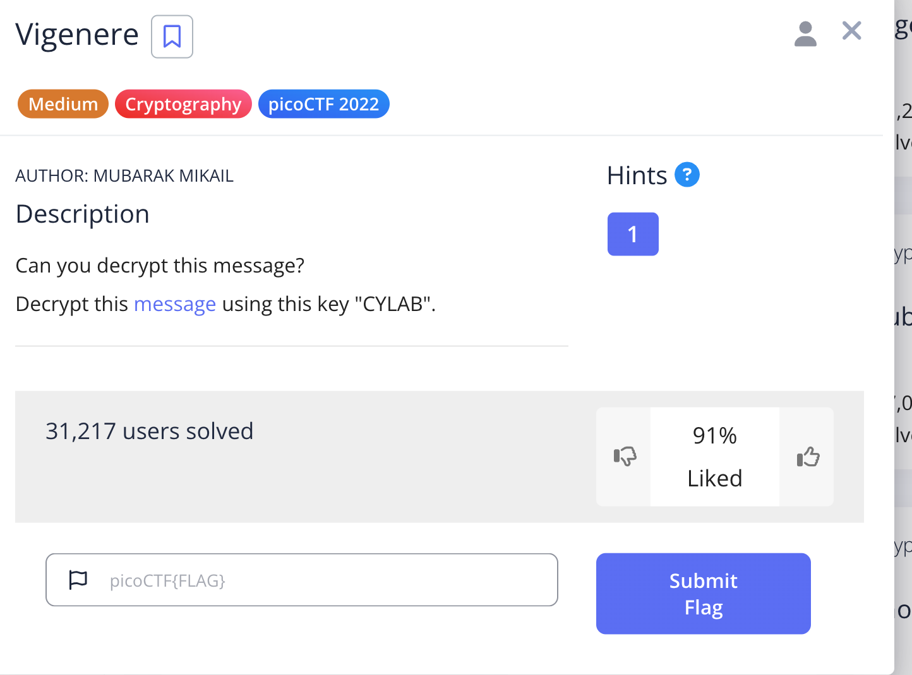
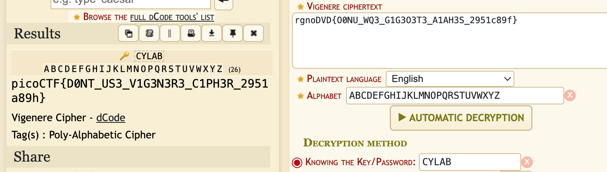
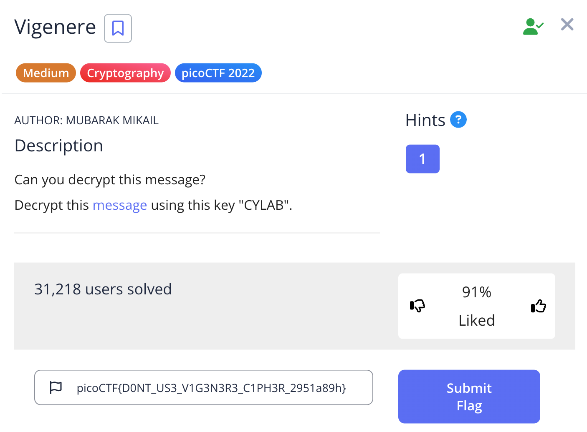

# Challenge: Vigenere

Category: Cryptography
Points: 150
Difficulty: Medium

## Challenge Description

Can you decrypt this message?
Decrypt this message using this key "CYLAB".

## Resource

[PicoCTF](https://play.picoctf.org/practice/challenge/316?category=2&page=2&search=)

## Step-by-Step Solution

1. **Analisis Soal**
   Diberikan sebuah file berisi ciphertext `rgnoDVD{O0NU_WQ3_G1G3O3T3_A1AH3S_2951c89f}` dan sebuah kunci, "CYLAB".
   

2. **Dekripsi Menggunakan Vigenere Cipher**
   Berdasarkan nama challenge dan adanya kunci, kita dapat menyimpulkan bahwa ini adalah Vigenere cipher. Gunakan tool online untuk mendekripsi ciphertext dengan kunci "CYLAB".
   

3. **Flag Ditemukan**
   Setelah dekripsi, kita berhasil mendapatkan flag dan men-submit-nya.
   

## Reflection

- **Status:** ✅ Berhasil
- **Root Cause:** Teks dienkripsi menggunakan Vigenere cipher, dan kuncinya diberikan secara eksplisit.
- **Attack Vector:** Menggunakan Vigenere cipher decoder dengan kunci yang telah disediakan.
- **Key Insight:**
  - Vigenere cipher adalah bentuk poli-alfabetik dari Caesar cipher, yang membuatnya lebih tahan terhadap analisis frekuensi sederhana.
  - Namun, jika kuncinya diketahui, enkripsi ini sangat mudah untuk dipecahkan.
  - Challenge ini menyoroti pentingnya menjaga kerahasiaan kunci dalam kriptografi simetris.
