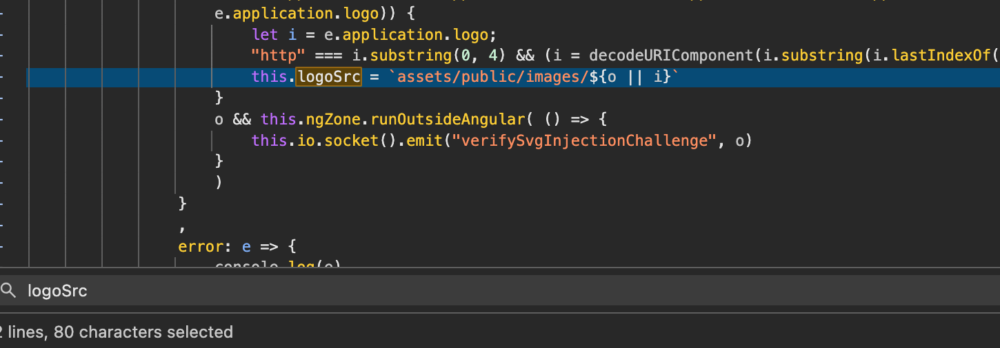
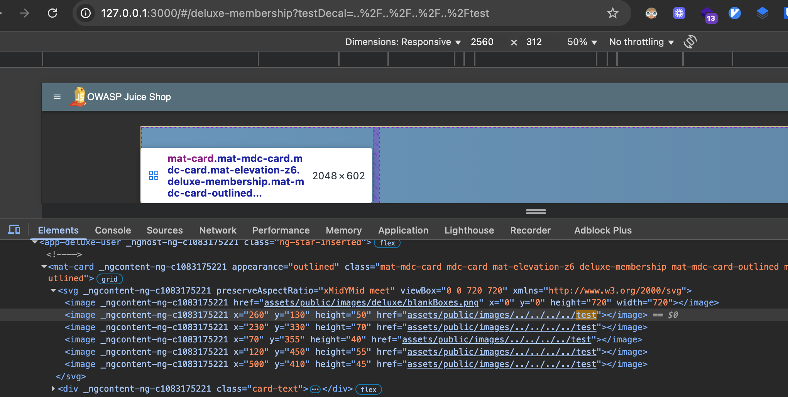

# Challenge: Cross-Site Imaging

Category: Security Misconfiguration
Points: 5 Stars
Difficulty: Hard

## Challenge Description

Mengeksploitasi kerentanan pada fungsionalitas penggantian gambar untuk menampilkan gambar dari sumber eksternal yang tidak sah.

## Resource

[OWASP Juice Shop](https://juice-shop.herokuapp.com/#/score-board)

## Step-by-Step Solution

1.  Pertama, kita akses halaman _Deluxe Membership_ di `http://127.0.0.1:3000/#/deluxe-membership`.

2.  Selanjutnya, kita periksa file `main.js` untuk memahami bagaimana gambar di-load. Ditemukan bahwa path gambar diatur oleh variabel `logoSrc`.
    

3.  **Review Kode:**
    Setelah menganalisis kode JavaScript, ditemukan bahwa:

    - `logoSrc` pada awalnya diatur ke path gambar default di dalam _constructor_.
    - Jika parameter URL `testDecal` diberikan, nilainya akan menimpa path gambar default. Jika tidak, path default yang akan digunakan.

4.  **Eksploitasi dengan Redirect:**
    Eksploitasi dilakukan dengan menyisipkan URL gambar eksternal melalui parameter `testDecal`. Payload berikut digunakan untuk melakukan _directory traversal_ dan memanfaatkan fungsionalitas _redirect_ internal untuk memuat gambar dari luar.

    ```
    http://127.0.0.1:3000/#/deluxe-membership?testDecal=../../../../redirect?to=https://dummyimage.com/600x400/000/fff&x=https://github.com/bkimminich/juice-shop
    ```

    - Payload ini menggunakan `../../../../` untuk keluar dari direktori saat ini hingga ke root.
    - Kemudian, ia menggunakan endpoint `redirect` untuk mengarahkan ke gambar eksternal.
    - Parameter `&x=https://github.com/bkimminich/juice-shop` ditambahkan untuk mem-bypass _allowlist_ yang ada (lihat tantangan _allowlist bypass_ untuk detailnya).

5.  **Eksploitasi Final:**
    Dengan mengirimkan URL yang telah dimodifikasi dengan payload `testDecal`, kita berhasil membuat halaman menampilkan gambar dari sumber eksternal, yang mengkonfirmasi adanya kerentanan _Cross-Site Imaging_.
    

## Reflection

- **Status:** ✅ Berhasil
- **Root Cause:** Aplikasi secara tidak aman menyisipkan input dari parameter URL (`testDecal`) langsung ke dalam path sumber gambar (`logoSrc`) tanpa validasi atau sanitasi yang memadai.
- **Attack Vector:** Injeksi path gambar melalui parameter URL, dikombinasikan dengan _directory traversal_ dan penyalahgunaan fungsionalitas _redirect_ untuk mem-bypass _allowlist_.
- **Key Insight:**
  - Parameter URL yang mengontrol path file atau sumber daya adalah vektor serangan yang umum.
  - Kurangnya sanitasi input dapat menyebabkan kerentanan seperti _Path Traversal_ dan _Cross-Site Imaging_.
  - Fungsionalitas internal seperti _redirect_ dapat disalahgunakan untuk mem-bypass mekanisme keamanan seperti _allowlist_.
