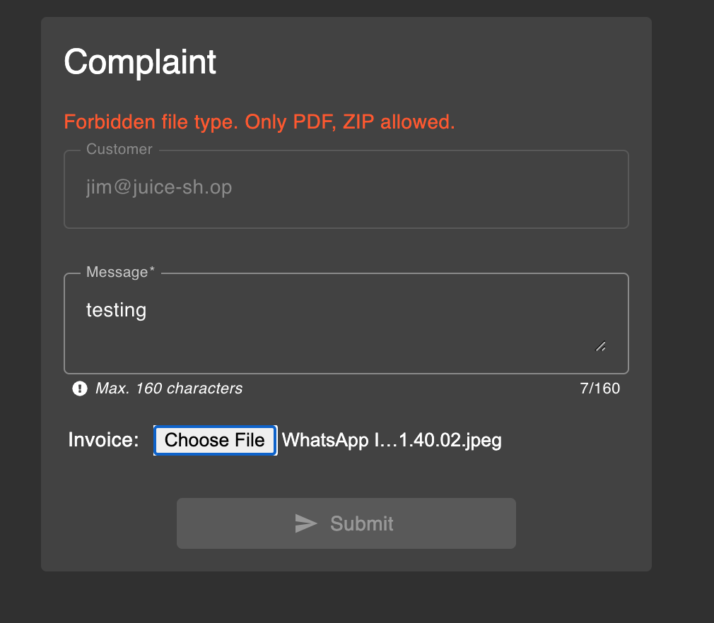
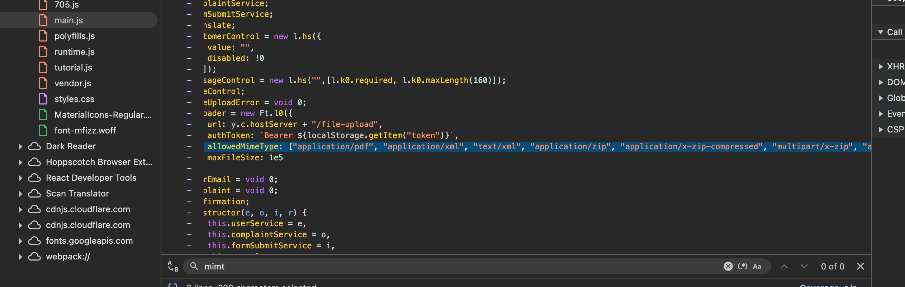
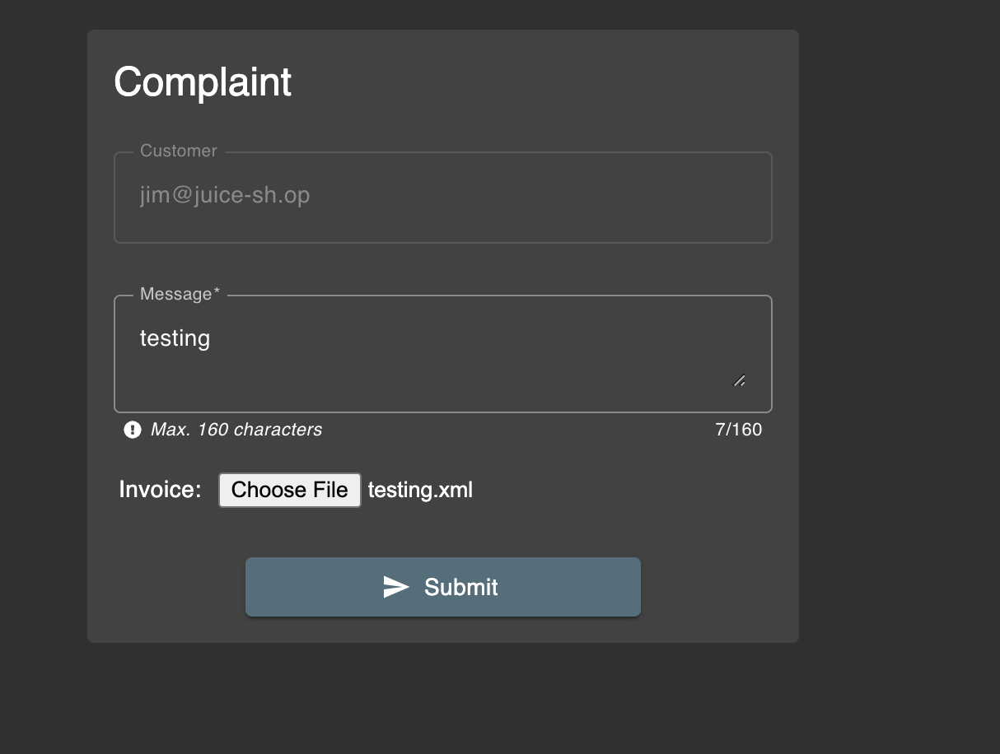
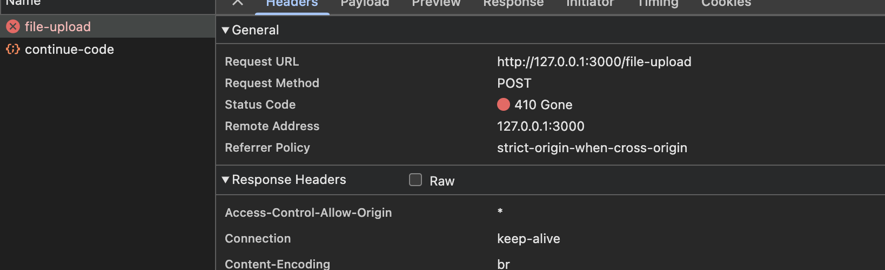
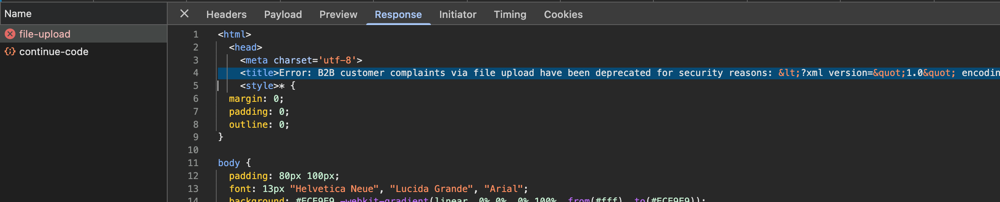
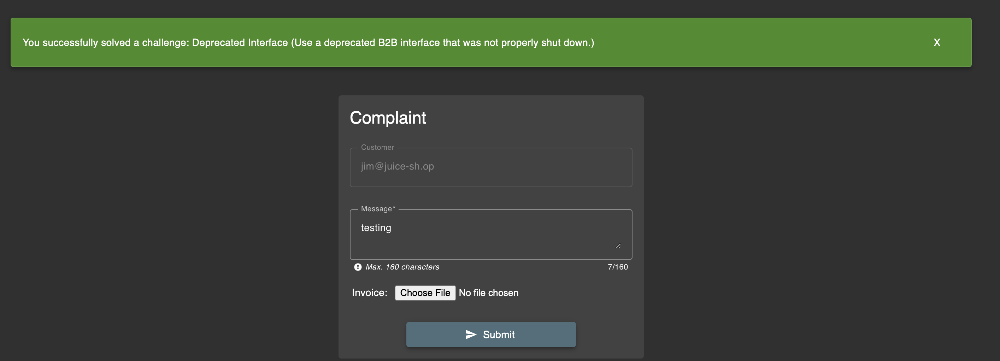

# Challenge: Deprecated Interface

Category: Security Misconfiguration
Points: 2 Stars
Difficulty: Easy

## Challenge Description

Use a deprecated B2B interface that was not properly shut down.

## Resource

[OWASP Juice Shop - Deprecated Interface](https://juice-shop.herokuapp.com/#/score-board)

## Step-by-Step Solution

1.  Pertama, login sebagai user dan navigasi ke halaman _complaint_.

2.  Pada halaman tersebut, terlihat bahwa form upload hanya menerima file dengan format PDF dan ZIP.
    

3.  Dengan memeriksa source code, kita menemukan bagian `AllowedMimeTypes`. Ternyata, tipe file `xml` juga diizinkan.
    

4.  Selanjutnya, kita mencoba untuk meng-upload file XML.
    
    
    

5.  Percobaan upload file XML berhasil.
    

## Reflection

- **Status:** ✅ Berhasil
- **Root Cause:** Validasi tipe file di sisi frontend tidak sesuai dengan konfigurasi di backend. Backend mengizinkan upload file XML, meskipun frontend tidak menampilkannya.
- **Attack Vector:** File upload dengan tipe file yang tidak terduga (XML) pada endpoint yang sudah _deprecated_.
- **Key Insight:**
  - Penting untuk selalu memastikan bahwa validasi di sisi frontend dan backend sinkron.
  - Menganalisa source code dapat mengungkap konfigurasi tersembunyi atau celah keamanan.
  - Endpoint yang sudah tidak terpakai (_deprecated_) bisa menjadi sumber risiko keamanan jika tidak dikelola dengan baik.
