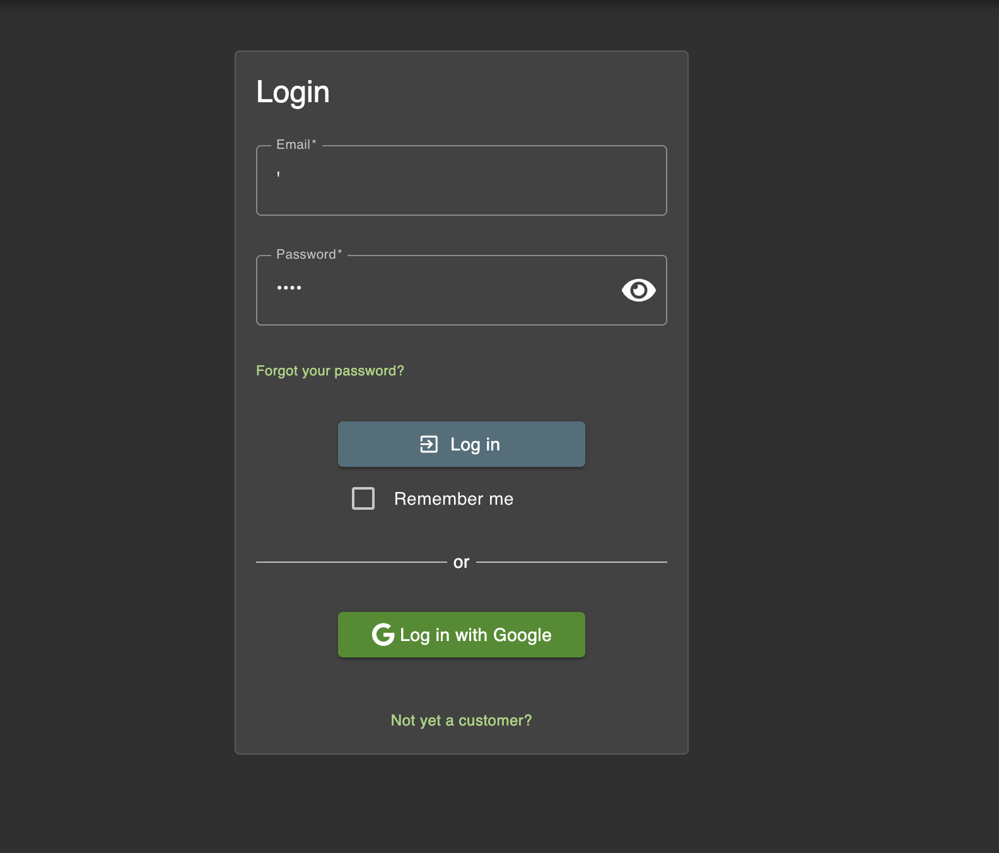
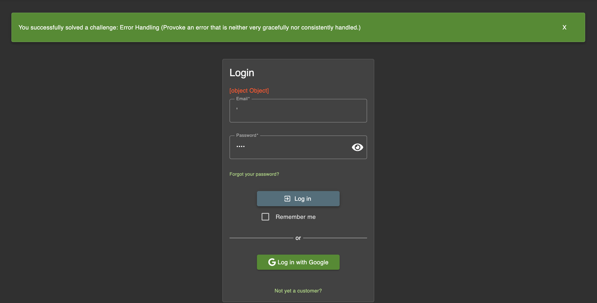

# Challenge: Error Handling

Category: Security Misconfiguration
Points: 2 Star
Difficulty: Easy

## Challenge Description

Trigger a server-side error that is not handled properly.

## Resource

[OWASP Juice Shop](https://juice-shop.herokuapp.com/#/score-board)

## Step-by-Step Solution

1. Jadi disini tugasnya adalah untuk men trigger error yang tidak dihandle dengan baik pertama kita ke login lalu kita coba login dengan input yang salah
   

2. Disini kita berhasil trigger error
   

## Reflection

- **Status:** ✅ Berhasil
- **Root Cause:** Aplikasi tidak menangani kesalahan (exceptions) dengan baik, sehingga ketika terjadi error saat login dengan input yang tidak valid, stack trace atau informasi sensitif lainnya dari server ditampilkan kepada pengguna.
- **Attack Vector:** Memberikan input yang tidak terduga atau tidak valid pada halaman login untuk memicu kesalahan internal di server.
- **Key Insight:**
  - Penanganan error yang tidak tepat dapat membocorkan informasi sensitif tentang teknologi yang digunakan (misalnya, framework, bahasa pemrograman, struktur database).
  - Informasi dari error-reporting yang bocor dapat digunakan oleh penyerang untuk merencanakan serangan lebih lanjut yang lebih tertarget.
  - Semua error harus ditangani dengan menampilkan pesan error yang generik kepada pengguna, sementara detail error dicatat (logging) di sisi server untuk dianalisis oleh developer.
