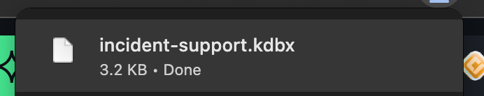
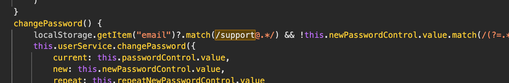
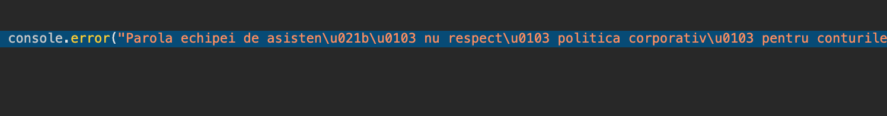
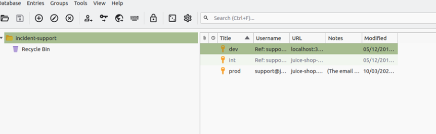
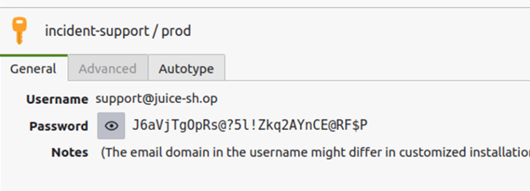
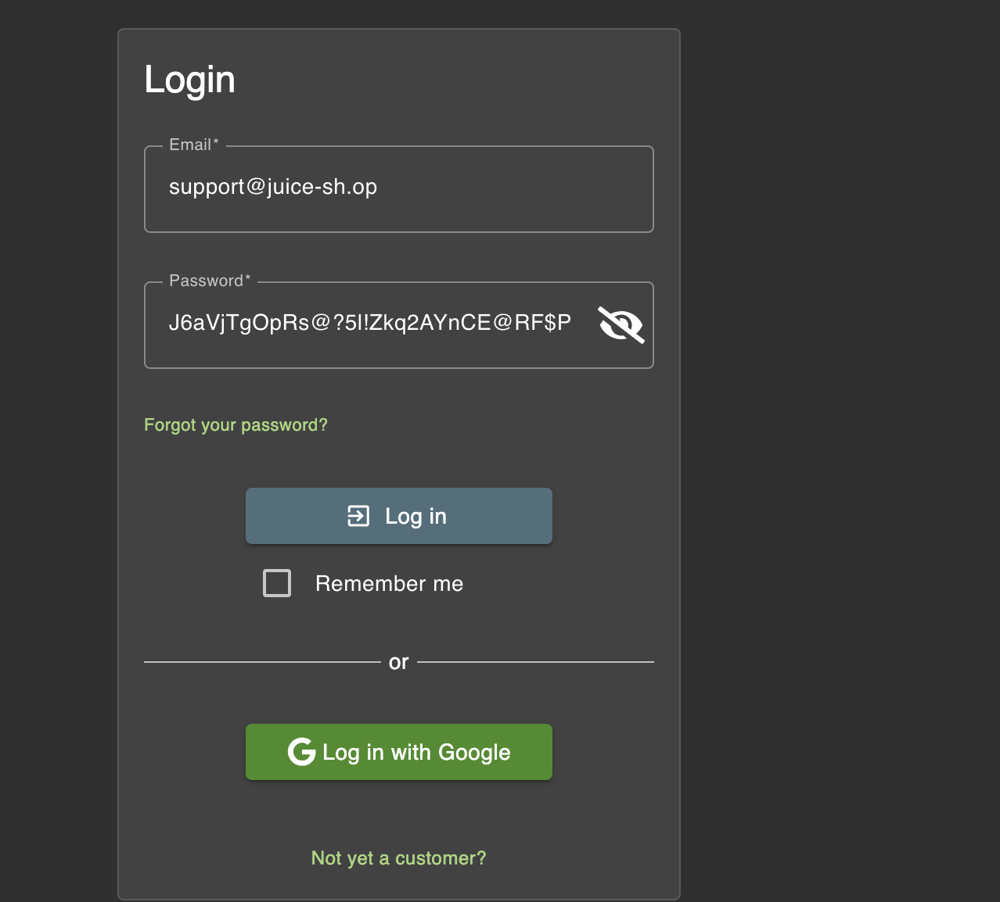
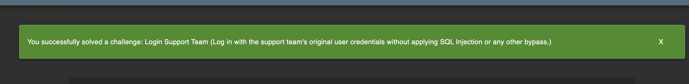

# Challenge: Login Support Team

Category: Broken Authentication
Points: 5 Stars
Difficulty: Hard

## Challenge Description

Mendapatkan akses ke akun tim pendukung dengan cara menganalisis file database kata sandi yang bocor dan memecahkan kata sandi utamanya melalui analisis kode sumber.

## Resource

- [John the Ripper](https://www.openwall.com/john/)
- [KeePass](https://keepass.info/)
  [OWASP Juice Shop](https://juice-shop.herokuapp.com/#/score-board)

## Step-by-Step Solution

1.  Berdasarkan petunjuk, kita mengetahui bahwa ada file `incident-support.kdbx` yang bisa diunduh dan email tim pendukung adalah `support@juice-sh.op`.
    

2.  Setelah mengunduh file `.kdbx`, kita menggunakan `keepass2john` untuk mengekstrak hash kata sandi utama dari file tersebut.

    ```bash
    keepass2john incident-support.kdbx > keepasshash.txt
    ```

3.  Percobaan untuk memecahkan hash menggunakan `johntheripper` dengan wordlist `rockyou.txt` tidak berhasil. Karena itu, kita mencari petunjuk lain di dalam source code (`main.js`).

4.  Dalam source code, kita menemukan bagian yang berkaitan dengan perubahan kata sandi akun pendukung dan sebuah pesan error dalam bahasa Rumania.
    
    

5.  **Analisis Petunjuk:**

    - Pesan error dalam bahasa Rumania tersebut berarti: _"Kata sandi tim pendukung tidak sesuai dengan kebijakan perusahaan untuk akun dengan hak istimewa! Harap ubah kata sandi Anda sesuai dengan itu!"_
    - Pencarian lebih lanjut pada kode mengarahkan kita pada sebuah ekspresi reguler (regex) yang mendefinisikan kebijakan kata sandi tersebut: `/(?=.*[a-z])(?=.*[A-Z])(?=.*\d)(?=.*[@$!%*?&])[A-Za-z\d@$!%*?&]{12,30}/`.
    - Berdasarkan kebijakan ini dan petunjuk lain, ditemukan bahwa kata sandi utama untuk file `.kdbx` adalah `Support2022!`.

6.  Kita menggunakan kata sandi `Support2022!` untuk membuka file `incident-support.kdbx` menggunakan KeePass.
    

7.  Di dalam database KeePass, kita menemukan kredensial untuk akun pendukung: `J6aVjTgOpRs@?5l!Zkq2AYnCE@RF$P`.
    

8.  Terakhir, kita berhasil login sebagai `support@juice-sh.op` menggunakan kata sandi yang telah ditemukan.
    
    

## Reflection

- **Status:** ✅ Berhasil
- **Root Cause:** Kebocoran file database kata sandi (`.kdbx`) dan adanya petunjuk mengenai kebijakan pembuatan kata sandi di dalam kode sumber aplikasi. Kata sandi utama yang lemah dan dapat ditebak juga menjadi faktor.
- **Attack Vector:** _Offline password cracking_ yang dibantu dengan analisis source code untuk mempersempit ruang pencarian kata sandi.
- **Key Insight:**
  - Kebocoran file sensitif seperti database kata sandi merupakan risiko keamanan yang sangat tinggi.
  - Petunjuk, bahkan yang tersamar (seperti pesan error dalam bahasa lain atau regex dalam kode), dapat secara signifikan membantu penyerang.
  - Brute force murni tidak selalu efektif. Analisis cerdas terhadap konteks aplikasi seringkali lebih cepat membuahkan hasil.
