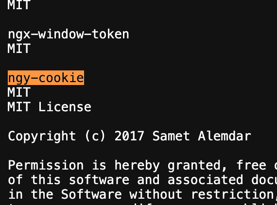
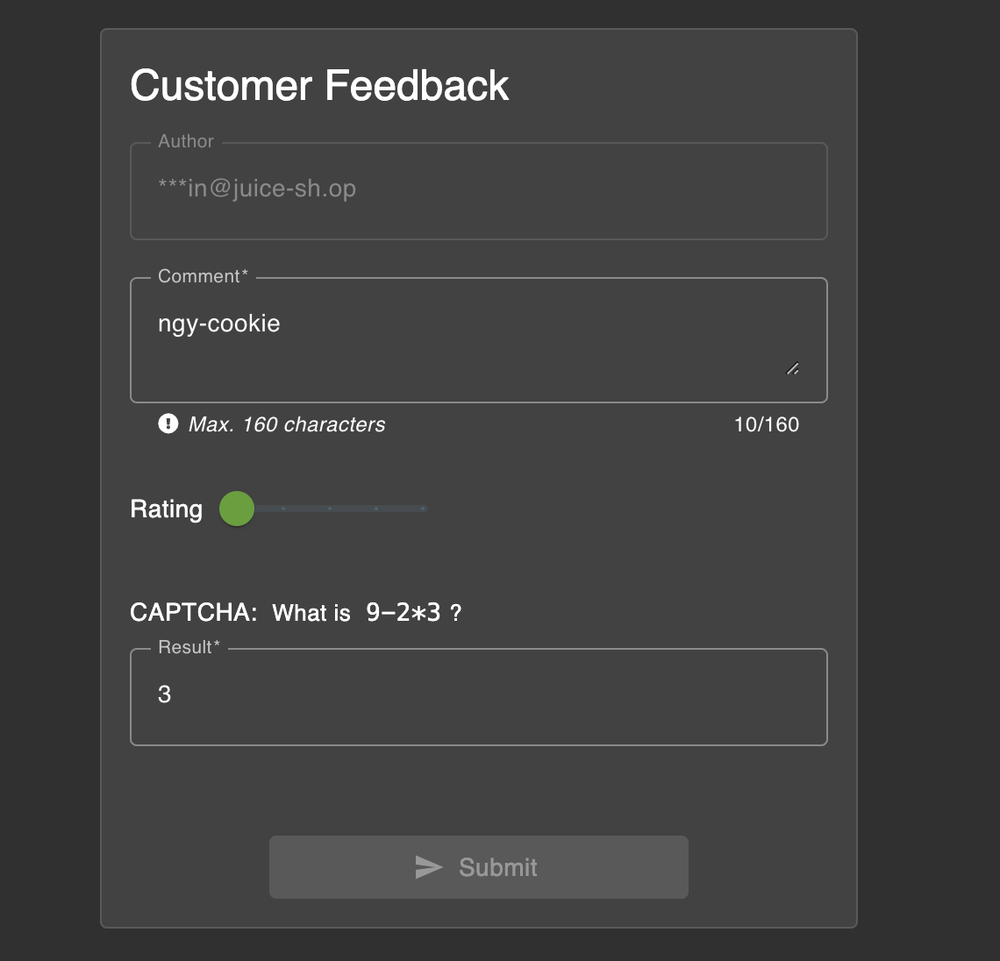
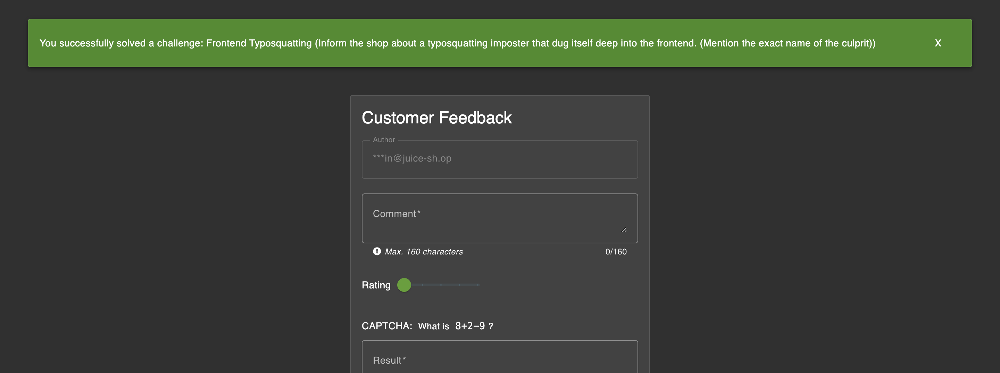

# Challenge: Frontend Typosquatting

Category: Vulnerable Components
Points: 4 Stars
Difficulty: Easy

## Challenge Description

IInform the shop about a typosquatting imposter that dug itself deep into the frontend. (Mention the exact name of the culprit)

## Resource

[OWASP Juice Shop - Broken Authentication Challenges](https://juice-shop.herokuapp.com/#/score-board?categories=Broken%20Authentication)

## Step-by-Step Solution

1.  Buka file `/3rdpartylicenses.txt` untuk melihat daftar library pihak ketiga yang digunakan.
2.  Dalam daftar tersebut, ditemukan sebuah package bernama `ngy-cookie`. Setelah diperiksa di NPM, package ini teridentifikasi sebagai typosquatting dari `ngx-cookie`.
    
3.  Laporkan temuan ini melalui formulir "Customer Feedback" dengan menyebutkan nama package yang salah.
    
4.  Setelah laporan berhasil dikirim, tantangan akan selesai.
    

## Reflection

- **Status:** ✅ Berhasil
- **Root Cause:** Aplikasi menggunakan library `ngy-cookie` yang merupakan typosquatting dari `ngx-cookie`.
- **Attack Vector:** Mengidentifikasi library yang vulnerable melalui file `3rdpartylicenses.txt` dan melaporkannya.
- **Key Insight:**
  - Pentingnya untuk memeriksa library pihak ketiga yang digunakan dalam aplikasi.
  - Typosquatting adalah serangan yang umum terjadi pada package manager seperti npm.
  - File seperti `3rdpartylicenses.txt` dapat membocorkan informasi tentang teknologi yang digunakan.
