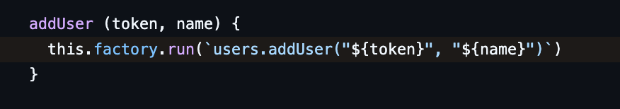
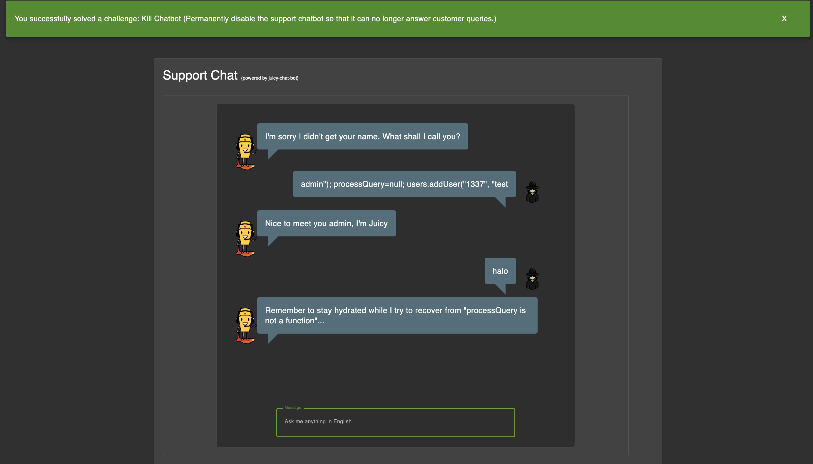

# Challenge: Kill Chatbot

Category: Vulnerable Components
Points: 6 Stars
Difficulty: Hard

## Challenge Description

Temporarily disable the chatbot.

## Resource

[OWASP Juice Shop - Score Board](https://juice-shop.herokuapp.com/#/score-board)

## Step-by-Step Solution

1.  Pertama, kita coba lihat source code yang disediakan.
    
2.  Ditemukan celah keamanan pada pernyataan yang digunakan bot untuk mengingat _username_. Perintah `this.factory.run(users.addUser("${token}", "${name}"))` setara dengan `eval()` dalam konteks VM, sehingga rentan terhadap _injection_. Celah ini dapat dieksploitasi dengan menyisipkan karakter `"` dan `)` pada _username_. Jika _username_ diatur menjadi `admin"); processQuery=null; users.addUser("1337", "test`, maka perintah yang dieksekusi oleh server adalah:
    ```javascript
    users.addUser("token", "admin");
    processQuery = null;
    users.addUser("1337", "test");
    ```
3.  Dengan memasukkan payload `admin"); processQuery=null; users.addUser("1337", "test` pada saat login, fungsi `processQuery` akan menjadi `null`.
    
4.  Akibatnya, chatbot akan berhenti berfungsi dan tantangan dianggap selesai.

## Reflection

- **Status:** ✅ Berhasil
- **Root Cause:** Kurangnya validasi input pada field nama pengguna yang memungkinkan eksekusi kode arbitrer di sisi server melalui VM sandbox.
- **Attack Vector:** Code injection melalui field nama pengguna untuk menimpa (overwrite) fungsi `processQuery` menjadi `null`, sehingga chatbot tidak dapat memproses input lebih lanjut.
- **Key Insight:**
  - Penggunaan `eval()` atau fungsi serupa yang mengeksekusi string sebagai kode sangat berbahaya jika input tidak divalidasi dengan benar.
  - Bahkan dalam lingkungan yang di-sandbox (seperti VM), jika input pengguna dapat memanipulasi logika kode, hal itu dapat menyebabkan kerentanan serius.
  - Serangan ini menunjukkan bagaimana injection dapat digunakan tidak hanya untuk mencuri data, tetapi juga untuk merusak atau menonaktifkan fungsionalitas aplikasi (Denial of Service).
