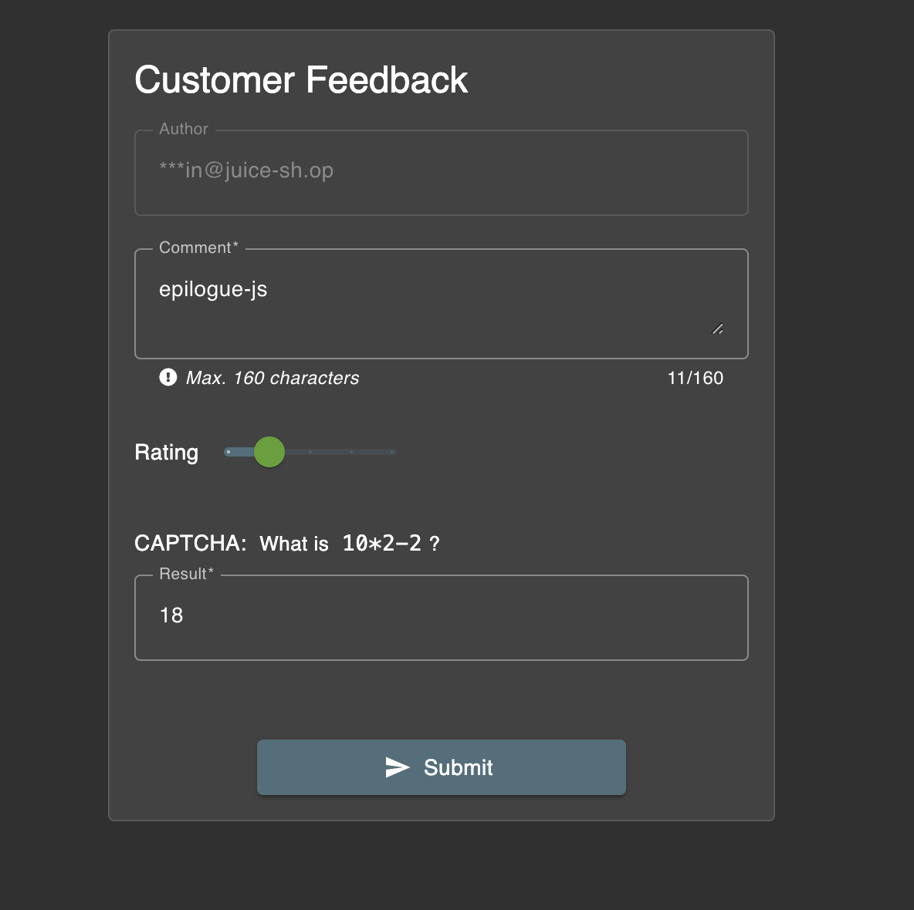
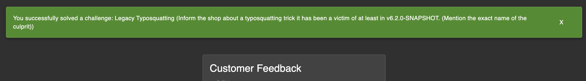

# Challenge: Legacy Typosquatting

Category: Vulnerable Components
Points: 4 Stars
Difficulty: Medium

## Challenge Description

Inform the shop about a typosquatted library it uses from a legacy version.

## Resource

[OWASP Juice Shop - Score Board](https://juice-shop.herokuapp.com/#/score-board)

## Step-by-Step Solution

1.  Akses direktori `/ftp` dan temukan file `package.json.bak` yang berisi informasi mengenai dependensi aplikasi.
2.  Gunakan teknik *null byte injection* (`%2500.md`) untuk mengunduh file tersebut, melewati filter validasi nama file di server.
    
3.  Setelah menganalisis dependensi, ditemukan paket `epilogue-js` yang merupakan typosquatting dari paket `epilogue`.
4.  Laporkan temuan ini melalui formulir "Customer Feedback".
    
5.  Setelah laporan berhasil dikirim, tantangan akan ditandai selesai.
    

## Reflection

- **Status:** ✅ Berhasil
- **Root Cause:** Aplikasi menggunakan dependensi `epilogue-js` yang merupakan paket typosquatting dari `epilogue`. Hal ini terjadi karena kesalahan pengetikan saat menambahkan dependensi pada versi lama aplikasi.
- **Attack Vector:** Menganalisis `package.json.bak` untuk menemukan paket dengan nama yang mirip dengan paket populer (typosquatting), lalu melaporkannya.
- **Key Insight:**
  - Typosquatting adalah serangan di mana paket berbahaya dibuat dengan nama yang sangat mirip dengan paket populer untuk mengelabui pengembang agar salah menginstall.
  - Sangat penting untuk memeriksa nama paket dengan teliti saat menambahkannya ke sebuah proyek.
  - Menganalisis dependensi proyek dapat mengungkap kerentanan keamanan seperti ini.
