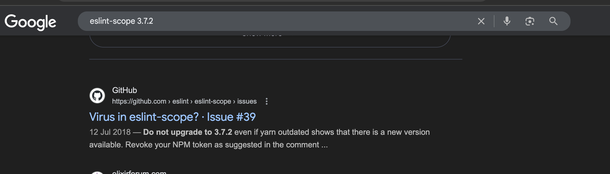
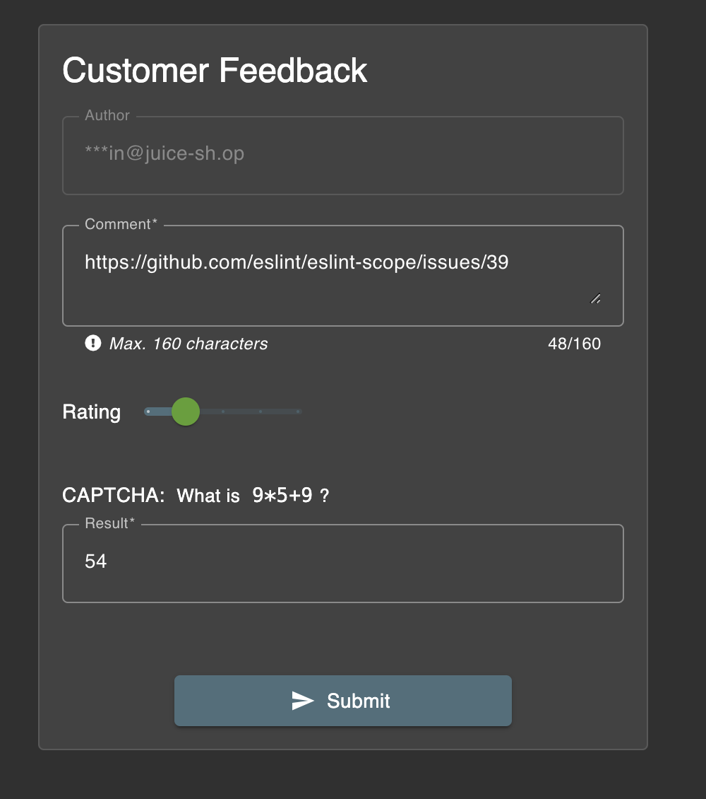
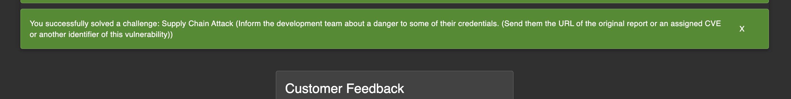

# Challenge: Supply Chain Attack

Category: Vulnerable Components
Points: 6 Stars
Difficulty: Hard

## Challenge Description

Inform the development team about a danger to some of their credentials. (Send them the URL of the original report or an assigned CVE or another identifier of this vulnerability)

## Resource

[OWASP Juice Shop - Score Board](https://juice-shop.herokuapp.com/#/score-board)

## Step-by-Step Solution

1.  Akses direktori `/ftp` pada aplikasi untuk mencari file yang mungkin terekspos.
2.  Unduh file `package.json.bak` yang ditemukan.
    
3.  Analisis bagian `devDependencies` pada file tersebut. Ditemukan sebuah package bernama `eslint-scope` versi 3.7.2. Pencarian di Google menunjukkan bahwa package ini memiliki riwayat kerentanan.
    
4.  Laporkan kerentanan yang ditemukan melalui formulir "Customer Feedback".
    
5.  Setelah laporan berhasil dikirim, tantangan akan ditandai sebagai selesai.
    

## Reflection

- **Status:** ✅ Berhasil
- **Root Cause:** Aplikasi menggunakan `eslint-scope` versi `3.7.2` yang memiliki kerentanan keamanan.
- **Attack Vector:** Mengidentifikasi library yang vulnerable melalui file `package.json.bak` dan melaporkannya.
- **Key Insight:**
  - Pentingnya untuk memeriksa library pihak ketiga yang digunakan dalam aplikasi, termasuk dev dependencies.
  - Serangan supply chain dapat terjadi ketika sebuah library yang digunakan dalam aplikasi memiliki kerentanan.
  - File seperti `package.json.bak` dapat membocorkan informasi tentang teknologi yang digunakan.
