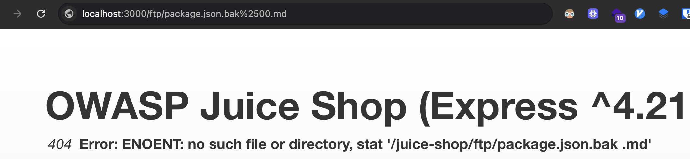
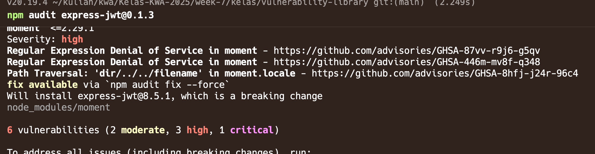
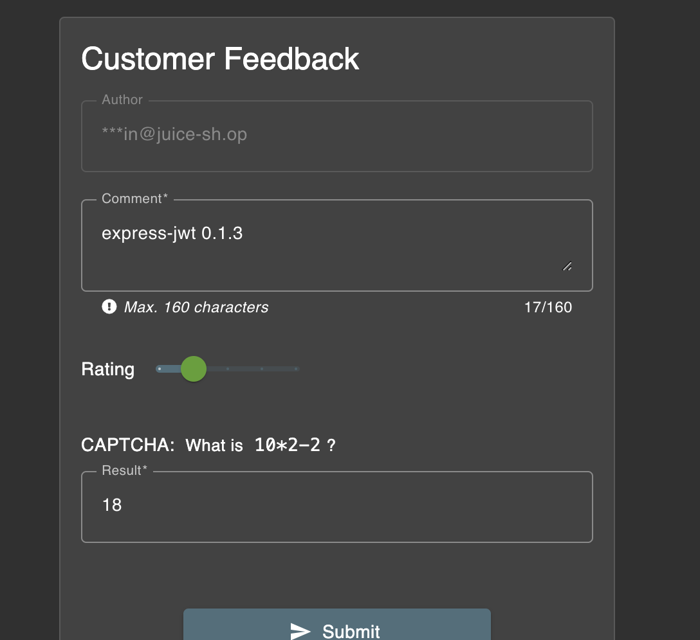

# Challenge: Vulnerability Library

Category: Vulnerable Components
Points: 4 Stars
Difficulty: Medium

## Challenge Description

Inform the shop about a vulnerable library it uses.

## Resource

[OWASP Juice Shop](https://juice-shop.herokuapp.com/#/score-board)

## Step-by-Step Solution

1.  Buka direktori `/ftp`. Kita dapat menemukan file `package.json.bak` yang mungkin berisi informasi sensitif tentang dependensi aplikasi.
2.  Untuk mengunduh file tersebut, kita bisa menggunakan trik null byte injection (`%2500.md`) untuk melewati validasi di sisi server.
    
3.  Setelah menganalisis file `package.json.bak`, kita dapat mengaudit dependensi untuk kerentanan yang diketahui. Kita menemukan bahwa `express-jwt` versi `0.1.3` memiliki kerentanan.
    
4.  Terakhir, kita kirimkan temuan ini melalui formulir umpan balik pelanggan untuk menyelesaikan tantangan.
    
    

## Reflection

- **Status:** ✅ Success
- **Root Cause:** The application exposes a backup file (`package.json.bak`) containing a list of its dependencies. One of the dependencies, `express-jwt` at version `0.1.3`, is outdated and has a known critical vulnerability.
- **Attack Vector:** The attack involves finding the backup file, downloading it using a null byte injection, identifying the vulnerable library, and reporting it via the customer feedback form.
- **Key Insight:**
  - Backup files often contain sensitive data that should not be publicly accessible.
  - Outdated dependencies with known vulnerabilities are a common security risk (A9:2017 - Using Components with Known Vulnerabilities).
  - It is crucial to regularly scan and update dependencies to mitigate risks.
  - Null byte injection can be an effective technique to bypass file access restrictions.
