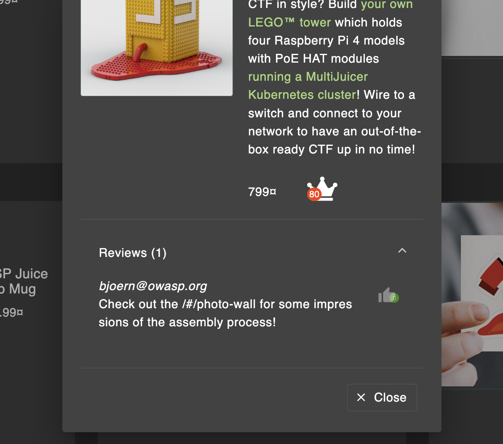
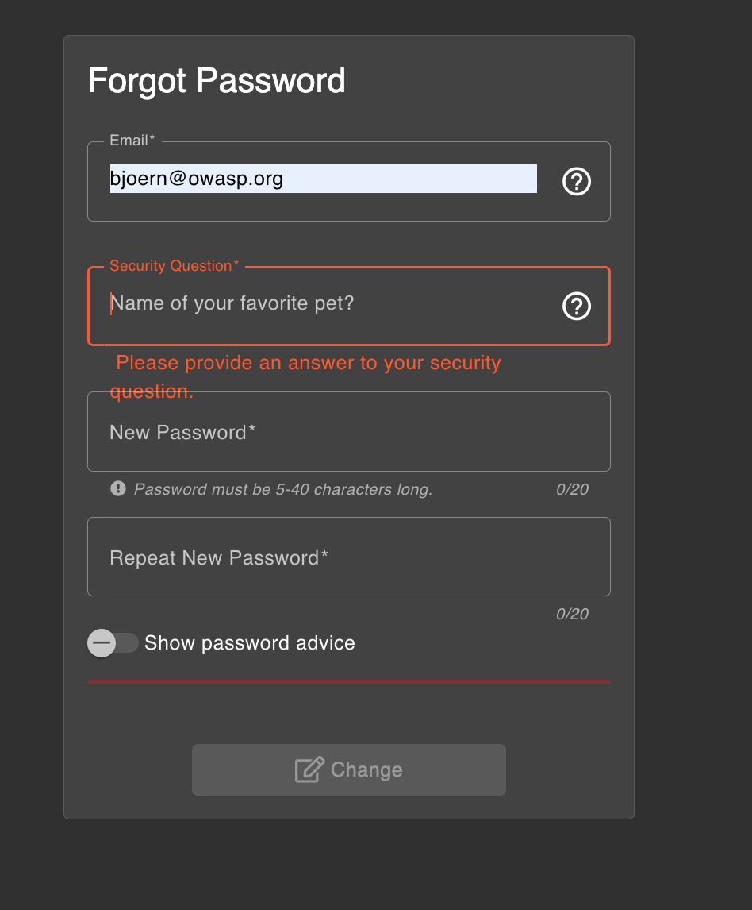
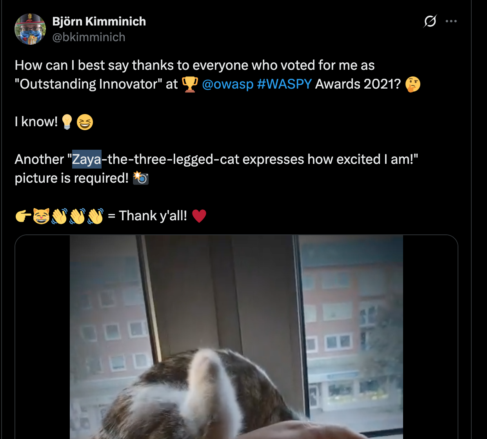
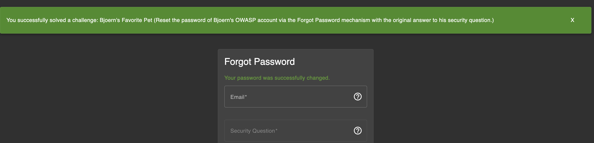

# Challenge: Bjoern's Favorite Pet

Category: Broken Authentication  
Difficulty: Easy

## Challenge Description

Reset the password of Bjoern's OWASP account via the Forgot Password mechanism using the original answer to his security question.

## Step-by-Step Solution

1. **Cari Email Bjoern**  
   Pertama, cari email Bjoern di aplikasi.

2. **Identifikasi Email**  
   Email yang ditemukan: `bjoern@owasp.org`
   

3. **Reset Password**  
   Buka halaman Forgot Password dan masukkan email Bjoern. Dapatkan security question: "What is Bjoern's favorite pet?"
   

4. **OSINT Research**  
   Lakukan pencarian di media sosial (X/Twitter) untuk menemukan informasi tentang hewan peliharaan favorit Bjoern.
   

5. **Verifikasi Success**  
   Masukkan jawaban yang ditemukan dan berhasil reset password.
   

## Reflection

- **Status:** ✅ Berhasil
- **Root Cause:** Security question berbasis informasi pribadi yang dapat ditemukan melalui OSINT.
- **Attack Vector:** Social media reconnaissance untuk menemukan jawaban security question.
- **Key Insight:**
  - Security question yang menggunakan informasi pribadi rentan terhadap OSINT.
  - Perlu menggunakan metode recovery yang lebih aman (email OTP, TOTP) dan hindari pertanyaan yang jawabannya dapat ditemukan di media sosial.
  - Demonstrasi pentingnya privacy awareness dalam memilih security questions.
