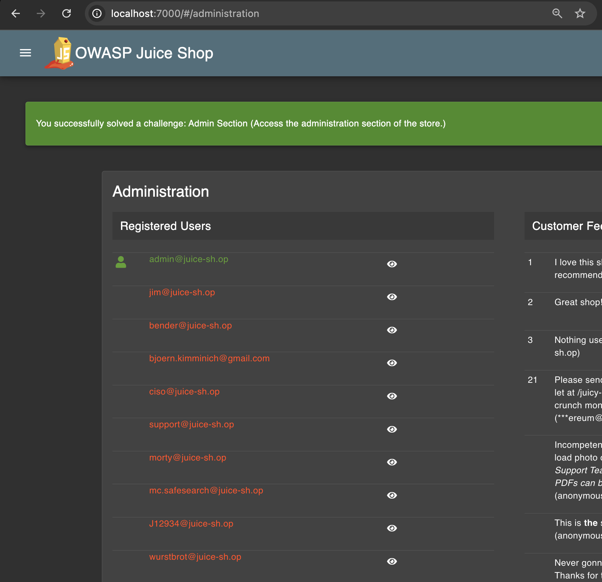
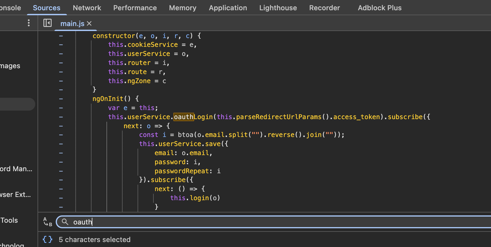
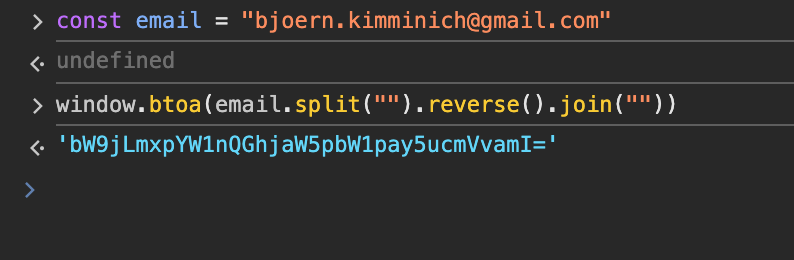
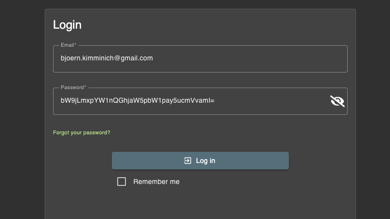
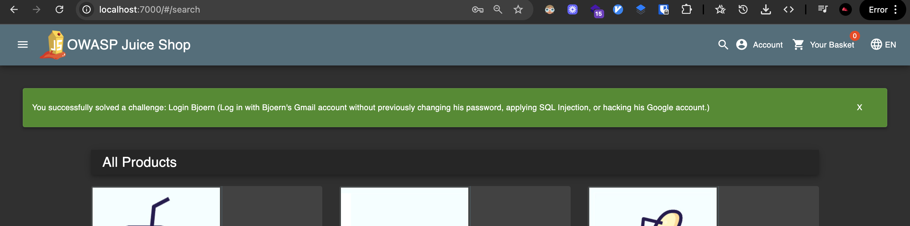

# Challenge: Login Bjoern

Category: Broken Authentication
Points: 3 Stars
Difficulty: Medium

## Challenge Description

Log in with Bjoern's Gmail account without previously changing his password, applying SQL Injection, or hacking his Google account.

## Resource

[OWASP Juice Shop - Broken Authentication Challenges](https://juice-shop.herokuapp.com/#/score-board?categories=Broken%20Authentication)

## Step-by-Step Solution

1. **Identifikasi Email Bjoern**
   Disini kita lihat di halaman `/administration` dan cari email Bjoern
   

2. **Analisis Logic OAuth**
   Lalu disini kita cari logic yang berkaitan dengan OAuth
   

   Disitu kita bisa melihat dia menggunakan `btoa(o.email.split("").reverse().join(""))` untuk membuat password

3. **Generate Password di Console**
   Jadi kita akan melakukan hal yang sama di console browser
   

4. **Input Generated Password**
   Kita masukkan hasilnya sebagai password
   

5. **Verifikasi Success**
   Sukses login dengan akun Bjoern
   

## Reflection

- **Status:** ✅ Berhasil
- **Root Cause:** Sistem menggunakan algoritma password generation yang predictable dan dapat di-reverse engineer
- **Attack Vector:** Reverse engineering password generation algorithm melalui analisis source code
- **Key Insight:**
  - Password generation menggunakan `btoa(o.email.split("").reverse().join(""))` yang dapat diprediksi
  - Algoritma ini melakukan base64 encoding dari email yang di-reverse
  - Demonstrasi pentingnya menggunakan cryptographically secure random password generation
  - Vulnerability ini menunjukkan bahaya menggunakan predictable algorithms untuk password generation
  - Source code analysis memungkinkan attacker untuk memahami dan memanfaatkan logic password generation
