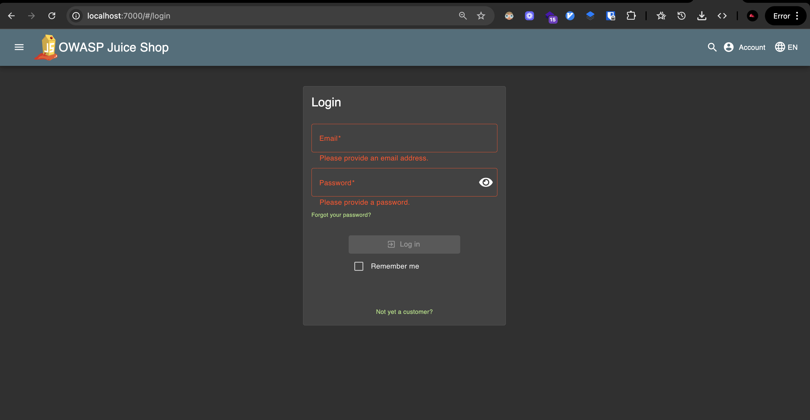
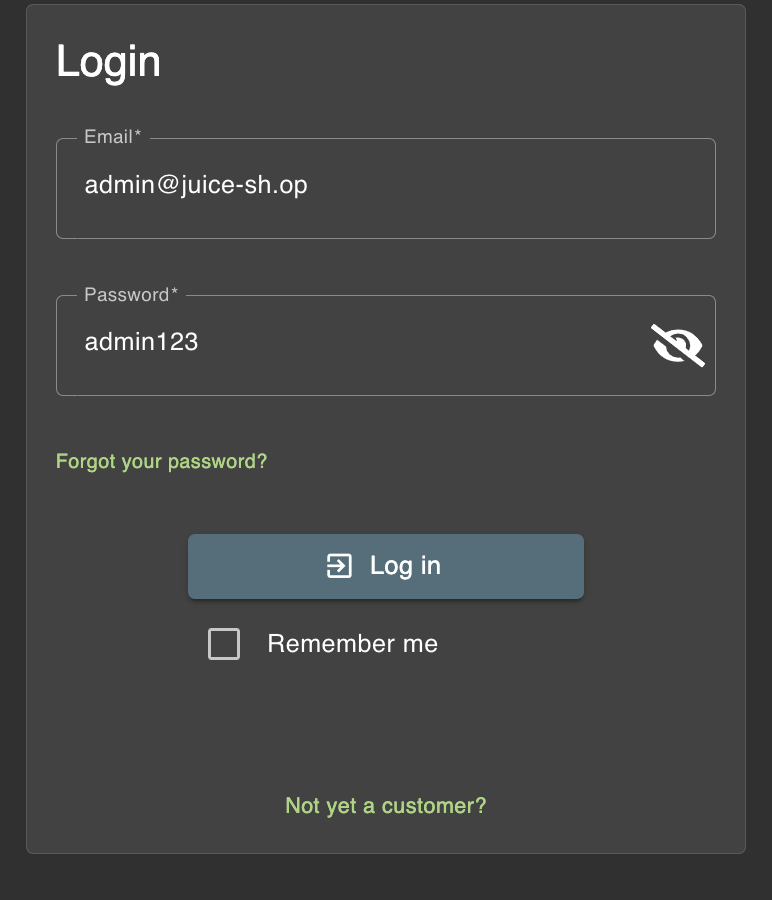

# Challenge: Password Strength

Category: Broken Authentication
Points: 2 Stars
Difficulty: Easy

## Challenge Description

Log in with the administrator's user account using a weak password.

## Resource

[OWASP Juice Shop - Broken Authentication Challenges](https://juice-shop.herokuapp.com/#/score-board?categories=Broken%20Authentication)

## Step-by-Step Solution

1. **Akses Login Page**
   Pertama kita ke login page
   

2. **Identifikasi Email Admin**
   Lalu kita isi dengan nama email admin yang generic seperti biasanya, kita juga bisa cari di review dan kita tau bahwa nama email adalah admin@juice-sh.op

3. **Coba Password Generic**
   Nah disini kita saatnya coba2 login menggunakan password generic admin, disini kita coba admin123 dan berhasil
   

## Reflection

- **Status:** ✅ Berhasil
- **Root Cause:** Sistem menggunakan password yang sangat lemah dan mudah ditebak untuk akun administrator
- **Attack Vector:** Brute force attack dengan password umum seperti "admin123"
- **Key Insight:**
  - Password "admin123" adalah password yang sangat umum dan mudah ditebak
  - Sistem tidak memiliki mekanisme untuk mencegah penggunaan password yang lemah
  - Demonstrasi pentingnya menggunakan password yang kuat dan unik untuk akun administrator
  - Vulnerability ini menunjukkan pentingnya password policy yang ketat untuk akun dengan privilege tinggi
