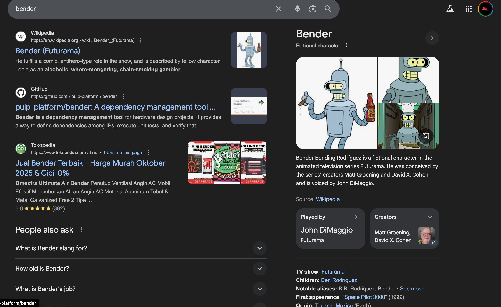
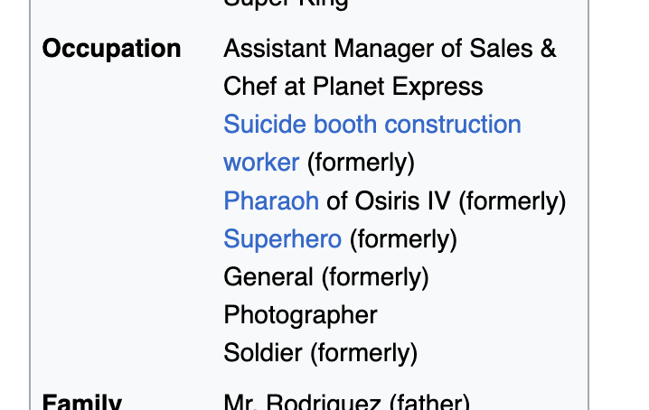
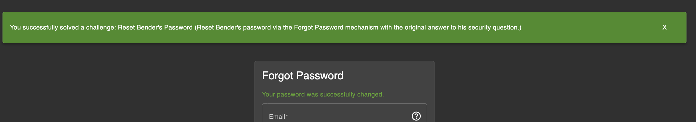

# Challenge: Reset Bender's Password

Category: Broken Authentication  
Difficulty: Easy

## Challenge Description

Reset Bender's password via the Forgot Password mechanism using the original answer to his security question.

## Step-by-Step Solution

1. Buka halaman Forgot Password dan lihat pertanyaan keamanannya: “Company you first work as an adult.”
   

2. Lakukan OSINT singkat.
   Cari siapa Bender — dia adalah karakter di Futurama.
   

3. Temukan perusahaan/brand pertama terkait Bender.
   Dari referensi Futurama, Bender terkait dengan Suicide Booth; brand terkenalnya adalah “Stop'n'Drop” (`http://futurama.wikia.com/wiki/Suicide_booth`).
   

4. Masukkan jawaban “Stop'n'Drop” sebagai jawaban security question dan submit — sukses.
   

## Reflection

- **Status:** ✅ Berhasil
- **Root Cause:** Pertanyaan keamanan berbasis trivia publik yang mudah ditebak/dicari.
- **Attack Vector:** OSINT ringan (mencari referensi karakter dan brand di internet) kemudian memvalidasi jawaban.
- **Key Insight:**
  - Pertanyaan keamanan semacam ini lemah; jawabannya sering tersedia publik.
  - Gunakan metode recovery yang lebih kuat (email OTP, TOTP) dan hindari pertanyaan generik.
