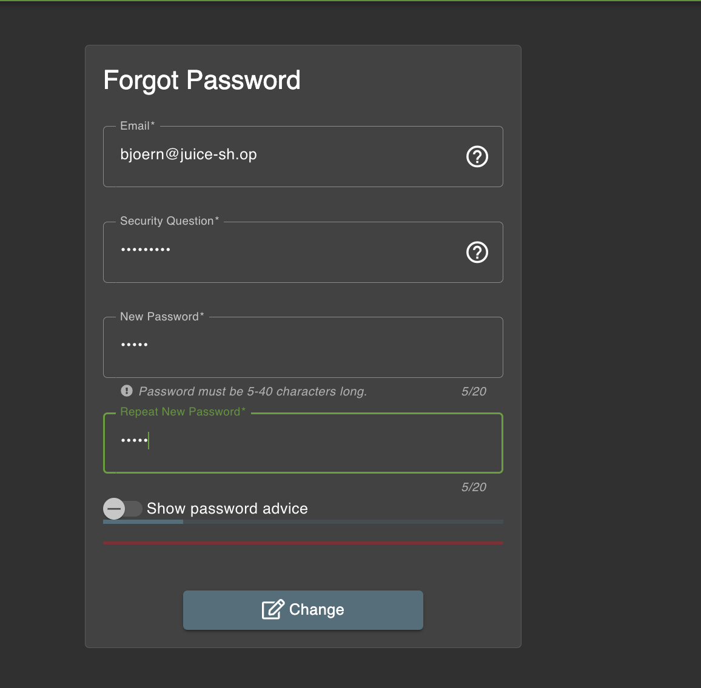
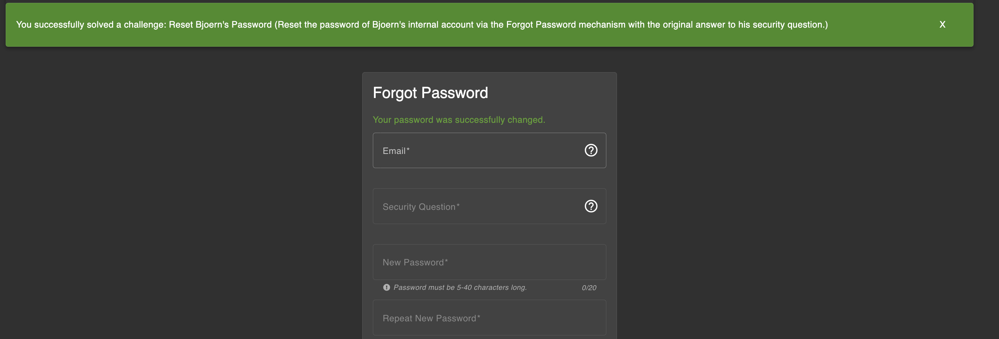

# Challenge: Reset Bjoern's Password

Category: Broken Authentication  
Difficulty: Medium

## Challenge Description

Reset Bjoern’s password via the Forgot Password flow dengan menjawab security question menggunakan OSINT. Jawaban yang benar adalah format kode pos lama Uetersen yang ditulis sebagai “West-2082”.

## Resource

[OWASP Juice Shop - Broken Authentication Challenges](https://juice-shop.herokuapp.com/#/score-board?categories=Broken%20Authentication)

## Step-by-Step Solution

1. **Identifikasi Bjoern**  
   “Bjoern” adalah project leader OWASP Juice Shop. Profil Facebook menunjukkan ia dari Uetersen, Germany (`https://www.facebook.com/bjoern.kimminich`).

2. **Kumpulkan Bukti Tambahan**

   - Game Turbo Pascal (1995): `https://gist.github.com/9045923` atau `https://pastebin.com/JL5E0RfX` → area code 04122 (Uetersen).
   - `http://www.geopostcodes.com/Uetersen` → ZIP modern Uetersen: `25436`.

3. **Coba Reset Password (Gagal dengan ZIP modern)**

   - Buka `http://localhost:3000/#/forgot-password`
   - Email: `bjoern@juice-sh.op`
   - Security question: “Your ZIP/postal code when you were a teenager?”
   - Jawab `25436` → tidak berhasil.

4. **Cari Kode Pos Lama (Pre-unification)**

   - `http://www.alte-postleitzahlen.de/uetersen` → kode pos lama: `W-2082`.
   - Catatan: Bjoern menggunakan variasi tertulis: `West-2082`.

5. **Jawaban Akhir dan Sukses**
   - Masukkan jawaban: `West-2082`.
     
   - Isi New Password dan Repeat New Password, klik Change → berhasil reset.
     

## Reflection

- **Status:** ✅ Berhasil
- **Root Cause:** Security question berbasis data historis publik (rentan OSINT) + sedikit obscurity pada format jawaban.
- **Attack Vector:** OSINT pada profil publik dan arsip kode, lalu pencarian kode pos lama Jerman.
- **Key Insight:**
  - Informasi publik/historis tidak cocok untuk security questions.
  - Obfuscation format (“West-2082”) bukan pengganti kontrol keamanan yang kuat.
  - Gunakan metode recovery yang lebih aman (OTP email/app, TOTP) dan hindari trivia-based questions.
