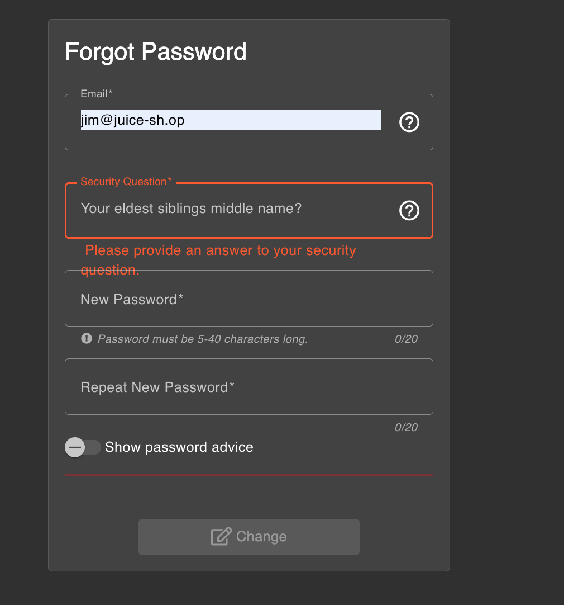
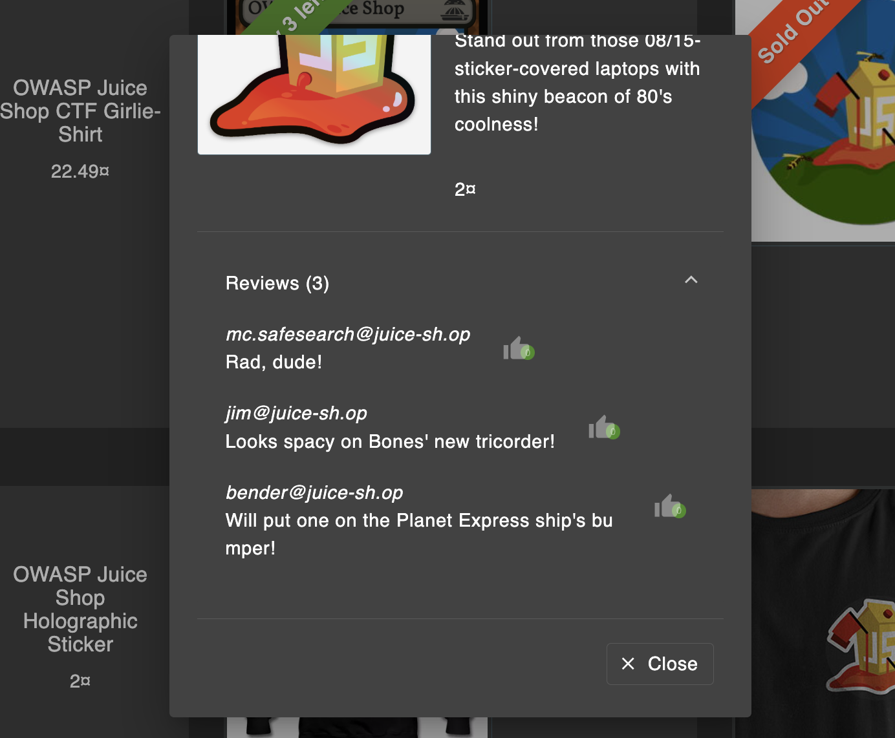
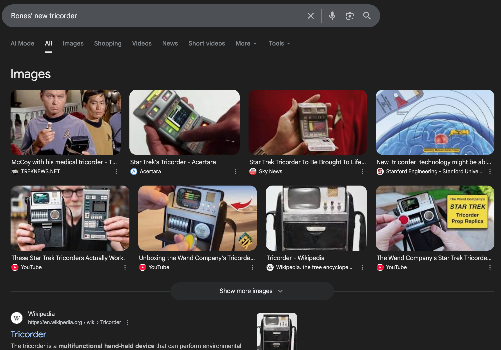
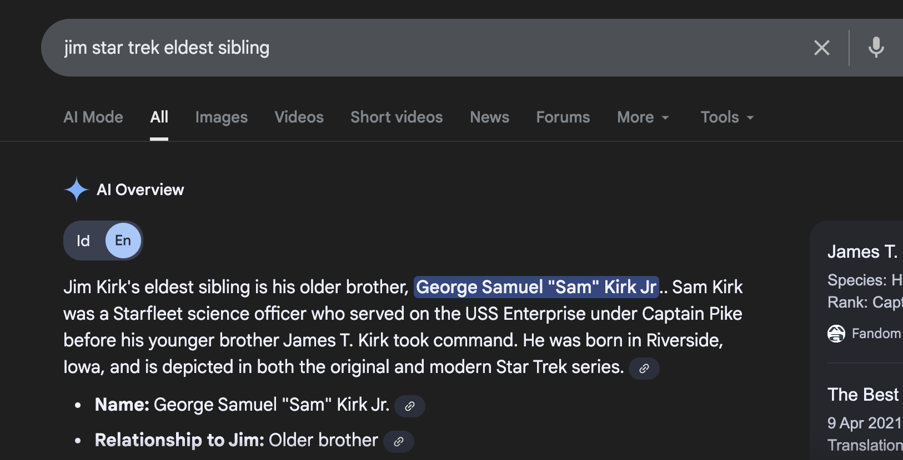

# Challenge: Reset Jim's Password

Category: Broken Authentication  
Difficulty: Easy

## Challenge Description

Reset Jim's password via the Forgot Password mechanism using the original answer to his security question.

## Step-by-Step Solution

1. Buka halaman Forgot Password dan masukkan email Jim: `jim@juice-sh.op`.
   
   Pertanyaan keamanan: middle name of Jim's oldest sibling.

2. Cari konteks di halaman review.
   Di sana Jim menyebut tentang “Bones’ new tricorder”.
   

3. Setelah dicari, “Bones’ new tricorder” terkait dengan universe Star Trek.
   

4. Karena Jim terkait Star Trek, kita cari saudara Jim di Star Trek.
   

5. Middle name yang didapat adalah “Samuel”. Masukkan jawaban tersebut.
   

## Reflection

- **Status:** ✅ Berhasil
- **Root Cause:** Pertanyaan keamanan menggunakan trivia publik yang mudah ditebak/ditemukan.
- **Attack Vector:** OSINT ringan melalui review/teks di aplikasi lalu validasi ke pencarian umum.
- **Key Insight:**
  - Security question berbasis trivia rentan karena jawabannya sering publik.
  - Gunakan metode recovery yang lebih kuat (email OTP, TOTP) dan hindari pertanyaan umum.
